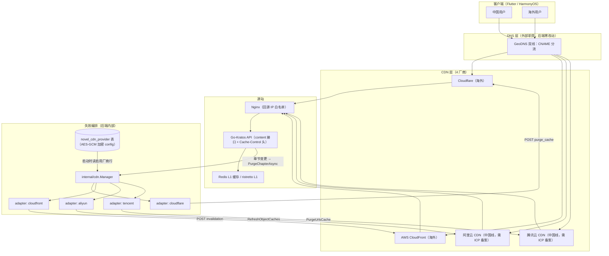

# 多厂商 CDN 加速与失效设计（cdn-support.md，2026-08-29）

> 目标：将现有「章节 CDN 静态化」升级为全站加速 + 多厂商接入——Cloudflare、AWS CloudFront（全球线）+ 阿里云 CDN、腾讯云 CDN（中国线）。
> 本文件为设计文档，不含业务实现代码；接口签名与伪代码仅为示意。
> 前置事实：researcher 报告（代码链路、厂商 API 对照表、配置缺口）已采信，不再重复调研过程。

## 一、现状与目标

### 1.1 现状（已实现）

| 项 | 现状 |
| :--- | :--- |
| 缓存头 | 免费章节 content 响应 `Cache-Control: public, s-maxage=3600`；VIP 章节 `no-store`（service/chapter.go:57-60，`biz.CdnEnabled()` 门控） |
| 缓存键 | `chapter/{id}?lang={lang}`（biz/cdn.go:38，query 带 lang） |
| 失效 | `PurgeChapterAsync`：fire-and-forget goroutine + 5s 超时，`CDN_PURGE_URL` URL 模板 `{key}`，非 2xx 仅记日志（biz/cdn.go:43-70） |
| 配置 | 全走 `os.Getenv`（`CDN_BASE_URL` / `CDN_PURGE_URL`），未入 DB（新方案迁 DB，见 §6） |
| 触发点 | biz/chapter.go:66 创建章节、:240-245 SetChapterStatus 逐 lang purge |

### 1.2 目标

1. 多厂商 purge：章节变更一次性广播到全部启用厂商（4 家 + 保留 generic 兼容路径）。
2. 全站缓存规则：明确「路径 → 缓存策略」映射，lang 统一保留进缓存键。
3. 配置入 DB（镜像 payment provider 模式：`novel_cdn_provider` 表 + AES-GCM 加密 config 列），沿用现有 payment.go 的 providerFactories / decryptConfig 思路。
4. 厂商侧安全：回源 IP 白名单、不误伤现有 security-go IP 黑名单。

### 1.3 非目标（本轮明确不做）

| 非目标 | 理由 |
| :--- | :--- |
| VIP 边缘缓存 / 签名 URL | 当前 VIP 无强制鉴权校验 + 4 家签名方案成本高（Cloudflare 需 Enterprise、CloudFront 需 trusted key group、阿里/腾讯为配置级）；前置条件是「先强制 VIP 校验」，见 §10 |
| 按 Region 返回 CDN base URL | 客户端直连固定 BASE_URL，区域分流属 DNS 层职责（GeoDNS/CNAME），后端零改动即可覆盖；API 暴露分域 URL 会带来客户端复杂度与缓存键分裂，仅在完全无法控制 DNS 时才考虑 |
| 动态 GET 列表静态化 | 响应依赖 OptionalAuth（登录态因人而异），短缓存收益低、风险高 |
| 静态资源加速 | 后端无上传/OSS/COS 服务，avatar/cover 为 DB 字符串 URL、页面未渲染图片；静态资源（前端构建产物）由部署流程直传 CDN，不路由经 kratos，本轮只留缓存规则预留位 |
| 可靠失效（消费队列 + 重试） | 现状 best-effort 已够：purge 丢失最坏让旧内容多缓存 1h（s-maxage 到期自然过期）；「可靠失效」列为后续升级路径（ponytail 注释同义） |

## 二、总体架构



关键点：**区域分流完全在 DNS 层**（外部职责），后端只负责「向全部启用厂商广播 purge」，不感知用户来源。

## 三、Provider 抽象层

### 3.1 包位置

- 新增 `internal/cdn` 包：Provider 接口 + Manager 编排 + 4 个厂商 HTTP adapter（`cdn_cloudflare.go` / `cdn_cloudfront.go` / `cdn_aliyun.go` / `cdn_tencent.go`）。**纯 HTTP，不依赖 DB/conf**，可独立测试。
- `biz/cdn.go` 保留薄门面，并镜像 payment.go 承载：`providerFactories` map + 启动时从 DB 读启用厂商行构造 Manager（见 §3.3）。参考 payment.go 的 providerFactories（:54-65）/ decryptConfig（:357）/ encryptConfig（:918）模式，不引入新抽象。
- 理由：biz/cdn.go 单文件承载 4 家签名/批处理会超 500 行（项目文件行数约束）；`internal/cdn` 不依赖 biz，无循环导入。

### 3.2 接口设计

```go
// internal/cdn/cdn.go
package cdn

// Provider 厂商适配器：一次调用清理一批缓存对象。
// 批量上限、接口限速、签名由各 adapter 内部处理（构造时从配置读取覆盖值）。
type Provider interface {
    Name() string
    Purge(ctx context.Context, keys []string) error // keys 为全量对象 key（如 chapter/123?lang=zh-CN）
}

// 签名 URL 扩展位：本轮不实现，接口预留。
// 未来做 VIP 边缘缓存时，只有实现该可选接口的厂商才暴露 SignURL（CloudFront canned policy）。
type URLSigner interface {
    SignURL(url string, expire time.Duration) (string, error)
}

// Manager 编排：由启用厂商列表构造，Purge 时广播全部。
type Manager struct{ providers []Provider }

func NewManager(providers []Provider) *Manager // 空列表 → 空 manager（全禁用，行为等同现状未启用）
func (m *Manager) Purge(ctx context.Context, keys []string) // 并发广播，每厂商失败仅记日志，不阻塞调用方
```

选择逻辑：

- **按区域选厂商：不做**。purge 必须发往全部激活厂商（同一对象在 4 家 CDN 上都可能有缓存副本）；区域分流是 DNS 层职责，后端无从得知也无须得知用户归属地。
- **按域名选厂商：不做**。后端不持有分发域名列表（CDN 域名是厂商侧配置 + DNS CNAME），key 是路径而非域名；若未来需要，可在 conf 增加 `domain → providers` 映射，本轮无此需求（YAGNI）。
- **响应暴露 CDN base URL：不做**。理由：① 客户端已固定 BASE_URL，DNS 双线对客户端透明；② 暴露分域 URL 需按 Region 探测，引入客户端逻辑 + 额外缓存键分裂；③ 无 DNS 控制权的场景不存在（项目自有域名即可做 GeoDNS）。若未来必须，单独设计 `GET /api/cdn/config` 接口，不影响本方案。

### 3.3 统一配置结构（DB，payment 模式）

按 payment.go 模式：配置存 DB 行（`novel_cdn_provider`），config 列 AES-GCM 加密 JSON。加密密钥**复用 `conf.Payment.EncryptKey`**（PAYMENT_ENCRYPT_KEY，`pkg.Crypto` AES-GCM，payment.go:80-88 同款）——一套密钥已在生产使用，不新增密钥面；独立 key 属可选项，未采纳。

DDL（追加进 `kratos/backend/sql/init.sql`，结构镜像 `novel_payment_provider`，去掉 lang/region——purge 广播无展示筛选需求）：

```sql
CREATE TABLE IF NOT EXISTS novel_cdn_provider (
  id         BIGINT UNSIGNED AUTO_INCREMENT PRIMARY KEY,
  code       VARCHAR(32)    NOT NULL COMMENT 'cloudflare/cloudfront/aliyun/tencent',
  enabled    TINYINT        NOT NULL DEFAULT 0 COMMENT '0禁用 1启用',
  sort       INT            NOT NULL DEFAULT 0 COMMENT '广播顺序（升序）',
  config     TEXT           NULL COMMENT 'AES-GCM 加密 JSON（凭据/批量/限速）',
  created_at DATETIME       NOT NULL DEFAULT CURRENT_TIMESTAMP,
  updated_at DATETIME       NOT NULL DEFAULT CURRENT_TIMESTAMP ON UPDATE CURRENT_TIMESTAMP,
  UNIQUE KEY uk_code (code),
  KEY idx_enabled_sort (enabled, sort)
) ENGINE=InnoDB DEFAULT CHARSET=utf8mb4 COLLATE=utf8mb4_unicode_ci COMMENT='CDN 厂商表';
```

config 明文 JSON 键（写入前用 `encryptConfig` 加密，读取用 `decryptConfig` 解密，均复用 payment.go 实现，加密工具函数含单测自检）：

| 厂商（code） | config 明文键 |
| :--- | :--- |
| cloudflare | `zone_id` `api_token`，可选 `batch_size`（默认 30） |
| cloudfront | `access_key_id` `secret_access_key` `distribution_id`，可选 `batch_size`（默认 3000） |
| aliyun | `access_key_id` `access_key_secret`，可选 `batch_size`（默认 1000）/ `rate_limit_qps`（默认 50） |
| tencent | `secret_id` `secret_key`，可选 `batch_size`（默认 1000）/ `rate_limit_qps`（默认 20） |

构造与选择：

- `providerFactories map[string]cdnProviderFactory`：`cloudflare / cloudfront / aliyun / tencent / generic → func(cfg map[string]any) (cdn.Provider, error)`（镜像 payment.go:54-65）。
- 启动时：`InitCdn(d, cr)` 读 `enabled=1` 行（`ORDER BY sort ASC`）→ 逐行 `decryptConfig` → factory 构造 → `cdn.NewManager(providers)`；无启用行且旧 env 存在 → 构造 generic（§4.2）。
- 管理端 CRUD：镜像 payment 的 provider 管理接口（创建/启停/删除 + WriteAudit + providerAuditKeys 同款）；**标记为管理端接口，本轮后补**，灰度期用 SQL 直插行即可（§8.4）。
- **按区域/域名选厂商：不做**（同 §3.2 理由：purge 必须广播全部启用厂商；区域分流在 DNS 层）。
- **响应暴露 CDN base URL：不做**（客户端固定 BASE_URL + GeoDNS 双线已覆盖；API 暴露分域 URL 引入客户端逻辑与缓存键分裂，仅在无 DNS 控制权时再议）。

## 四、现有代码改造

### 4.1 biz/cdn.go 演进

| 函数 | 改造 |
| :--- | :--- |
| `CdnEnabled()` | 逻辑变为「默认 Manager 含 ≥1 个启用厂商（启动时从 DB 读）或旧 env 存在」；签名不变（env 路径灰度期保留，退役后改 DB 驱动断言，见 §九决议 4） |
| `ChapterCacheControl(isVip)` | **不变**（public 1h / no-store 三态测试继续通过）；新增 `PathCachePolicy(path)` 供全站扩展（§4.2） |
| `ChapterKey(id, lang)` | **不变**；新增 `BookKey(id, lang) = book/{id}?lang={lang}`（书籍级预留，本轮无调用点） |
| `PurgeChapterAsync(id, lang)` | 签名不变，内部委托 `internal/cdn` 默认 Manager：`keys := []string{ChapterKey(id, lang)}` → `mgr.Purge(ctx, keys)`；保留 fire-and-forget + 5s 超时骨架 |
| 新增 `InitCdn(d *data.Data, cr *pkg.Crypto)` | cmd 启动调用：读启用厂商行 → decryptConfig → factory 构造 → 设置包级默认 Manager；无行且无旧 env → 空 Manager（全禁用）。镜像 payment.go 的 NewPaymentUsecase / decryptConfig |

Manager 编排语义：

```go
func (m *Manager) Purge(ctx context.Context, keys []string) {
    keys = dedupe(keys)
    var wg sync.WaitGroup
    for _, p := range m.providers {
        wg.Add(1)
        go func(p Provider) { defer wg.Done(); m.purgeOne(ctx, p, keys) }(p)
    }
    wg.Wait() // 广播并发；单厂商失败不影响其他
}
```

- **批量合并**：adapter 内部按各自限额把 keys 切批（Cloudflare 30/请求、阿里/腾讯 1000/请求、CloudFront 3000/请求），一次章节变更的多个 lang（SetChapterStatus 现逐 lang 调用 → 改为收集后单次调用多 key）自然合批。
- **限速规避**：每 adapter 构造时内置 token bucket（qps 默认：阿里 50、腾讯 20、Cloudflare/CloudFront 宽松）；超出按 429 处理走重试。
- **重试**：单次重试（429/5xx，退避 1s），仍失败记 warn 日志；不做队列。
- ponytail 注释保留：best-effort 语义不变，升级可靠失效的路径（队列）仅在「purge 丢失不可接受」时再引入。

### 4.2 缓存头扩展（全站路径 → 策略）

`ChapterCacheControl` 保持原样；新增路径级策略表供后续接口复用（当前仅 content 设置缓存头，其他接口不设 → CDN 遵循源站默认不缓存）：

| 路径 | 策略 | Cache-Control 头 | 说明 |
| :--- | :--- | :--- | :--- |
| `GET /api/chapters/{id}/content`（免费章节） | 可共享缓存 1h | `public, s-maxage=3600` | 现状，CDN 遵循源站 |
| 同上（VIP 章节） | 禁止缓存 | `no-store` | 现状，鉴权内容 |
| `GET /api/chapters/{id}` 等其余动态 GET | 不缓存 | 不设头 | OptionalAuth 下响应因人而异 |
| 静态资源（前端构建产物等） | 预留 | 不设头（部署直传 CDN） | 后端无上传服务；资源发布走 CDN 侧规则，由部署流程直传 |
| 其余 `/api/*` | 不缓存 | 不设头 | 默认行为 |

**lang 缓存键统一约定**：4 家均支持「缓存键含 query」，统一保留 `?lang=` 进缓存键，**不引入 `Vary: Accept-Language`**（4 家对该头的处理不一致，是已知坑）。后端无 gzip，也无 Vary 耦合问题。

### 4.3 测试兼容性

- `cdn_test.go` 现有 5 个测试在**灰度期（generic 存活时）全部保持通过**：`TestCdnEnabledEnvGate`（env 门控逻辑保留）、`TestPurgeChapterAsyncURLTemplate` / `TestPurgeFailureIgnored`（generic 路径保留，`CDN_PURGE_URL` 模板行为不变）、`TestSetChapterStatusPurgesChapter`（SetChapterStatus 收集 langs 后单次多 key 调用，mock 端点收到的仍是 2 个 key 的请求）。
- 注意：SetChapterStatus 若改为「收集多 key 一次调用」，旧测试断言的是「收到 2 次请求」——generic adapter 为 1 key/请求，2 个 key 仍产生 2 次请求，断言不受影响；若未来 generic 合批则需改测试，设计上 generic 保持单 key/请求。
- **退役迁移（§九决议 4 后）**：删除 `TestPurgeChapterAsyncURLTemplate` / `TestPurgeFailureIgnored`；`TestCdnEnabledEnvGate` 改写为 DB 驱动断言（插一行 enabled → CdnEnabled()=true）；`TestSetChapterStatusPurgesChapter` 改用注入 mock Provider 的 Manager 断言。

## 五、厂商适配器

通用约定：

- 请求超时 5s（沿用现状）；非 2xx 记 warn 日志；429/5xx 单次重试（1s 退避）。
- 所有 key 先 `dedupe`；CloudFront 需去 query + 前导 `/`，其余厂商保留原始 key（含 query）。
- 凭据一律来自 config map（DB 行解密，§3.3），**不落日志、不回显**。
- factory 签名统一：`func(cfg map[string]any) (cdn.Provider, error)`（镜像 payment.go），构造参数不合法返回 error 并记日志跳过该厂商。

### 5.1 Cloudflare

```go
func newCloudflare(cfg map[string]any) (Provider, error) // Name() = "cloudflare"
// Purge: POST https://api.cloudflare.com/client/v4/zones/{zone_id}/purge_cache
// Header: Authorization: Bearer {api_token}
// Body:   {"files": [key...]}   // 每次 ≤30（config batch_size 可调）；不支持通配符
// 成功判据：HTTP 200 且 JSON success=true
```

- 批量切 30/请求；多批串行发送（限速宽松，无 qps 限制）。
- 厂商侧要求：API Token 需 Zone → Cache Purge → Purge(Edit) 权限。

### 5.2 AWS CloudFront

```go
func newCloudFront(cfg map[string]any) (Provider, error) // Name() = "cloudfront"
// Purge: POST https://cloudfront.amazonaws.com/2020-05-31/distribution/{id}/invalidation
// 认证: IAM SigV4，走官方 aws-sdk-go-v2（新增依赖 github.com/aws/aws-sdk-go-v2 + config + cloudfront 模块，
//       已决议 §九1；只加依赖，不碰 go.mod 中 kratos v2.9.2）
// Body (XML): InvalidationBatch{ Paths{ Items: ["/chapter/123", ...], Quantity: n },
//                                CallerReference: "<batch 唯一串>" }
```

- **必须去 query**：key `chapter/123?lang=zh-CN` → invalidation path `/chapter/123`（官方明确 invalidation path 不含 query；需带前导 `/`）。
- CallerReference 用 batch 内 key 排序后哈希（UUID）保证唯一、幂等。
- 批量 ≤3000/请求；并发 in-progress invalidation ≤3000 files（单批次即可，超量时按 3000 切批串行）。
- 厂商侧要求：OAC（Origin Access Control）回源 + IAM 权限 `cloudfront:CreateInvalidation`；本方案仅需 CreateInvalidation。

### 5.3 阿里云 CDN

```go
func newAliyun(cfg map[string]any) (Provider, error) // Name() = "aliyun"
// Purge: POST https://cdn.aliyuncs.com/ （RPC form，公共参数 + Action=RefreshObjectCaches）
// 公共参数：AccessKeyId / SignatureMethod=HMAC-SHA1 / SignatureVersion=1.0 /
//           SignatureNonce（唯一）/ Timestamp(UTC ISO8601) / Format=JSON / Version=2014-11-11
// Action 参数：ObjectType=File, ObjectPath="key1\nkey2\n..."（换行分隔）
// 签名：参数名 ASCII 排序 → URL 编码（RFC3986 percent-encode）→ 拼 "GET&%2F&<encoded>"
//       → HMAC-SHA1(secret + "&") → base64 → Signature 公共参数
```

- 批量 ≤1000/请求；限速 50 请求/s（token bucket）。
- **每日限额 10000 URL**：本地按厂商累计计数，达 8000 起记 warn 日志（提醒人工核查），不做硬拦截——purge 过量是运营问题不是代码问题。
- RAM 权限：`cdn:RefreshObjectCaches`。
- 生效延迟约 5-6 分钟（厂商特性，写入文档与监控预期）。
- 厂商侧要求：域名回源设置「遵循源站」+「保留参数（lang）」；刷新用 ObjectType=File。

### 5.4 腾讯云 CDN

```go
func newTencent(cfg map[string]any) (Provider, error) // Name() = "tencent"
// Purge: POST https://cdn.tencentcloudapi.com/ （JSON）
// Header: X-TC-Action: PurgeUrlsCache / X-TC-Version: 2018-06-06 /
//         X-TC-Timestamp / X-TC-Region（空则省略）/ Content-Type: application/json; charset=utf-8
// Body:   {"Urls": [key...]}
// 认证: TC3-HMAC-SHA256
//   canonicalRequest = "POST\n/\n\ncontent-type;host;x-tc-action\n" + sha256Hex(body)
//   credentialScope = "2026-08-29/cdn/tc3_request"（date 用 UTC 当天）
//   Authorization = "TC3-HMAC-SHA256 Credential={SecretId}/{scope}, SignedHeaders=..., Signature=..."
```

- 批量 ≤1000/请求；限速 20 请求/s（token bucket）。
- 每日限额 10000 URL（境内/境外各自独立计数），同阿里处理（warn 日志）。
- CAM 权限：`cdn:PurgeUrlsCache`。
- 厂商侧要求：域名回源「遵循源站」+ 保留参数；注意国际站 endpoint 为 `cdn.intl.tencentcloudapi.com`（如需，加 endpoint 配置项，本轮不做）。

### 5.5 Generic（旧 webhook 兼容）

```go
func newGeneric(cfg map[string]any) (Provider, error) // Name() = "generic"
// Purge: 对每个 key 单独发 POST，URL = template 替换 {key}（现状 CDN_PURGE_URL 行为）
```

- 仅当 DB 无启用厂商且存在 `CDN_PURGE_URL` 时激活（由 InitCdn 兜底构造）；保底行为 = 现状，也是灰度期测试通道。
- **退役时机：阶段 0 灰度完成（Cloudflare 单厂商稳定 1 周）后删除** generic adapter + `CDN_PURGE_URL` 兼容路径 + 相关旧测试（§九决议 4）。

## 六、配置设计（DB + 管理端）

厂商凭据**全部走 DB 行**（`novel_cdn_provider`），不再设计 `CDN_*` 系列 env；env 仅保留 generic 兼容路径：

| 环境变量 | 作用 | 退役 |
| :--- | :--- | :--- |
| `CDN_BASE_URL` / `CDN_PURGE_URL` | DB 无启用厂商行时构造 generic provider（现状行为保底，灰度期测试通道） | 阶段 0 灰度完成后退役（§九决议 4） |
| `PAYMENT_ENCRYPT_KEY` | config 列 AES-GCM 加密密钥（复用，不新增密钥面） | 长期 |

管理端操作（镜像 payment provider 管理接口思路；**接口本轮后补**，灰度期 SQL 直插）：

1. 录入：INSERT `code='cloudflare', enabled=1, sort=1, config='<encryptConfig({...})>'`（config 加密走复用工具 + 单测自检）
2. 启停：UPDATE `enabled`（等效摘除厂商，灰度回滚手段）
3. 删除：DELETE 行（先禁用再删）
4. 审计：复用 WriteAudit + providerAuditKeys 思路（仅键名，不含 config 值）

conf.proto / conf.go **无需新增字段**（仅复用 `conf.Payment.EncryptKey`），**不触碰 go.mod**。

## 七、测试策略

| 层级 | 用例 | 说明 |
| :--- | :--- | :--- |
| 单测（internal/cdn） | key 构造：`ChapterKey` / `BookKey` / dedupe | 现有函数 + 新增 |
| 单测 | CloudFront 路径转换：`chapter/123?lang=zh-CN` → `/chapter/123`；无 query 输入也补前导 `/` | 核心规则，防回归 |
| 单测 | 批量切分：Cloudflare 30/批、阿里/腾讯 1000/批、CloudFront 3000/批 | 限额常量驱动 |
| 单测 | 阿里 RPC 签名：构造参数 → 与官方文档示例向量比对 | 签名错误= purge 全挂，必须留自检 |
| 单测 | 腾讯 TC3 签名：Header 各字段 + 签名串格式断言 | 同上 |
| 单测 | 缓存头：`ChapterCacheControl` 三态、`PathCachePolicy` 表 | 现有 TestChapterCacheControl 保持 |
| 单测（DB） | `novel_cdn_provider` 模型读写 + `encryptConfig`/`decryptConfig` 往返（复用 pkg.Crypto） | 密钥复用决策的守卫 |
| 单测（DB） | `InitCdn` 加载逻辑：启用行 → Manager 含对应厂商；无行 + 旧 env → generic；全无 → 空 Manager | 门控与回退 |
| 单测 | factory 按 map 构造 4 家；缺必填键返回 error | 镜像 payment factory 校验 |
| 集成（httptest） | 模拟 4 家厂商 API：断言请求方法/路径/头/body（Cloudflare Bearer+JSON files、CloudFront XML+去 query、阿里 form 参数与签名参数存在、腾讯 TC3 头 + JSON Urls） | 每家一个 mock server，driver 型断言 |
| 集成 | 429/5xx → 重试一次 → 记日志；超时（5s）不 panic | 复刻 TestPurgeFailureIgnored 思路 |
| 兼容 | 现有 `cdn_test.go` 5 个用例在灰度期不改动通过 | §4.3 详述；退役迁移见 §九决议 4 |
| 兼容 | `chapter_cdn_test.go` 缓存头三态不改动通过 | 头逻辑未变 |

## 八、上线检查清单

### 8.1 中国线前置（硬前提）

- [ ] 域名 ICP 备案完成，且备案接入商 = 阿里/腾讯（大陆节点域名必须备案且在服务商接入，厂商强制校验）
- [ ] 未备案前：DB 仅录入并启用 Cloudflare/CloudFront 两行（§8.4）

### 8.2 厂商侧配置

- [ ] Cloudflare：zone 已托管；API Token 授权 Zone → Cache Purge → Purge(Edit)
- [ ] Cloudflare：Cache Rule 匹配 `/api/chapters/*/content` → 缓存键包含 query `lang`（**默认不缓存带 query URL，必须配**）；遵循源站 Cache-Control
- [ ] CloudFront：distribution 已建；OAC 回源；IAM 用户仅授 `cloudfront:CreateInvalidation`
- [ ] 阿里云：域名接入 → 回源设置「遵循源站」+ 保留参数（lang）；RAM 用户授 `cdn:RefreshObjectCaches`
- [ ] 腾讯云：域名接入 → 回源「遵循源站」+ 保留参数；CAM 用户授 `cdn:PurgeUrlsCache`

### 8.3 源站安全

- [ ] Nginx 回源 IP 白名单：Cloudflare（官方 IP 列表）、CloudFront（官方列表/托管前缀列表）、阿里/腾讯（官方回源 IP 文档），仅允许这些 IP 访问内容接口
- [ ] security-go IP 黑名单：**确认 CDN 回源 IP 不进黑名单**（白名单先于黑名单判断，或黑名单配置排除 CDN 网段）；否则 CDN 回源被自家封禁 = 全站雪崩
- [ ] 管理端确认：无暴露的 purge 触发端点（现状 purge 由后端内部触发，无外部面）

### 8.4 配置注入与灰度

- [ ] 建表：执行 `novel_cdn_provider` DDL（并入 init.sql，随部署执行）
- [ ] 录入厂商行：`code/enabled/sort/config`（config 先经 encryptConfig 加密；灰度期 SQL 直插，管理端接口后补）
- [ ] 阶段 0：DB 仅启用 cloudflare 一行 → 观察 1 周：缓存命中率、purge 日志无 429、章节更新后旧内容 1h 内消失（人工抽查）
- [ ] 阶段 1：新增启用 cloudfront 一行 → 复核 invalidation 路径无 query 报错（CloudFront 对带 query 的 invalidation 直接 400，是最常见翻车点）
- [ ] 阶段 2：ICP 备案通过后新增启用 aliyun / tencent 行 → 复核刷新生效（阿里延迟 5-6 分钟属正常）
- [ ] 回滚预案：任一厂商 UPDATE `enabled=0` 即摘除，无需代码变更；缓存头逻辑无改动无风险
- [ ] 灰度完成后：按 §九决议 4 退役 generic（删 adapter + `CDN_PURGE_URL` 兼容 + 旧测试迁移）

## 九、已决议（2026-08-29 用户拍板）

1. **CloudFront 认证**：用官方 `aws-sdk-go-v2`（新增依赖 `github.com/aws/aws-sdk-go-v2` + `config` + `cloudfront` 模块；**只加依赖，绝不碰 go.mod 中 kratos v2.9.2**）。
2. **配置载体**：DB map（payment 模式）——§3.3 / §6 已按此修订；conf.proto 不加 Cdn message，密钥复用 `conf.Payment.EncryptKey`；管理端 CRUD 接口后补。
3. **国内线时序**：4 家 adapter 全部实现；上线阶段 0/1 仅启用 Cloudflare/CloudFront，ICP 备案后阶段 2 再启用阿里/腾讯（DB 行 `enabled` 控制，非代码改动）。
4. **generic 退役**：确认「灰度后退役」——阶段 0 灰度完成（Cloudflare 单厂商稳定 1 周）后删除 generic adapter + `CDN_PURGE_URL` 兼容路径 + 旧测试（`TestPurgeChapterAsyncURLTemplate` / `TestPurgeFailureIgnored`；`TestCdnEnabledEnvGate` 改写为 DB 驱动；`TestSetChapterStatusPurgesChapter` 改为注入 mock Provider 的 Manager）；`TestChapterCacheControl` 保留；`chapter_cdn_test.go` 不受影响。

## 十、后续升级路径（本轮不做，仅记录）

- 可靠失效：purge 入 Redis 队列 + 后台 worker 重试（当前 best-effort 上限：旧内容至多多缓存 1h）。
- VIP 边缘缓存：先落地「强制 VIP 校验」（biz/payment.go IsVipActive 可复用）→ 再评估 CloudFront 签名 URL（trusted key group）。
- 书籍级 purge：`BookKey` 已预留，批量失效 `book/{id}?lang={lang}` 接入同一 Manager。
- 每日限额预警：阿里/腾讯 10000 URL 计数器升级为指标上报（Prometheus），当前仅日志。
