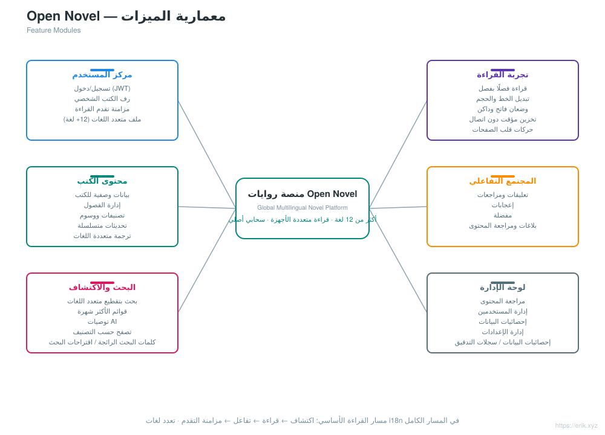
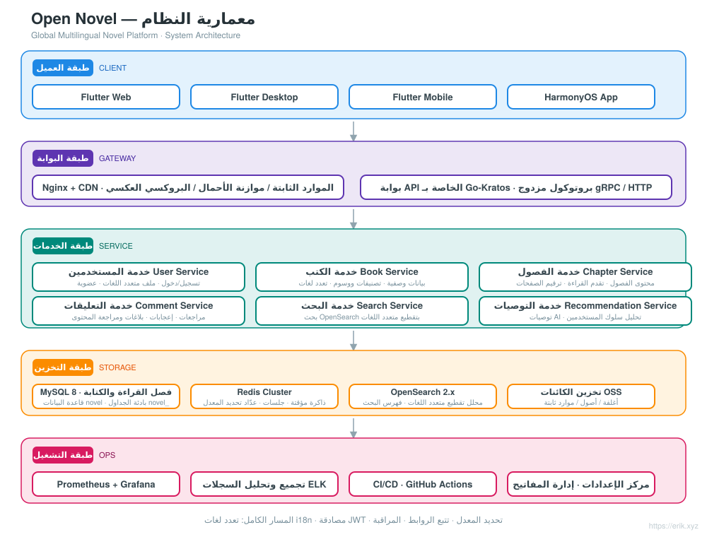
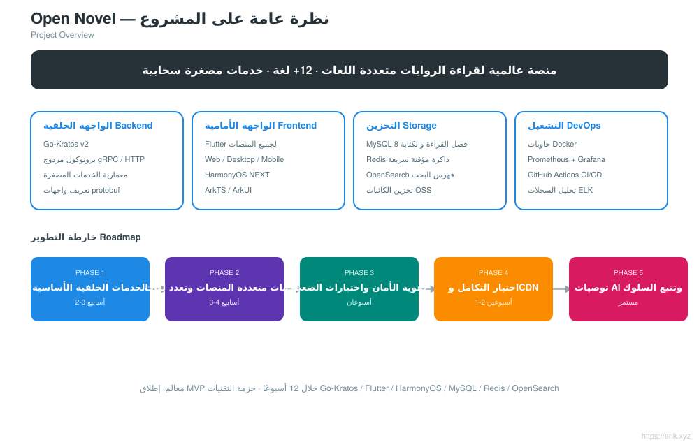
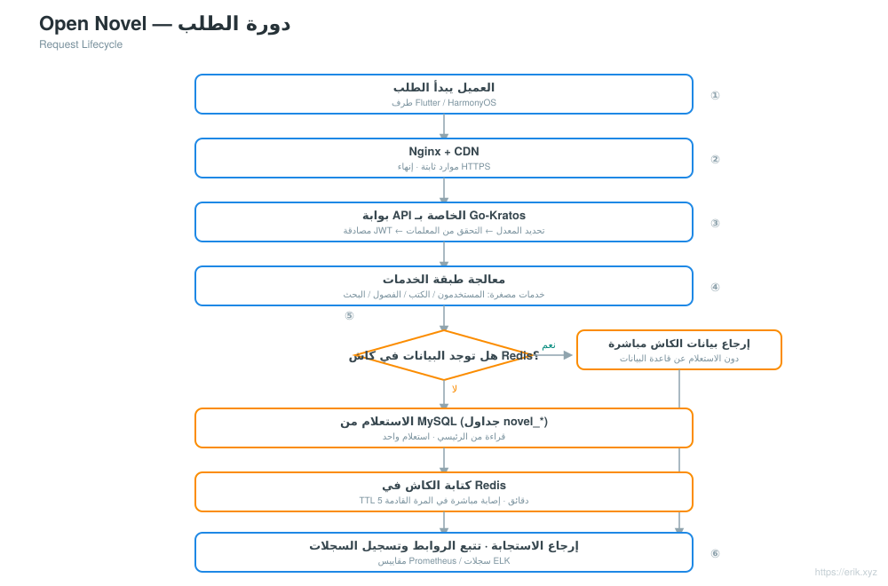
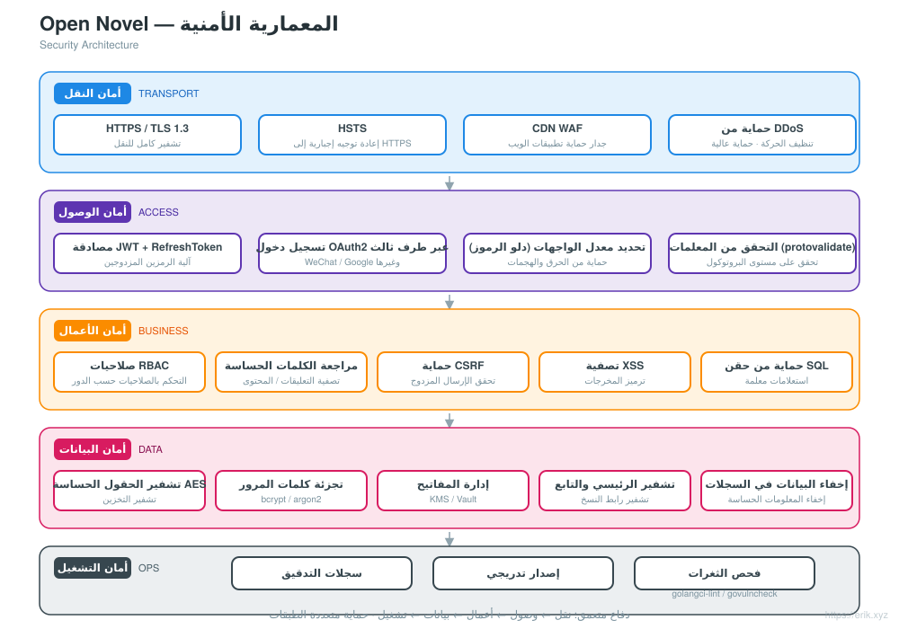
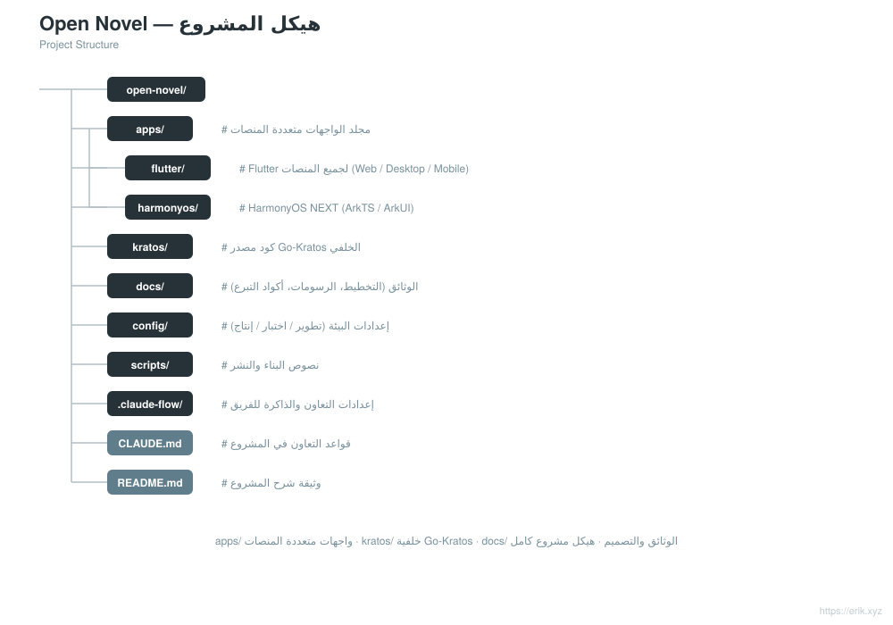

# Open Novel — منصة روايات عالمية متعددة اللغات

<div align="center">

[中文](../../README.md) · [English](README.en.md) · [日本語](README.ja.md) · [한국어](README.ko.md) · [Русский](README.ru.md) · [Deutsch](README.de.md) · [Français](README.fr.md) · [Español](README.es.md) · [Português](README.pt.md) · [हिन्दी](README.hi.md) · **العربية** · [বাংলা](README.bn.md) · [Bahasa Indonesia](README.id.md)

</div>

> منصة عالمية لقراءة الروايات متعددة اللغات، مبنية على معمارية الخدمات المصغرة **Go-Kratos** مع واجهات أمامية متعددة المنصات **Flutter / HarmonyOS**، تدعم **أكثر من 12 لغة رئيسية**، وتوفر لمستخدمي العالم أجمع قدرات القراءة والتفاعل والبحث والتوصيات الشخصية.

<div align="center"></div>

---

## مقدمة المشروع

Open Novel منصة عالمية للروايات متعددة اللغات بمعمارية خدمات مصغرة سحابية:

- **الواجهة الخلفية**: Go-Kratos v2 (بروتوكول مزدوج gRPC / HTTP)، خدمات مصغرة مقسمة حسب المجالات (المستخدمون، الكتب، الفصول، التعليقات، البحث، التوصيات)
- **الواجهة الأمامية**: Flutter لجميع المنصات (Web / Desktop / Mobile) + تطبيق HarmonyOS NEXT الأصلي، تشترك جميعها في نفس واجهات API الخلفية
- **تعدد اللغات**: تحميل ديناميكي لموارد i18n، يدعم أكثر من 12 لغة (الصينية، الإنجليزية، اليابانية، الكورية، الفرنسية، الألمانية، الإسبانية، الروسية، العربية وغيرها)
- **التخزين**: MySQL 8 (فصل القراءة والكتابة بين الرئيسي والتابع) + Redis (الذاكرة المؤقتة السريعة / الجلسات) + OpenSearch (بحث متعدد اللغات)
- **التشغيل**: نشر بضغطة واحدة عبر Docker Compose، مراقبة عبر Prometheus + Grafana، تكامل مستمر عبر GitHub Actions

## الميزات

<p align="center"></p>

- **مركز المستخدم**: التسجيل وتسجيل الدخول (JWT)، رف الكتب الشخصي، مزامنة تقدم القراءة عبر الأجهزة، ملف شخصي متعدد اللغات
- **تجربة القراءة**: قراءة فصلًا بفصل، تبديل الخط وحجمه، وضعان فاتح وداكن، تخزين مؤقت دون اتصال، حركات قلب الصفحات
- **محتوى الكتب**: بيانات وصفية للكتب، إدارة الفصول، تصنيفات ووسوم، تحديثات متسلسلة، ترجمة متعددة اللغات
- **المجتمع التفاعلي**: تعليقات ومراجعات، إعجابات، مفضلة، بلاغات ومراجعة المحتوى
- **البحث والاكتشاف**: بحث بتقطيع النصوص متعدد اللغات، قائمة الكلمات المفتاحية الرائجة، اقتراحات البحث (سجل محلي للعميل من 20 إدخالًا + اقتراحات بفاصل زمني 200 مللي ثانية)، توصيات AI، تصفح حسب التصنيف
- **لوحة الإدارة**: مراجعة المحتوى، إدارة المستخدمين، إحصائيات البيانات (لوحة المعلومات / DAU / التصنيفات / تحليل السلوك /api/stats/behavior)، إدارة الإعدادات (وسوم الفئات)، سير عمل الترجمة الآلية (DeepL، /api/admin/translate/*، صفحة «الترجمة» في لوحة الإدارة + التحرير اليدوي)، استعلام سجلات التدقيق (/api/admin/audit-logs)، إدارة مورّدي CDN (تكوين متعدد المورّدين / تفعيل-إيقاف / ترتيب، إعادة تحميل ساخنة بتأثير فوري)
- **الدفع وVIP**: مدفوعات متعددة القنوات عبر 11 مزودين (Stripe و NOWPayments (USDT) و Razorpay و KOMOJU و PortOne و Mercado Pago و Xendit و PayPal و Alipay و WeChat Pay Global, UnionPay)، اشتراك وتجديد خطط VIP، توجيه طرق الدفع حسب اللغة (WeChat Pay Global متكامل، WeChat Pay المحلي غير متكامل، يتطلب أهلية التاجر في الصين)

## معمارية النظام

<p align="center"></p>

النظام بأكمله مبني على معمارية الخدمات المصغرة Go-Kratos: تتفاعل تطبيقات Flutter / HarmonyOS مع بوابة API عبر Nginx + CDN متعدد المورّدين (Cloudflare / CloudFront للخط العالمي، Aliyun / Tencent Cloud للخط الصيني؛ قابل للتكوين من لوحة الإدارة، إعادة تحميل ساخنة لبصمة التكوين بتأثير فوري)؛ وتقوم البوابة بتوجيه الطلبات حسب المجالات إلى الخدمات الخلفية مثل المستخدمين والكتب والفصول والتعليقات والبحث والتوصيات؛ وطبقة البيانات هي MySQL رئيسي/تابع (فصل القراءة والكتابة) + ذاكرة Redis المؤقتة + فهرس بحث OpenSearch. التواصل بين الخدمات يتم عبر gRPC، وجميع واجهات HTTP الخارجية لها البادئة الموحدة `/api`.

مخططات التصميم الأخرى: نظرة عامة على المشروع [../project.svg](../project.svg) · دورة الطلب [../request-cycle.svg](../request-cycle.svg) · المعمارية الأمنية [../security.svg](../security.svg) · هيكل المشروع [../structure.svg](../structure.svg).

## نظرة عامة على المشروع

<p align="center"></p>

## دورة الطلب

<p align="center"></p>

## المعمارية الأمنية

<p align="center"></p>

## هيكل الدليل

```
open-novel/
├─ apps/                     # واجهات أمامية متعددة المنصات
│  ├─ flutter/               #   Flutter لجميع المنصات (Web / Desktop / Mobile)، تعدد لغات i18n
│  └─ harmonyos/             #   تطبيق HarmonyOS NEXT الأصلي (ArkTS / ArkUI)
├─ kratos/                   # كود مصدر إطار Go-Kratos (الإطار المصدر، يُحفظ كما هو، لا يُعدَّل)
│  └─ backend/               #   الواجهة الخلفية لأعمال هذا المشروع: نقطة دخول cmd/server + api/ + internal/ + sql/ + opensearch/
├─ docs/                     # وثائق المشروع (التخطيط، مخططات المعمارية، README i18n، رموز التبرع)
├─ scripts/                  # سكربتات البناء والنشر (الإصدار التلقائي post-push.sh، smoke.sh)
├─ docker-compose.yml        # مجموعة التبعيات المحلية: MySQL 8 + Redis 7 + OpenSearch 2
├─ CLAUDE.md                 # قواعد التعاون في المشروع
└─ README.md                 # وثيقة شرح المشروع
```

<p align="center"></p>

> ملاحظة: `kratos/` هو كود مصدر إطار Kratos (يتضمن README / LICENSE خاصًا به)، وجميع أكواد الأعمال موجودة في `kratos/backend/`.

## التقنيات المستخدمة

| الطبقة | التقنية |
| :--- | :--- |
| العميل | Flutter (Web / Desktop / Mobile)، HarmonyOS NEXT (ArkTS / ArkUI) |
| البوابة | Nginx + CDN متعدد المورّدين (Cloudflare / CloudFront / Aliyun / Tencent Cloud)، بوابة API الخاصة بـ Go-Kratos (بروتوكول مزدوج gRPC / HTTP) |
| الخادم | Go 1.22+، Kratos v2، protobuf / gRPC |
| التخزين | MySQL 8.0 (رئيسي/تابع)، Redis 7.x (Cluster)، OpenSearch 2.x، كاش L1 داخل العملية ristretto فوق Redis (مدة 30 ثانية) |
| المراقبة | Prometheus، Grafana، ELK، تتبع الروابط OpenTelemetry |
| التشغيل | Docker Compose، GitHub Actions CI/CD |

## قاعدة البيانات

- اسم قاعدة البيانات: `novel`
- بادئة الجداول: `novel_` (مثل `novel_user` و `novel_book` و `novel_chapter` و `novel_comment` وغيرها)

```sql
CREATE DATABASE novel DEFAULT CHARACTER SET utf8mb4 COLLATE utf8mb4_unicode_ci;
```

سكربت إنشاء الجداول: `kratos/backend/sql/init.sql` (يُنفَّذ تلقائيًا عند أول تشغيل لـ Docker Compose). تفاصيل تصميم الجداول واستراتيجية فصل القراءة والكتابة موجودة في [docs/novel-project-planning.md](../novel-project-planning.md).

## بادئة API

جميع واجهات HTTP الخلفية تبدأ بـ `/api`؛ يتم التفاوض على الإصدار عبر ترويسة `X-Api-Version: v1` (وليس في الرابط). تُقسم الواجهات حسب المجالات:

| المجال | أمثلة على المسارات | تعريف proto |
| :--- | :--- | :--- |
| المستخدمون | `/api/users` وغيرها | `kratos/backend/api/user/v1` |
| الكتب | `/api/books`、`/api/books/{id}`、`/api/categories`、`/api/tags` | `kratos/backend/api/book/v1` |
| الفصول | `/api/...` | `kratos/backend/api/chapter/v1` |
| التعليقات | `/api/...` | `kratos/backend/api/comment/v1` |
| البحث | `/api/...` | `kratos/backend/api/search/v1` |
| التوصيات | `/api/...` | `kratos/backend/api/recommendation/v1` |

تفاصيل المسارات موجودة في إعلانات `option (google.api.http)` داخل كل ملف proto.

## البدء السريع

```bash
# 1. تشغيل مجموعة التبعيات (MySQL / Redis / OpenSearch؛ ينشئ kratos/backend/sql/init.sql الجداول تلقائيًا عند أول تشغيل)
docker compose up -d

# 2. تشغيل الخدمة الخلفية (دليل أعمال Kratos، HTTP :8000 / gRPC :9000)
cd kratos/backend && go mod tidy && go run ./cmd/server

# 3. تشغيل تطبيق Flutter (يتصل بـ localhost:8000 افتراضيًا، دون إعدادات إضافية)
cd apps/client/flutter && flutter pub get && flutter run -d chrome
```

- تعيين منافذ مجموعة التبعيات: MySQL `3307` و Redis `6380` و OpenSearch `9200` (المنفذان 3306/6379 على المضيف مستخدمان من خدمات محلية، انظر تعليقات docker-compose.yml).
- عنوان الخادم والمفاتيح تُكوَّن في `kratos/backend/config/`، ويمكن تجاوزها بمتغيرات البيئة (مثل `PORT` و `OPENSEARCH_ADDR`).
- للاتصال بخادم آخر من Flutter: `flutter run -d chrome --dart-define=API_BASE_URL=http://<host>:8000`.

انظر [apps/README.md](../../apps/README.md) و [apps/client/flutter/README.md](../../apps/client/flutter/README.md) لمزيد من التفاصيل.

## عملية الإصدار

- **تلقائي**: بعد دفع `main`، تقوم GitHub Actions ([.github/workflows/release.yml](../../.github/workflows/release.yml)) تلقائيًا برفع رقم الإصدار patch استنادًا إلى أحدث وسم `v*`، وتنشئ الوسم وتدفعه، ثم تنشئ إصدار GitHub مع سجل تغييرات تدريجي؛ يُتخطى إذا كان HEAD يحمل وسم إصدار بالفعل. أول إصدار يبدأ من `v1.0.0`.
- **الحل اليدوي الاحتياطي**: شغّل [scripts/post-push.sh](../../scripts/post-push.sh) (يتطلب مصادقة `gh`): `echo "x y refs/heads/main z" | scripts/post-push.sh`.
- **يدوي**:

  ```bash
  git tag -a v1.0.1 -m "release v1.0.1"
  git push origin v1.0.1
  gh release create v1.0.1 --generate-notes
  ```

## خارطة الطريق

| المرحلة | المدة | محور المهام |
| :--- | :--- | :--- |
| Phase 1 | 2-3 أسابيع | خدمات Kratos الأساسية + تكامل MySQL / Redis / OpenSearch |
| Phase 2 | 3-4 أسابيع | واجهات Flutter / HarmonyOS متعددة المنصات + كتابة ملفات ARB متعددة اللغات |
| Phase 3 | أسبوعان | تقوية الأمان (JWT / RBAC / تحديد المعدل) + اختبارات الضغط |
| Phase 4 | 1-2 أسبوع | اختبار التكامل الشامل عبر المسار الكامل + إعداد تسريع CDN |
| Phase 5 | مستمر | دمج خوارزمية التوصيات AI، تتبع تحليلات سلوك المستخدم |

اكتملت جميع سلاسل المهام.

---

## الدعم والتبرعات

إذا كان هذا المشروع مفيدًا لك، فلا تتردد في دعمه عبر **Star** و **Fork**؛ كما نرحب بالتبرع عبر مسح رمز الاستجابة السريعة. كل دعم منك هو حافز لي للاستمرار في الصيانة والتحديث، شكرًا لتشجيعك!

<div align="center">

**تبرع WeChat** ｜ **تبرع Alipay**

　

</div>

### تبرع عبر التحويل البنكي العالمي (حوالة عبر الحدود)

【معلومات المستفيد】

- اسم المستفيد: WANG KEXUN
- رقم حساب المستفيد: 881015918251

【البنك المستلم】

- رمز ZA Bank SWIFT: AABLHKHHXXX
- اسم البنك: ZA Bank Limited
- رقم البنك: 387
- عنوان البنك: Core F, Cyberport 3, 100 Cyberport Road, Hong Kong

【البنك الوكيل للتحويل عبر الحدود (عند الحاجة)】

> يرجى الانتباه: هذه معلومات البنك الوكيل (البنك الوسيط) للتحويل عبر الحدود، وليست معلومات البنك المستلم. يرجى الاستفسار من البنك المُحوِّل عما إذا كان يلزم تقديم معلومات البنك الوكيل للتحويل عبر الحدود.

**البنك الوكيل لاستلام دولار هونغ كونغ واليوان والدولار الأمريكي هو Citibank**

- اسم البنك: Citibank N.A. Hong Kong
- رمز SWIFT: CITIHKHXXXX
- رقم البنك: 006
- اسم الفرع: Hong Kong Branch
- رقم الفرع: 391
- عنوان البنك: Citibank Tower, Citibank Plaza, 3 Garden Road, Central, Hong Kong

**البنك الوكيل للعملات الأخرى هو BNY Mellon**

- اسم البنك: THE BANK OF NEW YORK MELLON
- رمز SWIFT: IRVTUS3NXXX
- عنوان البنك: THE BANK OF NEW YORK MELLON, 240 GREENWICH STREET, NEW YORK, United States

### التبرع بالعملات الرقمية (Crypto Donation)

إذا كان هذا المشروع مفيدًا لك، فمرحبًا بمسح رمز الاستجابة السريعة للتبرع، شكرًا لك!

| الشبكة (Network) | رمز QR (QR Code) | عنوان المحفظة (Wallet Address) |
|---|---|---|
| BNB Smart Chain (BEP20) | [](../coin/1.jpg) | `0x355d429f97511897ccb4e271ec888205f9ab6629` |
| Tron (TRC20) | [](../coin/2.jpg) | `TEdDHWLajt1XvqtPDWmQctdrJaC3pzZZzz` |
| Ethereum (ERC20) | [](../coin/3.jpg) | `0x355d429f97511897ccb4e271ec888205f9ab6629` |
| Aptos | [](../coin/4.jpg) | `0x836e3780edfc3f7b2372b39e2a1a3a5d7adfaccd96c726f21cfde1b50dd68030` |
| Plasma | [](../coin/5.jpg) | `0x355d429f97511897ccb4e271ec888205f9ab6629` |
| Polygon POS | [](../coin/6.jpg) | `0x355d429f97511897ccb4e271ec888205f9ab6629` |
| Solana | [](../coin/7.jpg) | `2hfhboHdmdrYsY25XfQSsEWxq5ip4EQsR7f4AzSRMUyr` |
| The Open Network (TON) | [](../coin/8.jpg) | `UQB9kFQohzmXUir9QSSZq01iwl9aQZIDdBpNmDklljRtCoGK` |
| Arbitrum One | [](../coin/9.jpg) | `0x355d429f97511897ccb4e271ec888205f9ab6629` |
| AVAX C-Chain | [](../coin/10.jpg) | `0x355d429f97511897ccb4e271ec888205f9ab6629` |

---

## الترخيص وطرق التواصل

- **الترخيص**: لا يوجد LICENSE مستقل في جذر المستودع؛ `kratos/` هو كود المصدر الأعلى لإطار Kratos، ويخضع لـ [MIT License](../../kratos/LICENSE). ترخيص كود الأعمال يتبع إعلان المشروع لاحقًا.
- **طرق التواصل**: عبر GitHub Issues / PR؛ للتبرعات انظر «الدعم والتبرعات» أعلاه.
