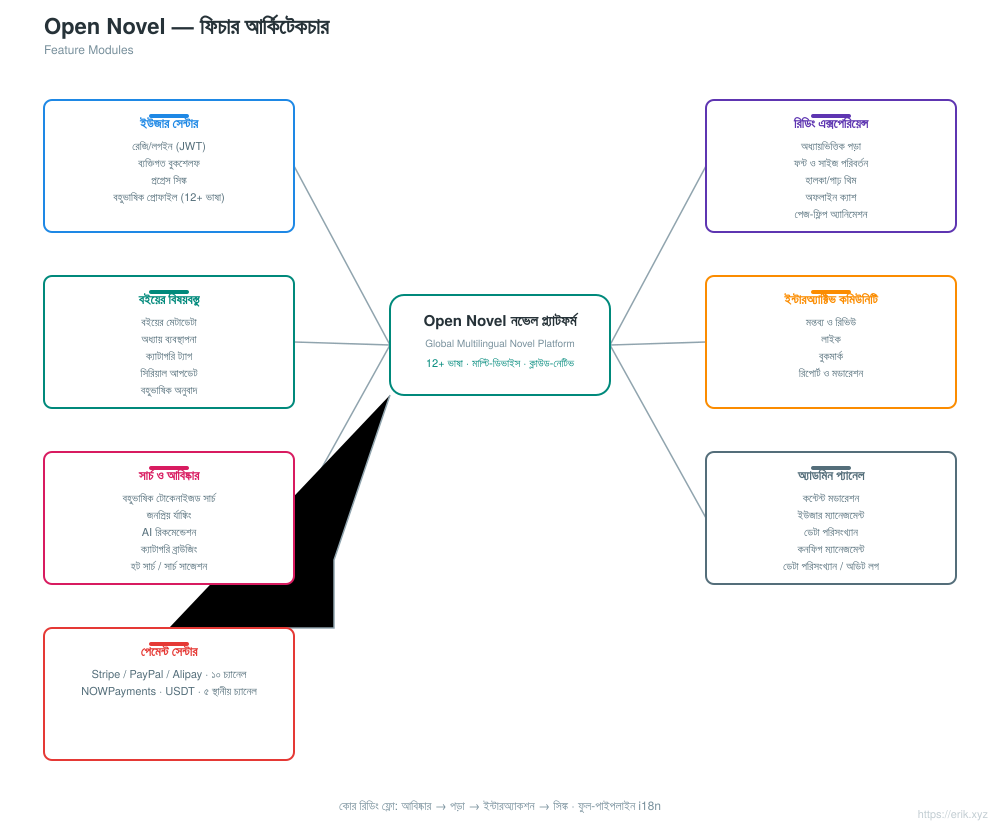
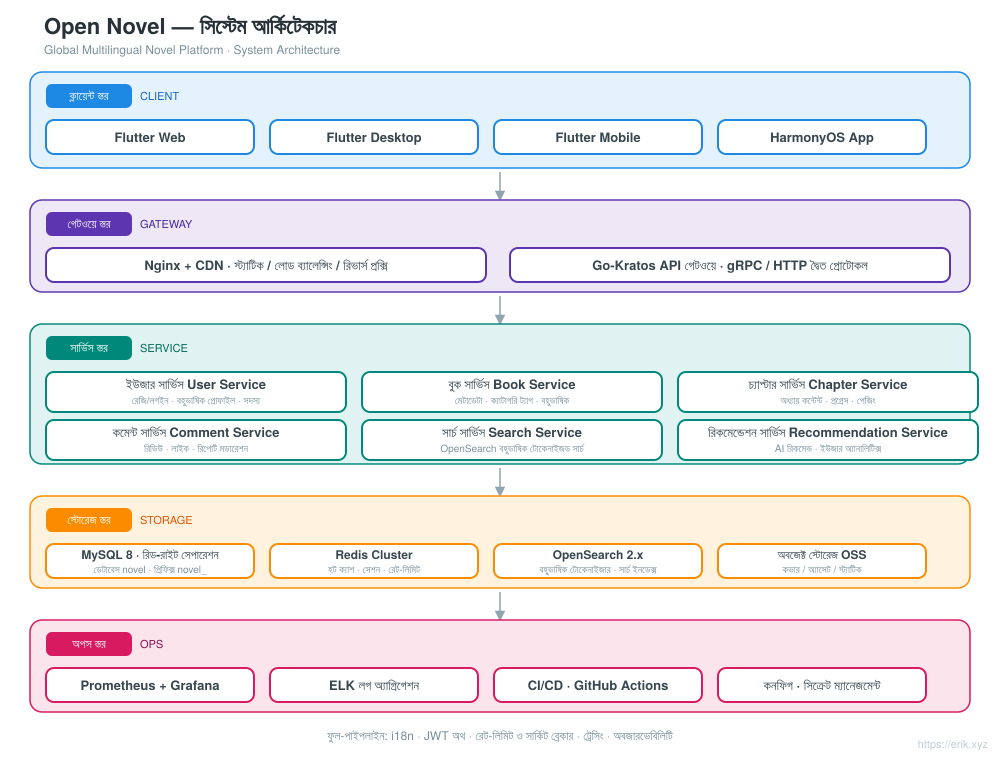
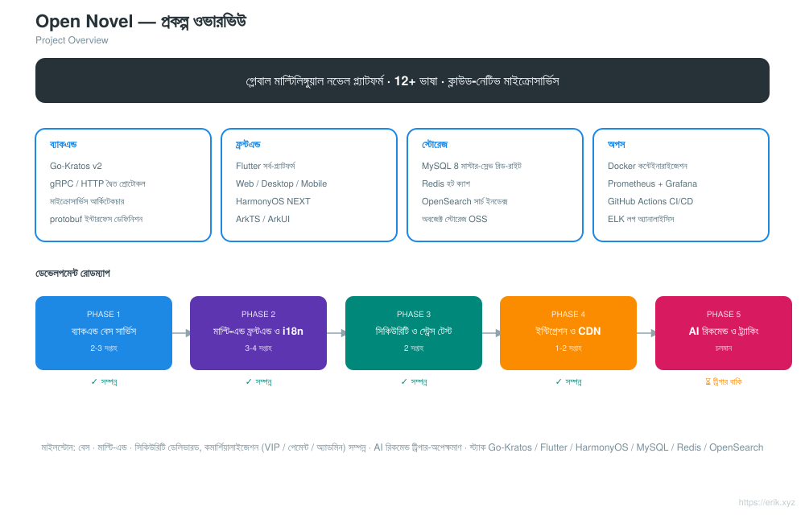
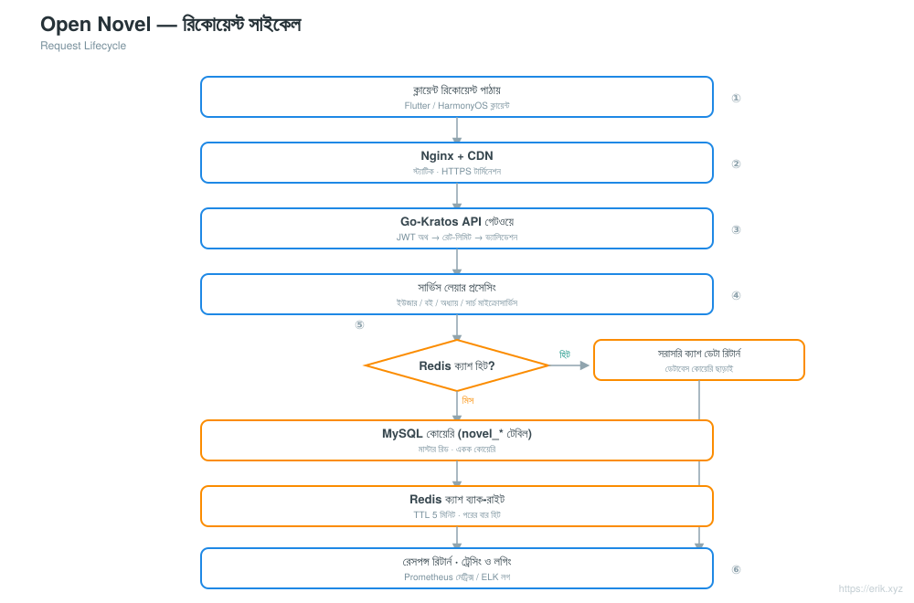
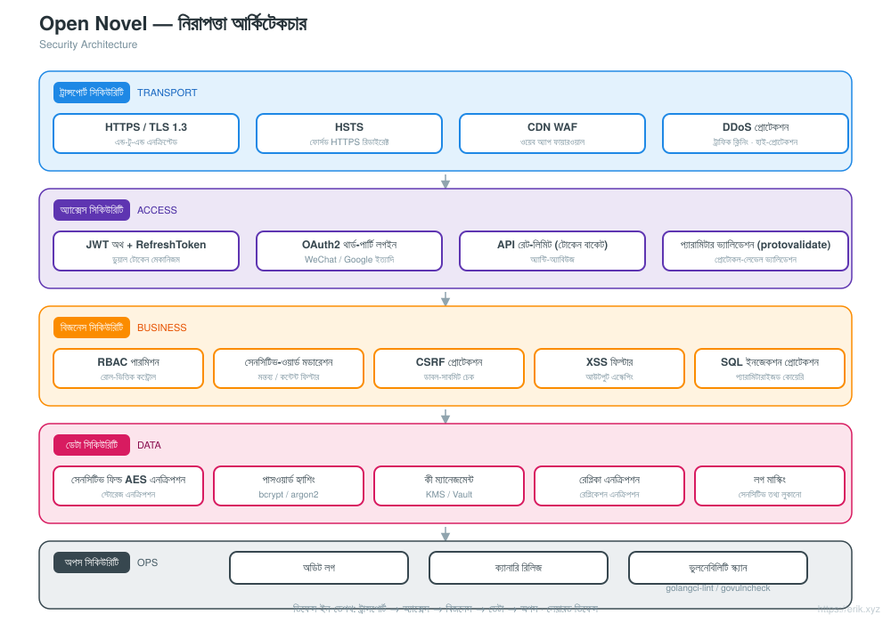
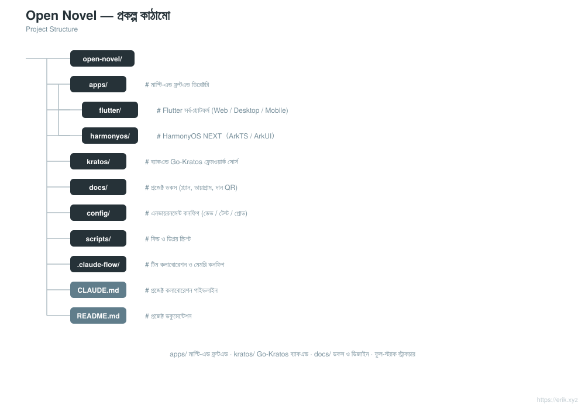

# Open Novel — বিশ্বব্যাপী বহুভাষিক উপন্যাস প্ল্যাটফর্ম

<div align="center">

[中文](../../README.md) · [English](README.en.md) · [日本語](README.ja.md) · [한국어](README.ko.md) · [Русский](README.ru.md) · [Deutsch](README.de.md) · [Français](README.fr.md) · [Español](README.es.md) · [Português](README.pt.md) · [हिन्दी](README.hi.md) · [العربية](README.ar.md) · **বাংলা** · [Bahasa Indonesia](README.id.md)

</div>

> **Go-Kratos** মাইক্রোসার্ভিস আর্কিটেকচার + **Flutter / HarmonyOS** মাল্টি-প্ল্যাটফর্ম ফ্রন্টএন্ডের উপর ভিত্তি করে গড়ে ওঠা বিশ্বব্যাপী বহুভাষিক উপন্যাস পড়ার প্ল্যাটফর্ম, যা **১২+টি প্রধান ভাষা** সমর্থন করে এবং বিশ্বজুড়ে ব্যবহারকারীদের পড়া, ইন্টারঅ্যাকশন, সার্চ ও ব্যক্তিগতকৃত রিকমেন্ডেশন সুবিধা প্রদান করে।

---

## প্রকল্প পরিচিতি

Open Novel একটি ক্লাউড-নেটিভ মাইক্রোসার্ভিস আর্কিটেকচারভিত্তিক বিশ্বব্যাপী বহুভাষিক উপন্যাস প্ল্যাটফর্ম:

- **ব্যাকএন্ড**: Go-Kratos v2 (gRPC / HTTP দ্বৈত প্রোটোকল), ডোমেইনভিত্তিতে বিভক্ত মাইক্রোসার্ভিস (ব্যবহারকারী, বই, অধ্যায়, মন্তব্য, সার্চ, রিকমেন্ডেশন)
- **ফ্রন্টএন্ড**: Flutter সর্ব-প্ল্যাটফর্ম (Web / Desktop / Mobile) + HarmonyOS NEXT নেটিভ অ্যাপ, সবগুলো একই ব্যাকএন্ড API ব্যবহার করে
- **বহুভাষিকতা**: i18n রিসোর্স ডায়নামিকভাবে লোড হয়, ১২+ ভাষা সমর্থন করে (চীনা, ইংরেজি, জাপানি, কোরিয়ান, ফরাসি, জার্মান, স্প্যানিশ, রুশ, আরবি ইত্যাদি)
- **স্টোরেজ**: MySQL 8 (মাস্টার-স্লেভ রিড-রাইট সেপারেশন) + Redis (হট ক্যাশ / সেশন) + OpenSearch (বহুভাষিক সার্চ)
- **অপারেশন**: Docker Compose এক-ক্লিক ডিপ্লয়মেন্ট, Prometheus + Grafana মনিটরিং, GitHub Actions কন্টিনিউয়াস ইন্টিগ্রেশন

## বৈশিষ্ট্যসমূহ

<p align="center"></p>

- **ব্যবহারকারী সেন্টার**: রেজিস্ট্রেশন/লগইন (JWT), ব্যক্তিগত বুকশেলফ, ডিভাইস জুড়ে পড়ার অগ্রগতি সিঙ্ক, বহুভাষিক প্রোফাইল
- **পড়ার অভিজ্ঞতা**: অধ্যায়ভিত্তিক পড়া, ফন্ট ও সাইজ পরিবর্তন, হালকা/গাঢ় থিম, অফলাইন ক্যাশ, পেজ-ফ্লিপ অ্যানিমেশন
- **বইয়ের বিষয়বস্তু**: বইয়ের মেটাডেটা, অধ্যায় ব্যবস্থাপনা, ক্যাটাগরি ট্যাগ, সিরিয়াল আপডেট, বহুভাষিক অনুবাদ
- **ইন্টারঅ্যাক্টিভ কমিউনিটি**: মন্তব্য ও রিভিউ, লাইক, বুকমার্ক, রিপোর্ট ও মডারেশন
- **সার্চ ও আবিষ্কার**: বহুভাষিক টোকেনাইজেশন সার্চ, জনপ্রিয় র্যাঙ্কিং, AI রিকমেন্ডেশন, ক্যাটাগরি ব্রাউজিং
- **অ্যাডমিন প্যানেল**: কন্টেন্ট মডারেশন, ইউজার ম্যানেজমেন্ট, ডেটা পরিসংখ্যান, কনফিগারেশন ম্যানেজমেন্ট

## সিস্টেম আর্কিটেকচার

<p align="center"></p>

পুরো সিস্টেমটি Go-Kratos মাইক্রোসার্ভিস আর্কিটেকচারের উপর ভিত্তি করে তৈরি: Flutter / HarmonyOS ক্লায়েন্ট Nginx + CDN এর মাধ্যমে API গেটওয়ের সাথে ইন্টারঅ্যাক্ট করে; গেটওয়ে ডোমেইন অনুযায়ী ব্যবহারকারী, বই, অধ্যায়, মন্তব্য, সার্চ, রিকমেন্ডেশন ইত্যাদি ব্যাকএন্ড সার্ভিসে রাউট করে; ডেটা লেয়ার হলো MySQL মাস্টার-স্লেভ (রিড-রাইট সেপারেশন) + Redis ক্যাশ + OpenSearch সার্চ ইনডেক্স। সার্ভিসগুলোর মধ্যে gRPC কমিউনিকেশন হয়, বাহ্যিক HTTP ইন্টারফেসের ইউনিফাইড প্রিফিক্স `/api`।

অন্যান্য ডিজাইন ডায়াগ্রাম: প্রকল্পের সার্বিক চিত্র [../project.svg](../project.svg) · রিকোয়েস্ট সাইকেল [../request-cycle.svg](../request-cycle.svg) · নিরাপত্তা আর্কিটেকচার [../security.svg](../security.svg) · প্রকল্প কাঠামো [../structure.svg](../structure.svg)।

## প্রকল্পের সার্বিক চিত্র

<p align="center"></p>

## রিকোয়েস্ট সাইকেল

<p align="center"></p>

## নিরাপত্তা আর্কিটেকচার

<p align="center"></p>

## ডিরেক্টরি স্ট্রাকচার

```
open-novel/
├─ apps/                     # মাল্টি-এন্ড ফ্রন্টএন্ড
│  ├─ flutter/               #   Flutter সর্ব-প্ল্যাটফর্ম (Web / Desktop / Mobile), i18n বহুভাষিক
│  └─ harmonyos/             #   HarmonyOS NEXT নেটিভ অ্যাপ (ArkTS / ArkUI)
├─ kratos/                   # Go-Kratos ফ্রেমওয়ার্ক সোর্স কোড (আপস্ট্রিম ফ্রেমওয়ার্ক, অপরিবর্তিত রাখুন, বদলাবেন না)
│  └─ backend/               #   এই প্রজেক্টের বিজনেস ব্যাকএন্ড: cmd/server এন্ট্রি + api/ + internal/ + sql/ + opensearch/
├─ docs/                     # প্রজেক্ট ডকুমেন্টেশন (প্ল্যানিং, আর্কিটেকচার ডায়াগ্রাম, i18n README, দান কোড)
├─ scripts/                  # বিল্ড ও ডিপ্লয় স্ক্রিপ্ট (post-push.sh অটো রিলিজ, smoke.sh)
├─ docker-compose.yml        # লোকাল ডিপেন্ডেন্সি স্ট্যাক: MySQL 8 + Redis 7 + OpenSearch 2
├─ CLAUDE.md                 # প্রজেক্ট সহযোগিতার নিয়মাবলি
└─ README.md                 # প্রজেক্ট ডকুমেন্টেশন
```

<p align="center"></p>

> নোট: `kratos/` হলো Kratos ফ্রেমওয়ার্কের সোর্স কোড (এর সাথে README / LICENSE আছে), সব বিজনেস কোড `kratos/backend/`-এ অবস্থিত।

## টেকনোলজি স্ট্যাক

| স্তর | প্রযুক্তি নির্বাচন |
| :--- | :--- |
| ক্লায়েন্ট | Flutter (Web / Desktop / Mobile), HarmonyOS NEXT (ArkTS / ArkUI) |
| গেটওয়ে | Nginx + CDN, Go-Kratos API গেটওয়ে (gRPC / HTTP দ্বৈত প্রোটোকল) |
| সার্ভার | Go 1.22+, Kratos v2, protobuf / gRPC |
| স্টোরেজ | MySQL 8.0 (মাস্টার-স্লেভ), Redis 7.x (Cluster), OpenSearch 2.x |
| অবজারভেবিলিটি | Prometheus, Grafana, ELK, OpenTelemetry ট্রেসিং |
| অপারেশন | Docker Compose, GitHub Actions CI/CD |

## ডেটাবেস

- ডেটাবেসের নাম: `novel`
- টেবিল প্রিফিক্স: `novel_` (যেমন `novel_user`, `novel_book`, `novel_chapter`, `novel_comment` ইত্যাদি)

```sql
CREATE DATABASE novel DEFAULT CHARACTER SET utf8mb4 COLLATE utf8mb4_unicode_ci;
```

টেবিল তৈরির স্ক্রিপ্ট: `kratos/backend/sql/init.sql` (Docker Compose প্রথমবার চালু হলে স্বয়ংক্রিয়ভাবে চলে)। বিস্তারিত টেবিল ডিজাইন ও রিড-রাইট সেপারেশন কৌশলের জন্য [docs/novel-project-planning.md](../novel-project-planning.md) দেখুন।

## API প্রিফিক্স

ব্যাকএন্ডের সব HTTP ইন্টারফেস `/api` দিয়ে শুরু হয়; সংস্করণ `X-Api-Version: v1` হেডারের মাধ্যমে নির্ধারিত হয় (URL-এ নয়)। এন্ডপয়েন্ট ডোমেইন অনুযায়ী গ্রুপ করা:

| ডোমেইন | উদাহরণ রুট | proto ডেফিনিশন |
| :--- | :--- | :--- |
| ব্যবহারকারী | `/api/users` ইত্যাদি | `kratos/backend/api/user/v1` |
| বই | `/api/books`、`/api/books/{id}`、`/api/categories`、`/api/tags` | `kratos/backend/api/book/v1` |
| অধ্যায় | `/api/...` | `kratos/backend/api/chapter/v1` |
| মন্তব্য | `/api/...` | `kratos/backend/api/comment/v1` |
| সার্চ | `/api/...` | `kratos/backend/api/search/v1` |
| রিকমেন্ডেশন | `/api/...` | `kratos/backend/api/recommendation/v1` |

বিস্তারিত রুটের জন্য প্রতিটি proto ফাইলের `option (google.api.http)` ঘোষণা দেখুন।

## দ্রুত শুরু

```bash
# 1. ডিপেন্ডেন্সি স্ট্যাক চালু করুন (MySQL / Redis / OpenSearch; প্রথমবার চালু হলে kratos/backend/sql/init.sql স্বয়ংক্রিয়ভাবে টেবিল তৈরি করে)
docker compose up -d

# 2. ব্যাকএন্ড সার্ভিস চালু করুন (Kratos বিজনেস ডিরেক্টরি, HTTP :8000 / gRPC :9000)
cd kratos/backend && go mod tidy && go run ./cmd/server

# 3. Flutter এন্ড চালু করুন (ডিফল্টভাবে localhost:8000-এর সাথে সংযুক্ত হয়, অতিরিক্ত কনফিগারেশনের প্রয়োজন নেই)
cd apps/client/flutter && flutter pub get && flutter run -d chrome
```

- ডিপেন্ডেন্সি স্ট্যাক পোর্ট ম্যাপিং: MySQL `3307`, Redis `6380`, OpenSearch `9200` (হোস্টের 3306/6379 লোকাল সার্ভিস ব্যবহার করে, docker-compose.yml-এর কমেন্ট দেখুন)।
- ব্যাকএন্ড ঠিকানা ও কী `kratos/backend/config/`-এ কনফিগার করা হয়, এনভায়রনমেন্ট ভেরিয়েবল (যেমন `PORT`, `OPENSEARCH_ADDR`) দিয়ে ওভাররাইড করা যায়।
- অন্য ব্যাকএন্ডের সাথে Flutter সংযোগ: `flutter run -d chrome --dart-define=API_BASE_URL=http://<host>:8000`।

বিস্তারিত জানতে দেখুন [apps/README.md](../../apps/README.md) এবং [apps/client/flutter/README.md](../../apps/client/flutter/README.md)।

## রিলিজ প্রক্রিয়া

- **স্বয়ংক্রিয়**: `main` পুশ করার পর GitHub Actions ([.github/workflows/release.yml](../../.github/workflows/release.yml)) সর্বশেষ `v*` ট্যাগের ভিত্তিতে patch ভার্সন স্বয়ংক্রিয়ভাবে বাড়ায়, ট্যাগ তৈরি করে পুশ করে, তারপর ইনক্রিমেন্টাল changelog দিয়ে GitHub Release তৈরি করে; HEAD-এ ইতিমধ্যে ভার্সন ট্যাগ থাকলে এড়িয়ে যায়। প্রথম রিলিজ `v1.0.0` থেকে শুরু হয়।
- **ম্যানুয়াল ফলব্যাক**: [scripts/post-push.sh](../../scripts/post-push.sh) চালান (`gh` অথেনটিকেটেড থাকা প্রয়োজন): `echo "x y refs/heads/main z" | scripts/post-push.sh`.
- **ম্যানুয়াল**:

  ```bash
  git tag -a v1.0.1 -m "release v1.0.1"
  git push origin v1.0.1
  gh release create v1.0.1 --generate-notes
  ```

## রোডম্যাপ

| পর্যায় | সময়কাল | কাজের মূল ফোকাস |
| :--- | :--- | :--- |
| Phase 1 | ২-৩ সপ্তাহ | Kratos ব্যাকএন্ড বেস সার্ভিস + MySQL / Redis / OpenSearch ইন্টিগ্রেশন |
| Phase 2 | ৩-৪ সপ্তাহ | Flutter / HarmonyOS মাল্টি-প্ল্যাটফর্ম ফ্রন্টএন্ড + বহুভাষিক ARB লেখা |
| Phase 3 | ২ সপ্তাহ | সিকিউরিটি হার্ডেনিং (JWT / RBAC / রেট লিমিটিং) + স্ট্রেস টেস্ট |
| Phase 4 | ১-২ সপ্তাহ | ফুল-পাইপলাইন ইন্টিগ্রেশন টেস্ট + CDN এক্সিলারেশন কনফিগারেশন |
| Phase 5 | চলমান | AI রিকমেন্ডেশন অ্যালগরিদম ইন্টিগ্রেশন, ইউজার বিহেভিয়ার অ্যানালিটিক্স ট্র্যাকিং |

---

## সাপোর্ট ও দান

যদি এই প্রকল্পটি আপনার কাজে লাগে, তাহলে **Star** ও **Fork** দিয়ে সাপোর্ট করতে স্বাগতম; স্ক্যান করে দান করেও সাপোর্ট করতে পারেন। আপনার প্রতিটি সমর্থনই আমার নিয়মিত মেইনটেন্যান্স ও আপডেটের চালিকাশক্তি, আপনার উৎসাহের জন্য ধন্যবাদ!

<div align="center">

**WeChat দান** ｜ **Alipay দান**

　

</div>

### বৈশ্বিক ব্যাংক ট্রান্সফার দান (ক্রস-বর্ডার রেমিট্যান্স)

【প্রাপকের তথ্য】

- প্রাপকের নাম: WANG KEXUN
- প্রাপকের অ্যাকাউন্ট নম্বর: 881015918251

【প্রাপক ব্যাংক】

- ZA Bank SWIFT কোড: AABLHKHHXXX
- ব্যাংকের নাম: ZA Bank Limited
- ব্যাংক কোড: 387
- ব্যাংকের ঠিকানা: Core F, Cyberport 3, 100 Cyberport Road, Hong Kong

【ক্রস-বর্ডার রেমিট্যান্স এজেন্ট ব্যাংক (প্রয়োজন হলে)】

> অনুগ্রহ করে লক্ষ্য করুন: এটি ক্রস-বর্ডার রেমিট্যান্স এজেন্ট ব্যাংক (মধ্যস্থতাকারী ব্যাংক) এর তথ্য, প্রাপক ব্যাংকের তথ্য নয়। রেমিট্যান্স পাঠানোর ব্যাংককে জিজ্ঞাসা করুন ক্রস-বর্ডার এজেন্ট ব্যাংকের তথ্য প্রদান করা প্রয়োজন কিনা।

**হংকং ডলার, রেনমিনবি ও মার্কিন ডলারের জন্য এজেন্ট ব্যাংক Citibank**

- ব্যাংকের নাম: Citibank N.A. Hong Kong
- SWIFT কোড: CITIHKHXXXX
- ব্যাংক কোড: 006
- শাখার নাম: Hong Kong Branch
- শাখা কোড: 391
- ব্যাংকের ঠিকানা: Citibank Tower, Citibank Plaza, 3 Garden Road, Central, Hong Kong

**অন্যান্য মুদ্রার জন্য এজেন্ট ব্যাংক BNY Mellon**

- ব্যাংকের নাম: THE BANK OF NEW YORK MELLON
- SWIFT কোড: IRVTUS3NXXX
- ব্যাংকের ঠিকানা: THE BANK OF NEW YORK MELLON, 240 GREENWICH STREET, NEW YORK, United States

### ক্রিপ্টো দান (Crypto Donation)

এই প্রকল্পটি আপনার কাজে লাগলে, দান করতে QR কোড স্ক্যান করুন, ধন্যবাদ!

| নেটওয়ার্ক (Network) | QR কোড (QR Code) | ওয়ালেট ঠিকানা (Wallet Address) |
|---|---|---|
| BNB Smart Chain (BEP20) | [](../coin/1.jpg) | `0x355d429f97511897ccb4e271ec888205f9ab6629` |
| Tron (TRC20) | [](../coin/2.jpg) | `TEdDHWLajt1XvqtPDWmQctdrJaC3pzZZzz` |
| Ethereum (ERC20) | [](../coin/3.jpg) | `0x355d429f97511897ccb4e271ec888205f9ab6629` |
| Aptos | [](../coin/4.jpg) | `0x836e3780edfc3f7b2372b39e2a1a3a5d7adfaccd96c726f21cfde1b50dd68030` |
| Plasma | [](../coin/5.jpg) | `0x355d429f97511897ccb4e271ec888205f9ab6629` |
| Polygon POS | [](../coin/6.jpg) | `0x355d429f97511897ccb4e271ec888205f9ab6629` |
| Solana | [](../coin/7.jpg) | `2hfhboHdmdrYsY25XfQSsEWxq5ip4EQsR7f4AzSRMUyr` |
| The Open Network (TON) | [](../coin/8.jpg) | `UQB9kFQohzmXUir9QSSZq01iwl9aQZIDdBpNmDklljRtCoGK` |
| Arbitrum One | [](../coin/9.jpg) | `0x355d429f97511897ccb4e271ec888205f9ab6629` |
| AVAX C-Chain | [](../coin/10.jpg) | `0x355d429f97511897ccb4e271ec888205f9ab6629` |

---

## লাইসেন্স ও যোগাযোগ

- **লাইসেন্স**: রিপোজিটরি রুটে আলাদা কোনো LICENSE নেই; `kratos/` হলো Kratos ফ্রেমওয়ার্কের আপস্ট্রিম সোর্স কোড, যা এর [MIT License](../../kratos/LICENSE) অনুসরণ করে। বিজনেস কোডের লাইসেন্স প্রকল্পের পরবর্তী ঘোষণা অনুযায়ী হবে।
- **যোগাযোগ**: GitHub Issues / PR-এর মাধ্যমে; দানের জন্য উপরে «সাপোর্ট ও দান» দেখুন।
