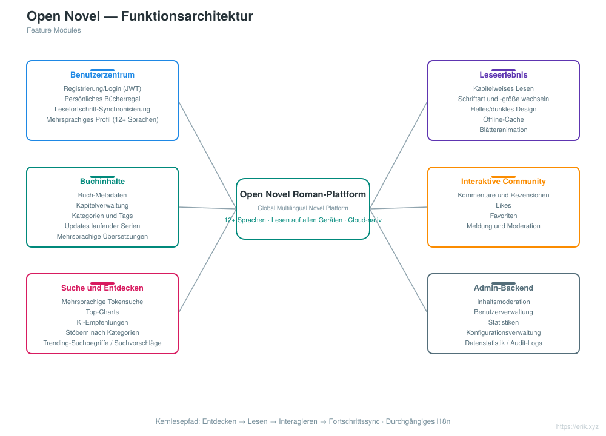
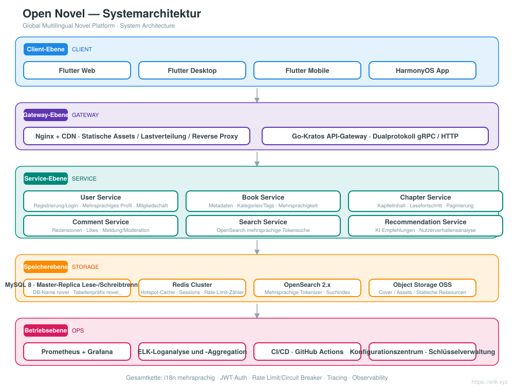
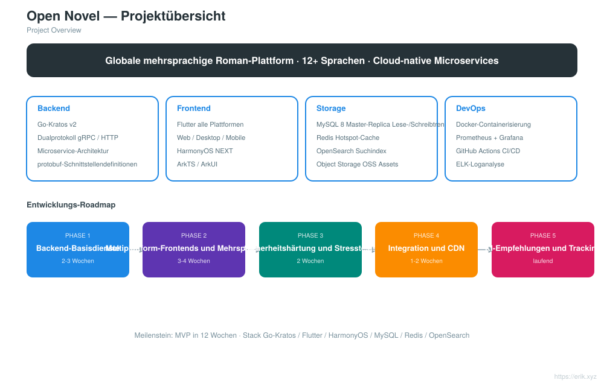
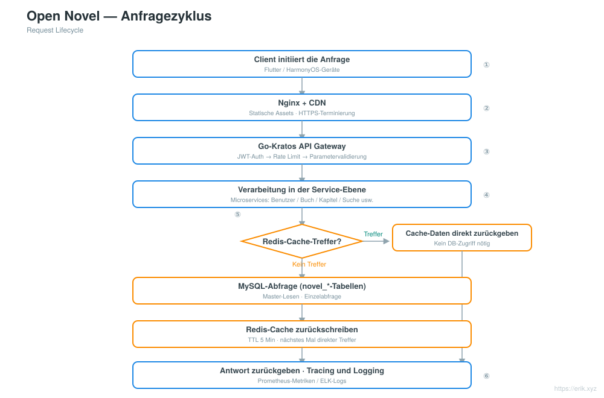
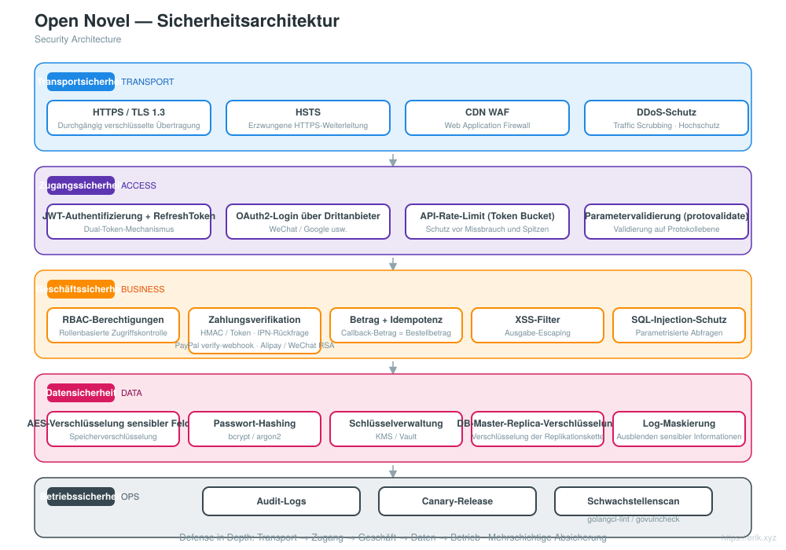
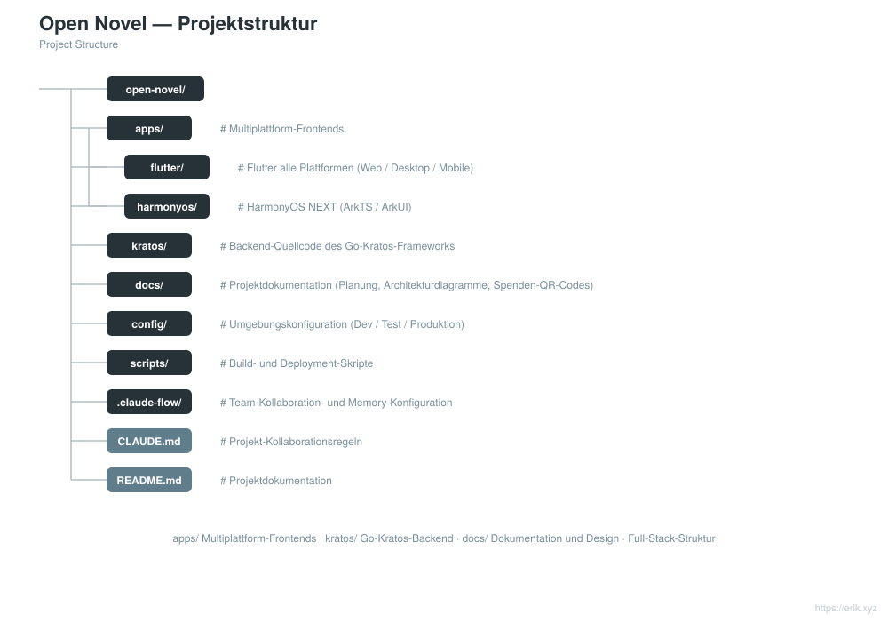

# Open Novel — globale mehrsprachige Plattform für Online-Romane

<div align="center">

[中文](../../README.md) · [English](README.en.md) · [日本語](README.ja.md) · [한국어](README.ko.md) · [Русский](README.ru.md) · **Deutsch** · [Français](README.fr.md) · [Español](README.es.md) · [Português](README.pt.md) · [हिन्दी](README.hi.md) · [العربية](README.ar.md) · [বাংলা](README.bn.md) · [Bahasa Indonesia](README.id.md)

</div>

> Eine globale mehrsprachige Plattform für Online-Romane auf Basis der **Go-Kratos**-Mikroservicearchitektur mit **Flutter / HarmonyOS**-Multiplattform-Frontends, die **12+ Hauptsprachen** unterstützt und Nutzern weltweit Lesen, Interaktion, Suche und personalisierte Empfehlungen bietet.

---

## Projektübersicht

Open Novel ist eine globale mehrsprachige Roman-Plattform mit cloudnativer Mikroservicearchitektur:

- **Backend**: Go-Kratos v2 (Doppelprotokoll gRPC / HTTP), Mikroservices nach Domänen aufgeteilt (Benutzer, Bücher, Kapitel, Kommentare, Suche, Empfehlungen)
- **Frontend**: Flutter auf allen Plattformen (Web / Desktop / Mobile) + native HarmonyOS-NEXT-App, alle mit derselben Backend-API
- **Mehrsprachigkeit**: dynamisches Laden von i18n-Ressourcen, Unterstützung für 12+ Sprachen (Chinesisch, Englisch, Japanisch, Koreanisch, Französisch, Deutsch, Spanisch, Russisch, Arabisch usw.)
- **Speicherung**: MySQL 8 (Master-Replica mit Lese-/Schreibtrennung) + Redis (Hotspot-Cache / Sessions) + OpenSearch (mehrsprachige Suche)
- **Betrieb**: Ein-Klick-Bereitstellung per Docker Compose, Überwachung mit Prometheus + Grafana, kontinuierliche Integration mit GitHub Actions

## Funktionen

<p align="center"></p>

- **Benutzerkonto**: Registrierung/Login (JWT), persönliches Bücherregal, Synchronisierung des Lesefortschritts über Geräte hinweg, mehrsprachiges Profil
- **Leseerlebnis**: kapitelweises Lesen, Schriftart- und Schriftgrößenwechsel, helles/dunkles Design, Offline-Cache, Blätteranimationen
- **Buchinhalte**: Buch-Metadaten, Kapitelverwaltung, Kategorien und Tags, Updates laufender Serien, mehrsprachige Übersetzungen
- **Interaktive Community**: Kommentare und Rezensionen, Likes, Favoriten, Meldung und Moderation
- **Suche & Entdecken**: mehrsprachige Tokensuche, Top-Charts, KI-Empfehlungen, Stöbern nach Kategorien
- **Admin-Backend**: Inhaltsmoderation, Benutzerverwaltung, Statistiken, Konfigurationsverwaltung

## Systemarchitektur

<p align="center"></p>

## Projektübersicht (Diagramm)

<p align="center"></p>

## Anfragezyklus

<p align="center"></p>

## Sicherheitsarchitektur

<p align="center"></p>

## Projektstruktur

<p align="center"></p>

---

## Technologie-Stack

| Ebene | Technologien |
| :--- | :--- |
| Client | Flutter (Web / Desktop / Mobile), HarmonyOS NEXT (ArkTS / ArkUI) |
| Gateway | Nginx + CDN, Go-Kratos-API-Gateway (Doppelprotokoll gRPC / HTTP) |
| Server | Go 1.22+, Kratos v2, protobuf / gRPC |
| Speicher | MySQL 8.0 (Master-Replica), Redis 7.x (Cluster), OpenSearch 2.x |
| Observability | Prometheus, Grafana, ELK, OpenTelemetry-Tracing |
| Betrieb | Docker Compose, GitHub Actions CI/CD |

## Datenbank

- Datenbankname: `novel`
- Tabellenpräfix: `novel_` (z. B. `novel_user`, `novel_book`, `novel_chapter`, `novel_comment` usw.)

```sql
CREATE DATABASE novel DEFAULT CHARACTER SET utf8mb4 COLLATE utf8mb4_unicode_ci;
```

Detailliertes Tabellendesign und die Strategie zur Lese-/Schreibtrennung finden Sie in [docs/novel-project-planning.md](../novel-project-planning.md).

## Verzeichnisse der Client-Apps

```
apps/
├─ flutter/     # Flutter 全平台（Web / Desktop / Mobile），i18n 多语言
└─ harmonyos/   # HarmonyOS NEXT 原生应用（ArkTS / ArkUI）
```

Siehe [apps/README.md](../../apps/README.md).

## Roadmap

| Phase | Zeitraum | Schwerpunkte |
| :--- | :--- | :--- |
| Phase 1 | 2-3 Wochen | Kratos-Backend-Basisdienste + Integration von MySQL / Redis / OpenSearch |
| Phase 2 | 3-4 Wochen | Flutter / HarmonyOS-Multi-Endgeräte-Frontends + Erstellung mehrsprachiger ARB-Dateien |
| Phase 3 | 2 Wochen | Sicherheitshärtung (JWT / RBAC / Ratenbegrenzung) + Stresstests |
| Phase 4 | 1-2 Wochen | End-to-End-Integration aller Komponenten + Konfiguration der CDN-Beschleunigung |
| Phase 5 | laufend | Integration von KI-Empfehlungsalgorithmen, Tracking zur Analyse des Nutzerverhaltens |

## Lokale Entwicklung

```bash
# 启动依赖（MySQL / Redis / OpenSearch）
docker compose up -d

# 后端服务（Kratos 工作区）
cd backend && go mod tidy && go run ./cmd/server

# Flutter 端
cd apps/flutter && flutter pub get && flutter run

# HarmonyOS 端
cd apps/harmonyos && hvigorw assembleHap
```

---

## Unterstützung und Spenden

Wenn Ihnen dieses Projekt hilft, unterstützen Sie es gern mit **Star** und **Fork**; auch Spenden per QR-Code sind willkommen. Jede Unterstützung motiviert mich, das Projekt weiter zu pflegen und zu aktualisieren. Danke für Ihre Ermutigung!

<div align="center">

**WeChat-Spende** ｜ **Alipay-Spende**

　

</div>

### Globale Spenden per Überweisung (internationale Überweisung)

【Informationen zum Empfänger】

- Name des Empfängers: WANG KEXUN
- Kontonummer des Empfängers: 881015918251

【Empfängerbank】

- SWIFT Code der ZA Bank: AABLHKHHXXX
- Bankname: ZA Bank Limited
- Bankleitzahl: 387
- Bankadresse: Core F, Cyberport 3, 100 Cyberport Road, Hong Kong

【Korrespondenzbank für internationale Überweisungen (falls erforderlich)】

> Bitte beachten Sie: Dies sind die Angaben der Korrespondenzbank (Zwischenbank) für internationale Überweisungen, nicht die der Empfängerbank. Erkundigen Sie sich bei Ihrer Bank, ob die Angabe der Korrespondenzbank erforderlich ist.

**Für Überweisungen in Hongkong-Dollar, chinesischen Yuan und US-Dollar ist Citibank die Korrespondenzbank**

- Bankname: Citibank N.A. Hong Kong
- SWIFT Code: CITIHKHXXXX
- Bankleitzahl: 006
- Filialname: Hong Kong Branch
- Filialnummer: 391
- Bankadresse: Citibank Tower, Citibank Plaza, 3 Garden Road, Central, Hong Kong

**Für Überweisungen in anderen Währungen ist BNY Mellon die Korrespondenzbank**

- Bankname: THE BANK OF NEW YORK MELLON
- SWIFT Code: IRVTUS3NXXX
- Bankadresse: THE BANK OF NEW YORK MELLON, 240 GREENWICH STREET, NEW YORK, United States
