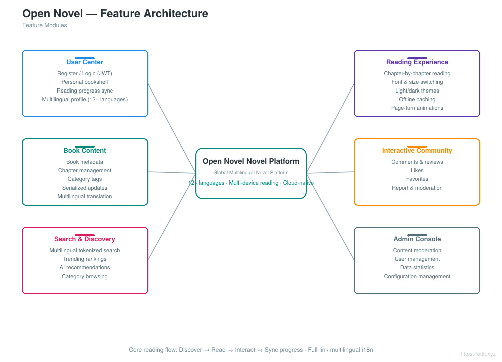
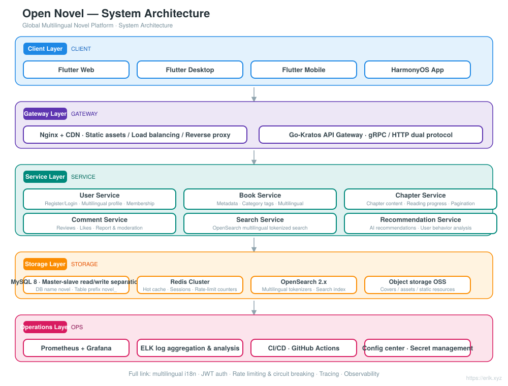
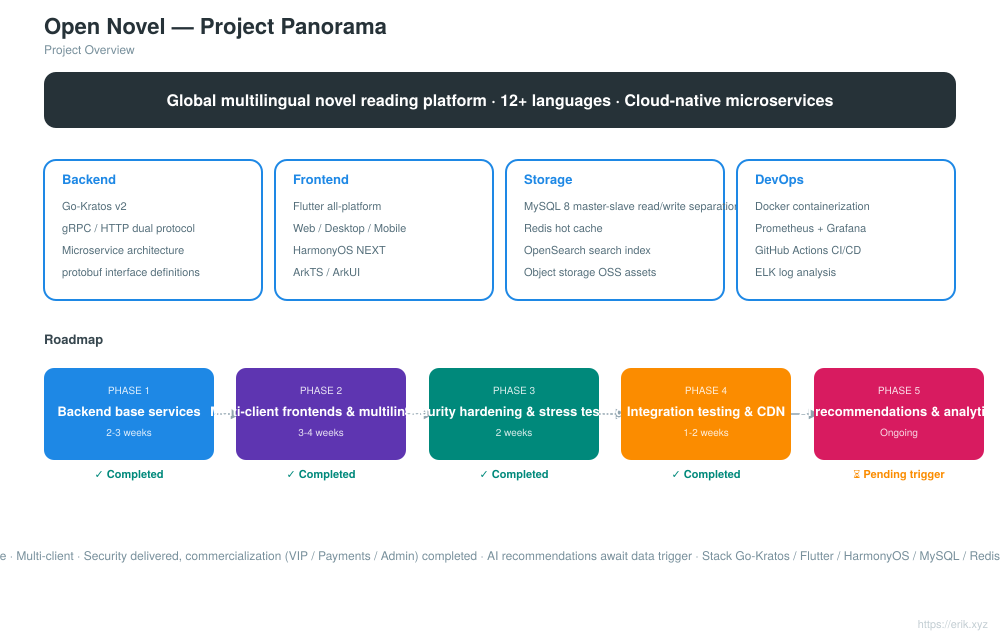
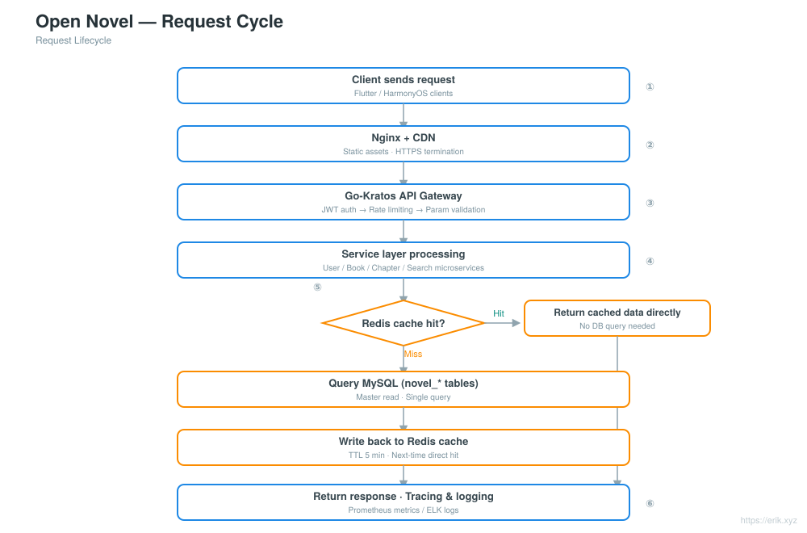
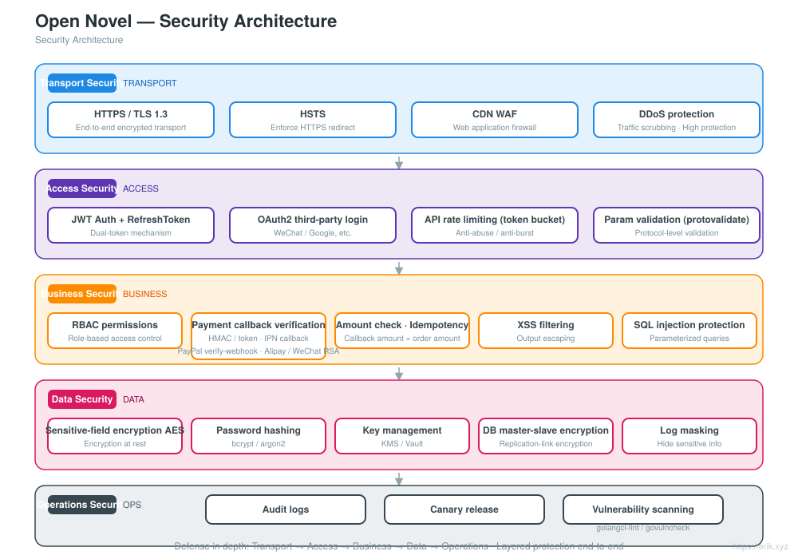
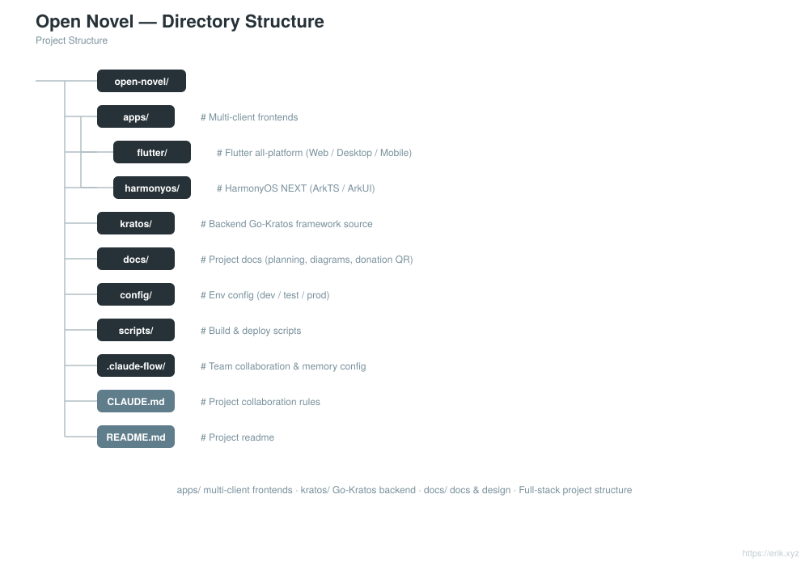

# Open Novel — Global Multilingual Novel Platform

<div align="center">

[中文](../../README.md) · **English** · [日本語](README.ja.md) · [한국어](README.ko.md) · [Русский](README.ru.md) · [Deutsch](README.de.md) · [Français](README.fr.md) · [Español](README.es.md) · [Português](README.pt.md) · [हिन्दी](README.hi.md) · [العربية](README.ar.md) · [বাংলা](README.bn.md) · [Bahasa Indonesia](README.id.md)

</div>

> A global multilingual novel reading platform built on the **Go-Kratos** microservice architecture with **Flutter / HarmonyOS** multi-client frontends, supporting **12+ major languages** and delivering reading, interaction, search and personalized recommendation capabilities to users worldwide.

---

## Project Overview

Open Novel is a cloud-native, microservice-architecture global multilingual novel platform:

- **Backend**: Go-Kratos v2 (gRPC / HTTP dual protocol), microservices split by domain (users, books, chapters, comments, search, recommendations)
- **Frontend**: Flutter all-platform (Web / Desktop / Mobile) + HarmonyOS NEXT native app, sharing the same set of backend APIs
- **Multilingual**: Dynamically loaded i18n resources, supporting 12+ languages (Chinese, English, Japanese, Korean, French, German, Spanish, Russian, Arabic, etc.)
- **Storage**: MySQL 8 (master-slave read/write separation) + Redis (hot cache / sessions) + OpenSearch (multilingual search)
- **Operations**: Docker Compose one-click deployment, Prometheus + Grafana monitoring, GitHub Actions continuous integration


## Features

<p align="center"></p>

- **User Center**: Registration and login (JWT), personal bookshelf, cross-device reading progress sync, multilingual profiles
- **Reading Experience**: Chapter-by-chapter reading, font and size switching, light/dark themes, offline caching, page-turn animations
- **Book Content**: Book metadata, chapter management, category tags, serialized updates, multilingual translation
- **Interactive Community**: Comments and reviews, likes, favorites, reporting and moderation
- **Search & Discovery**: Multilingual tokenized search, trending rankings, AI recommendations, category browsing
- **Admin Console**: Content moderation, user management, data statistics, configuration management

## System Architecture

<p align="center"></p>

## Project Panorama

<p align="center"></p>

## Request Cycle

<p align="center"></p>

## Security Architecture

<p align="center"></p>

## Project Structure

<p align="center"></p>

---

## Tech Stack

| Layer | Technology |
| :--- | :--- |
| Client | Flutter (Web / Desktop / Mobile), HarmonyOS NEXT (ArkTS / ArkUI) |
| Gateway | Nginx + CDN, Go-Kratos API Gateway (gRPC / HTTP dual protocol) |
| Server | Go 1.22+, Kratos v2, protobuf / gRPC |
| Storage | MySQL 8.0 (master-slave), Redis 7.x (Cluster), OpenSearch 2.x |
| Observability | Prometheus, Grafana, ELK, OpenTelemetry tracing |
| Operations | Docker Compose, GitHub Actions CI/CD |

## Database

- Database name: `novel`
- Table prefix: `novel_` (e.g. `novel_user`, `novel_book`, `novel_chapter`, `novel_comment`, etc.)

```sql
CREATE DATABASE novel DEFAULT CHARACTER SET utf8mb4 COLLATE utf8mb4_unicode_ci;
```

For detailed table design and the read/write separation strategy, see [docs/novel-project-planning.md](../novel-project-planning.md).

## Multi-Client Directories

```
apps/
├─ flutter/     # Flutter all-platform (Web / Desktop / Mobile), i18n multilingual
└─ harmonyos/   # HarmonyOS NEXT native app (ArkTS / ArkUI)
```

See [apps/README.md](../../apps/README.md).

## Roadmap

| Phase | Duration | Focus |
| :--- | :--- | :--- |
| Phase 1 | 2-3 weeks | Kratos backend base services + MySQL / Redis / OpenSearch integration |
| Phase 2 | 3-4 weeks | Flutter / HarmonyOS multi-client frontends + multilingual ARB authoring |
| Phase 3 | 2 weeks | Security hardening (JWT / RBAC / rate limiting) + stress testing |
| Phase 4 | 1-2 weeks | Full-link integration testing + CDN acceleration configuration |
| Phase 5 | Ongoing | AI recommendation algorithms, user behavior analytics tracking |

## Local Development

```bash
# Start dependencies (MySQL / Redis / OpenSearch)
docker compose up -d

# Backend services (Kratos workspace)
cd backend && go mod tidy && go run ./cmd/server

# Flutter client
cd apps/flutter && flutter pub get && flutter run

# HarmonyOS client
cd apps/harmonyos && hvigorw assembleHap
```

---

## Support and Donations

If this project has helped you, feel free to **Star** and **Fork** it; you are also welcome to scan the QR codes to donate. Every bit of your support is my motivation to keep maintaining and updating the project. Thank you for your encouragement!

<div align="center">

**WeChat Reward** ｜ **Alipay Reward**

　

</div>

### Global Transfer Donations (Cross-border Remittance)

【Payee Information】

- Payee Name: WANG KEXUN
- Payee Account Number: 881015918251

【Payee Bank】

- ZA Bank SWIFT Code: AABLHKHHXXX
- Bank Name: ZA Bank Limited
- Bank Code: 387
- Bank Address: Core F, Cyberport 3, 100 Cyberport Road, Hong Kong

【Cross-border Remittance Intermediary Bank (If Required)】

> Please note that this is the information of the cross-border remittance intermediary bank (correspondent bank), not the payee's bank. Please check with your remitting bank whether the cross-border remittance intermediary bank information is required.

**The intermediary bank for HKD, CNY and USD remittances is Citibank**

- Bank Name: Citibank N.A. Hong Kong
- SWIFT Code: CITIHKHXXXX
- Bank Code: 006
- Branch Name: Hong Kong Branch
- Branch Code: 391
- Bank Address: Citibank Tower, Citibank Plaza, 3 Garden Road, Central, Hong Kong

**The intermediary bank for other currencies is BNY Mellon**

- Bank Name: THE BANK OF NEW YORK MELLON
- SWIFT Code: IRVTUS3NXXX
- Bank Address: THE BANK OF NEW YORK MELLON, 240 GREENWICH STREET, NEW YORK, United States
