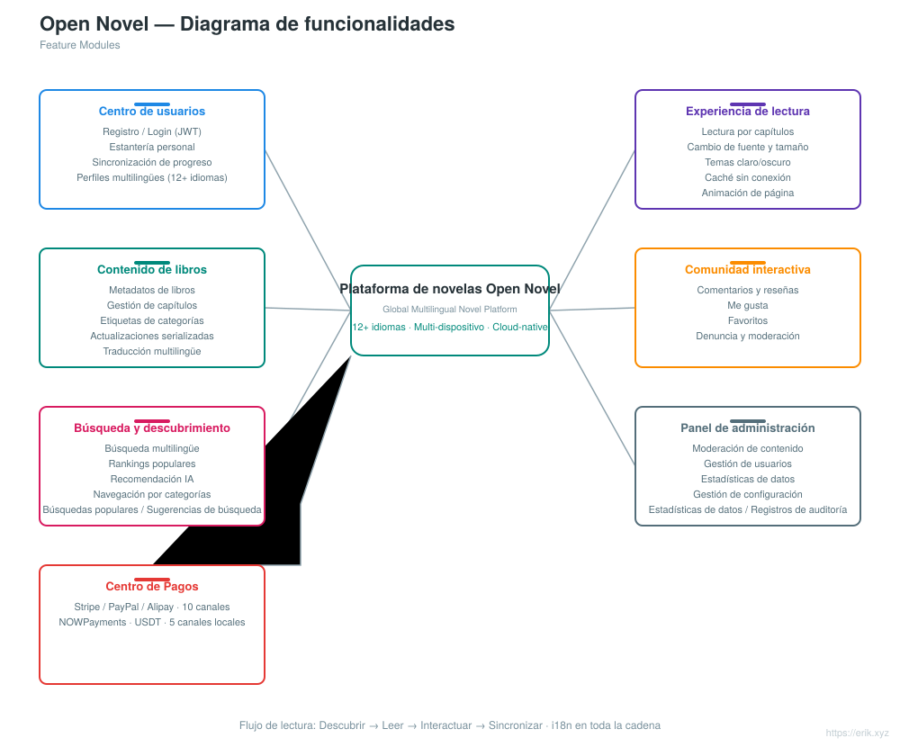
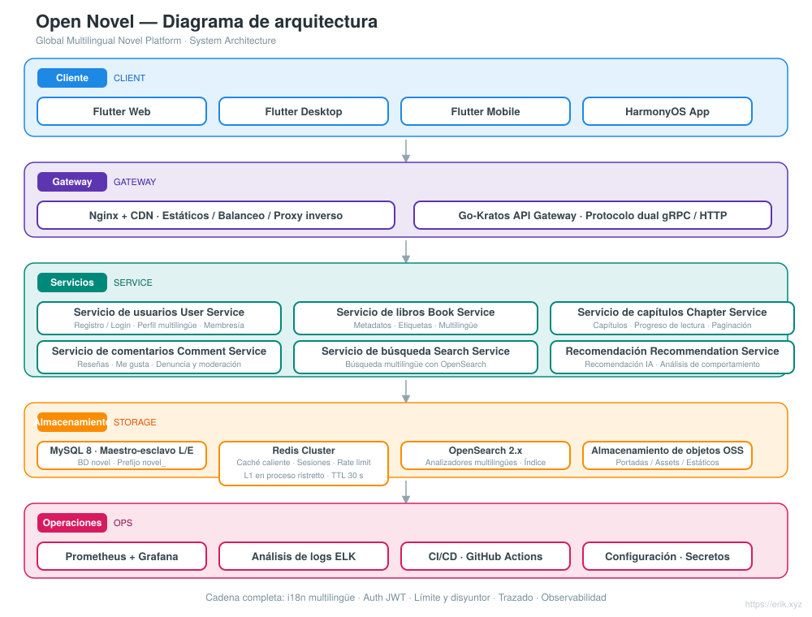
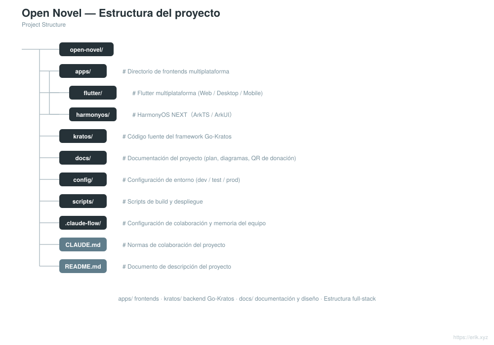

# Open Novel — Plataforma global de novelas multilingüe

<div align="center">

[中文](../../README.md) · [English](README.en.md) · [日本語](README.ja.md) · [한국어](README.ko.md) · [Русский](README.ru.md) · [Deutsch](README.de.md) · [Français](README.fr.md) · **Español** · [Português](README.pt.md) · [हिन्दी](README.hi.md) · [العربية](README.ar.md) · [বাংলা](README.bn.md) · [Bahasa Indonesia](README.id.md)

</div>

> Plataforma global de novelas multilingüe basada en la arquitectura de microservicios **Go-Kratos** con frontends multiplataforma **Flutter / HarmonyOS**, compatible con **más de 12 idiomas principales**, y diseñada para ofrecer a usuarios de todo el mundo lectura, interacción, búsqueda y recomendaciones personalizadas.

---

## Introducción del proyecto

Open Novel es una plataforma global de novelas multilingüe con arquitectura de microservicios nativa de la nube:

- **Backend**: Go-Kratos v2 (protocolo dual gRPC / HTTP), microservicios divididos por dominio (usuarios, libros, capítulos, comentarios, búsqueda, recomendaciones)
- **Frontend**: Flutter multiplataforma (Web / Desktop / Mobile) + aplicación nativa HarmonyOS NEXT, que comparten el mismo conjunto de API de backend
- **Multilingüe**: carga dinámica de recursos i18n, compatible con más de 12 idiomas (chino, inglés, japonés, coreano, francés, alemán, español, ruso, árabe, etc.)
- **Almacenamiento**: MySQL 8 (maestro-esclavo con separación de lectura/escritura) + Redis (caché de datos calientes / sesiones) + OpenSearch (búsqueda multilingüe)
- **Operaciones**: despliegue con un clic mediante Docker Compose, monitoreo con Prometheus + Grafana, integración continua con GitHub Actions


## Funcionalidades

<p align="center"></p>

- **Centro de usuarios**: registro e inicio de sesión (JWT), estantería personal, sincronización del progreso de lectura entre dispositivos, perfiles multilingües
- **Experiencia de lectura**: lectura por capítulos, cambio de fuente y tamaño, temas claro/oscuro, caché sin conexión, animaciones de paso de página
- **Contenido de libros**: metadatos de libros, gestión de capítulos, etiquetas de categorías, actualizaciones por entregas, traducción multilingüe
- **Comunidad interactiva**: comentarios y reseñas, me gusta, favoritos, denuncia y moderación
- **Búsqueda y descubrimiento**: búsqueda con segmentación multilingüe, rankings populares, recomendaciones con IA, navegación por categorías
- **Panel de administración**: moderación de contenido, gestión de usuarios, estadísticas de datos, gestión de configuración

## Arquitectura del sistema

<p align="center"></p>

## Panorama del proyecto

<p align="center"></p>

## Ciclo de solicitudes

<p align="center"></p>

## Arquitectura de seguridad

<p align="center"></p>

## Estructura del proyecto

<p align="center"></p>

---

## Pila tecnológica

| Capa | Tecnología |
| :--- | :--- |
| Cliente | Flutter（Web / Desktop / Mobile）、HarmonyOS NEXT（ArkTS / ArkUI） |
| Puerta de enlace | Nginx + CDN、Go-Kratos API Gateway（protocolo dual gRPC / HTTP） |
| Servidor | Go 1.22+、Kratos v2、protobuf / gRPC |
| Almacenamiento | MySQL 8.0（maestro-esclavo）、Redis 7.x（Cluster）、OpenSearch 2.x |
| Observabilidad | Prometheus、Grafana、ELK、trazado de cadenas con OpenTelemetry |
| Operaciones | Docker Compose、GitHub Actions CI/CD |

## Base de datos

- Nombre de la base de datos: `novel`
- Prefijo de tablas: `novel_` (p. ej. `novel_user`, `novel_book`, `novel_chapter`, `novel_comment`, etc.)

```sql
CREATE DATABASE novel DEFAULT CHARACTER SET utf8mb4 COLLATE utf8mb4_unicode_ci;
```

Consulta el diseño detallado de las tablas y la estrategia de separación de lectura/escritura en [docs/novel-project-planning.md](../novel-project-planning.md).

## Directorios multiplataforma

```
apps/
├─ flutter/     # Flutter 全平台（Web / Desktop / Mobile），i18n 多语言
└─ harmonyos/   # HarmonyOS NEXT 原生应用（ArkTS / ArkUI）
```

Consulta [apps/README.md](../../apps/README.md) para más detalles.

## Hoja de ruta

| Fase | Período | Tareas principales |
| :--- | :--- | :--- |
| Phase 1 | 2-3 semanas | Servicios base de backend Kratos + integración de MySQL / Redis / OpenSearch |
| Phase 2 | 3-4 semanas | Frontends multiplataforma Flutter / HarmonyOS + redacción de ARB multilingüe |
| Phase 3 | 2 semanas | Refuerzo de seguridad (JWT / RBAC / limitación de tasa) + pruebas de carga |
| Phase 4 | 1-2 semanas | Depuración integral del flujo completo + configuración de aceleración CDN |
| Phase 5 | Continuo | Integración de algoritmos de recomendación con IA, seguimiento de análisis de comportamiento de usuarios |

## Desarrollo local

```bash
# 启动依赖（MySQL / Redis / OpenSearch）
docker compose up -d

# 后端服务（Kratos 工作区）
cd kratos/backend && go mod tidy && go run ./cmd/server

# Flutter 端
cd apps/flutter && flutter pub get && flutter run

# HarmonyOS 端
cd apps/harmonyos && hvigorw assembleHap
```

---

## Apoyo y donaciones

Si este proyecto te resulta útil, eres bienvenido a apoyarlo con un **Star** o un **Fork**; también puedes realizar una donación escaneando el código QR. Cada muestra de apoyo me motiva a seguir manteniéndolo y actualizándolo. ¡Gracias por tu aliento!

<div align="center">

**Donación por WeChat** ｜ **Donación por Alipay**

　

</div>

### Donación por transferencia global (remesa transfronteriza)

【Información del beneficiario】

- Nombre del beneficiario: WANG KEXUN
- Número de cuenta del beneficiario: 881015918251

【Banco receptor】

- ZA Bank SWIFT Code: AABLHKHHXXX
- Nombre del banco: ZA Bank Limited
- Código del banco: 387
- Dirección del banco: Core F, Cyberport 3, 100 Cyberport Road, Hong Kong

【Banco corresponsal para remesas transfronterizas (si es necesario)】

> Tenga en cuenta que esta es la información del banco corresponsal (banco intermediario) para remesas transfronterizas, no la del banco receptor. Consulte con su banco de envío si es necesario proporcionar la información del banco corresponsal.

**El banco corresponsal para depósitos en HKD, CNY y USD es Citibank**

- Nombre del banco: Citibank N.A. Hong Kong
- SWIFT Code: CITIHKHXXXX
- Código del banco: 006
- Nombre de la sucursal: Hong Kong Branch
- Código de sucursal: 391
- Dirección del banco: Citibank Tower, Citibank Plaza, 3 Garden Road, Central, Hong Kong

**El banco corresponsal para depósitos en otras divisas es BNY Mellon**

- Nombre del banco: THE BANK OF NEW YORK MELLON
- SWIFT Code: IRVTUS3NXXX
- Dirección del banco: THE BANK OF NEW YORK MELLON, 240 GREENWICH STREET, NEW YORK, United States
