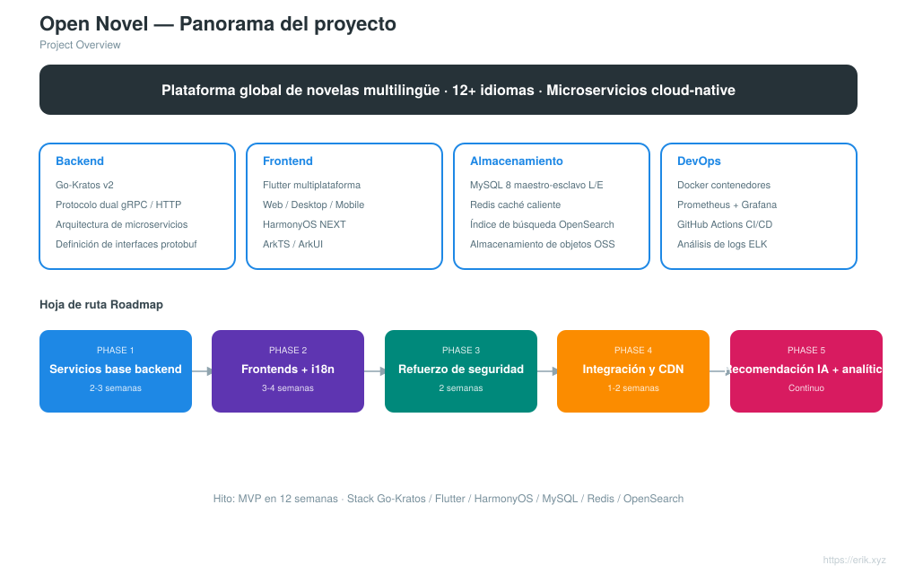
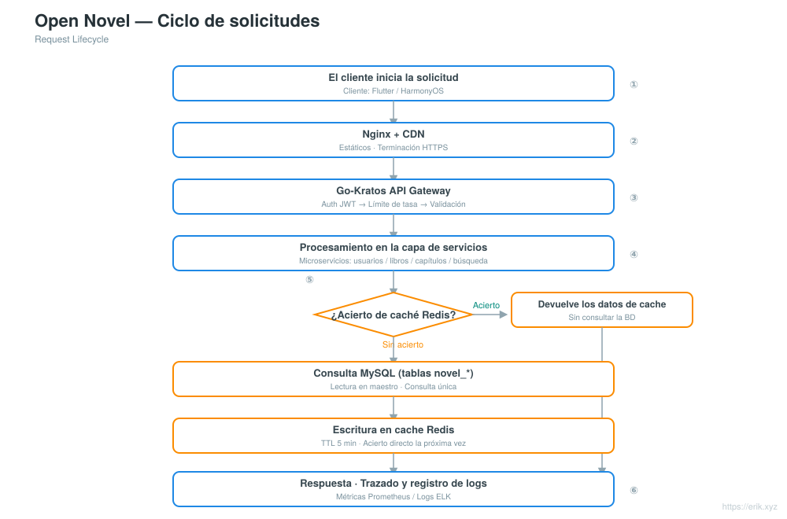
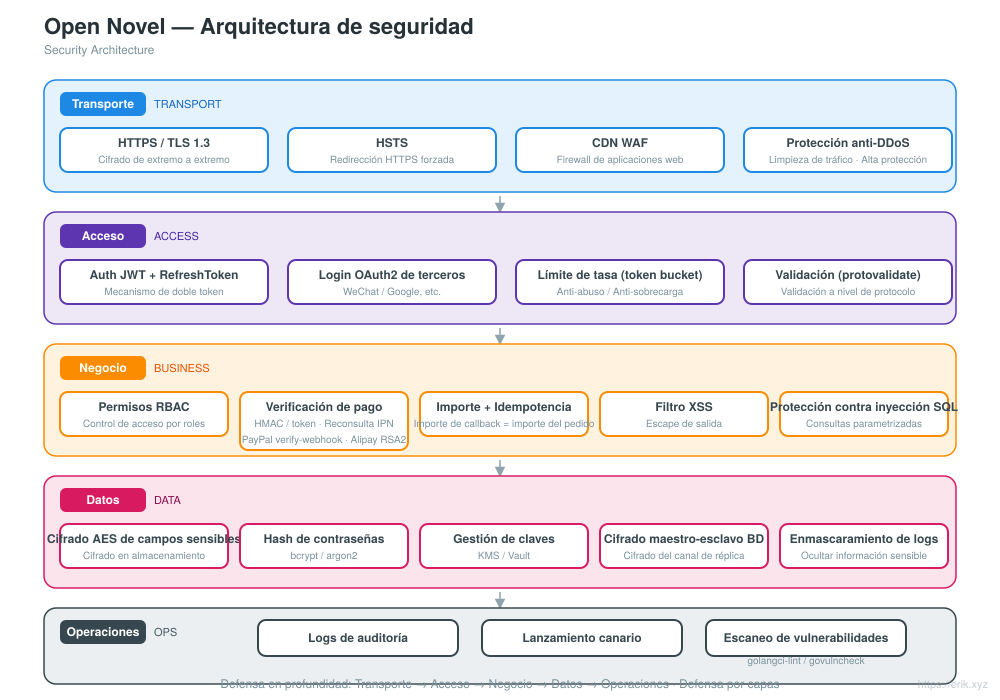

# Open Novel — Plataforma global de novelas multilingüe

<div align="center">

[中文](../../README.md) · [English](README.en.md) · [日本語](README.ja.md) · [한국어](README.ko.md) · [Русский](README.ru.md) · [Deutsch](README.de.md) · [Français](README.fr.md) · **Español** · [Português](README.pt.md) · [हिन्दी](README.hi.md) · [العربية](README.ar.md) · [বাংলা](README.bn.md) · [Bahasa Indonesia](README.id.md)

</div>

> Plataforma global de novelas multilingüe basada en la arquitectura de microservicios **Go-Kratos** con frontends multiplataforma **Flutter / HarmonyOS**, compatible con **más de 12 idiomas principales**, y diseñada para ofrecer a usuarios de todo el mundo lectura, interacción, búsqueda y recomendaciones personalizadas.

---

## Introducción del proyecto

Open Novel es una plataforma global de novelas multilingüe con arquitectura de microservicios nativa de la nube:

- **Backend**: Go-Kratos v2 (protocolo dual gRPC / HTTP), microservicios divididos por dominio (usuarios, libros, capítulos, comentarios, búsqueda, recomendaciones)
- **Frontend**: Flutter multiplataforma (Web / Desktop / Mobile) + aplicación nativa HarmonyOS NEXT, que comparten el mismo conjunto de API de backend
- **Multilingüe**: carga dinámica de recursos i18n, compatible con más de 12 idiomas (chino, inglés, japonés, coreano, francés, alemán, español, ruso, árabe, etc.)
- **Almacenamiento**: MySQL 8 (maestro-esclavo con separación de lectura/escritura) + Redis (caché de datos calientes / sesiones) + OpenSearch (búsqueda multilingüe)
- **Operaciones**: despliegue con un clic mediante Docker Compose, monitoreo con Prometheus + Grafana, integración continua con GitHub Actions

## Funcionalidades

<p align="center"></p>

- **Centro de usuarios**: registro e inicio de sesión (JWT), estantería personal, sincronización del progreso de lectura entre dispositivos, perfiles multilingües
- **Experiencia de lectura**: lectura por capítulos, cambio de fuente y tamaño, temas claro/oscuro, caché sin conexión, animaciones de paso de página
- **Contenido de libros**: metadatos de libros, gestión de capítulos, etiquetas de categorías, actualizaciones por entregas, traducción multilingüe
- **Comunidad interactiva**: comentarios y reseñas, me gusta, favoritos, denuncia y moderación
- **Búsqueda y descubrimiento**: búsqueda con segmentación multilingüe, rankings populares, recomendaciones con IA, navegación por categorías
- **Panel de administración**: moderación de contenido, gestión de usuarios, estadísticas de datos, gestión de configuración

## Arquitectura del sistema

<p align="center"></p>

La arquitectura general es una arquitectura de microservicios Go-Kratos: los clientes Flutter / HarmonyOS interactúan con la puerta de enlace de API a través de Nginx + CDN; la puerta de enlace enruta por dominio hacia los servicios backend de usuarios, libros, capítulos, comentarios, búsqueda y recomendaciones. La capa de datos está compuesta por MySQL maestro-esclavo (separación de lectura/escritura) + caché Redis + índice de búsqueda OpenSearch. Los servicios se comunican mediante gRPC; las interfaces HTTP externas usan uniformemente el prefijo `/api`.

Otros diagramas: panorama del proyecto [../project.svg](../project.svg) · ciclo de solicitudes [../request-cycle.svg](../request-cycle.svg) · arquitectura de seguridad [../security.svg](../security.svg) · estructura del proyecto [../structure.svg](../structure.svg).

## Panorama del proyecto

<p align="center"></p>

## Ciclo de solicitudes

<p align="center"></p>

## Arquitectura de seguridad

<p align="center"></p>

## Estructura de directorios

```
open-novel/
├─ apps/                     # Frontends multiplataforma
│  ├─ flutter/               #   Flutter multiplataforma (Web / Desktop / Mobile), i18n multilingüe
│  └─ harmonyos/             #   Aplicación nativa HarmonyOS NEXT (ArkTS / ArkUI)
├─ kratos/                   # Código fuente del framework Go-Kratos (framework ascendente, conservado tal cual, no modificar)
│  └─ backend/               #   Backend de negocio del proyecto: entrada cmd/server + api/ + internal/ + sql/ + opensearch/
├─ docs/                     # Documentación del proyecto (planificación, diagramas de arquitectura, README i18n, códigos de donación)
├─ scripts/                  # Scripts de compilación y despliegue (post-push.sh para releases automáticas, smoke.sh)
├─ docker-compose.yml        # Pila de dependencias local: MySQL 8 + Redis 7 + OpenSearch 2
├─ CLAUDE.md                 # Normas de colaboración del proyecto
└─ README.md                 # Documentación del proyecto
```

<p align="center"></p>

> Nota: `kratos/` es el código fuente del framework Kratos (con su propio README / LICENSE); todo el código de negocio se encuentra en `kratos/backend/`.

## Pila tecnológica

| Capa | Tecnología |
| :--- | :--- |
| Cliente | Flutter (Web / Desktop / Mobile), HarmonyOS NEXT (ArkTS / ArkUI) |
| Puerta de enlace | Nginx + CDN, Go-Kratos API Gateway (protocolo dual gRPC / HTTP) |
| Servidor | Go 1.22+, Kratos v2, protobuf / gRPC |
| Almacenamiento | MySQL 8.0 (maestro-esclavo), Redis 7.x (Cluster), OpenSearch 2.x |
| Observabilidad | Prometheus, Grafana, ELK, trazado de cadenas con OpenTelemetry |
| Operaciones | Docker Compose, GitHub Actions CI/CD |

## Base de datos

- Nombre de la base de datos: `novel`
- Prefijo de tablas: `novel_` (p. ej. `novel_user`, `novel_book`, `novel_chapter`, `novel_comment`, etc.)

```sql
CREATE DATABASE novel DEFAULT CHARACTER SET utf8mb4 COLLATE utf8mb4_unicode_ci;
```

Script de creación de tablas: `kratos/backend/sql/init.sql` (se ejecuta automáticamente en el primer inicio de Docker Compose). Consulta el diseño detallado de las tablas y la estrategia de separación de lectura/escritura en [docs/novel-project-planning.md](../novel-project-planning.md).

## Prefijo de API

Las interfaces HTTP del backend comienzan uniformemente con `/api`; la versión se negocia mediante la cabecera `X-Api-Version: v1` (no en la URL). Se agrupan por dominio:

| Dominio | Rutas de ejemplo | Definición proto |
| :--- | :--- | :--- |
| Usuarios | `/api/users` etc. | `kratos/backend/api/user/v1` |
| Libros | `/api/books`、`/api/books/{id}`、`/api/categories`、`/api/tags` | `kratos/backend/api/book/v1` |
| Capítulos | `/api/...` | `kratos/backend/api/chapter/v1` |
| Comentarios | `/api/...` | `kratos/backend/api/comment/v1` |
| Búsqueda | `/api/...` | `kratos/backend/api/search/v1` |
| Recomendaciones | `/api/...` | `kratos/backend/api/recommendation/v1` |

Las rutas detalladas se encuentran en las declaraciones `option (google.api.http)` de cada archivo proto.

## Inicio rápido

```bash
# 1. Iniciar la pila de dependencias (MySQL / Redis / OpenSearch; ejecuta automáticamente kratos/backend/sql/init.sql en el primer inicio)
docker compose up -d

# 2. Iniciar el backend (directorio de negocio de Kratos, HTTP :8000 / gRPC :9000)
cd kratos/backend && go mod tidy && go run ./cmd/server

# 3. Iniciar el frontend Flutter (se conecta por defecto a localhost:8000, sin configuración adicional)
cd apps/flutter && flutter pub get && flutter run -d chrome
```

- Mapeo de puertos de la pila de dependencias: MySQL `3307`、Redis `6380`、OpenSearch `9200` (los puertos 3306/6379 del host están ocupados por servicios locales, ver el comentario en docker-compose.yml).
- La dirección y las claves del backend se configuran en `kratos/backend/config/`, con soporte de anulación mediante variables de entorno (p. ej. `PORT`, `OPENSEARCH_ADDR`).
- Conectar Flutter a otro backend: `flutter run -d chrome --dart-define=API_BASE_URL=http://<host>:8000`.

Consulta [apps/README.md](../../apps/README.md) y [apps/flutter/README.md](../../apps/flutter/README.md).

## Proceso de lanzamiento

- **Automático**: tras hacer push a `main`, GitHub Actions ([.github/workflows/release.yml](../../.github/workflows/release.yml)) incrementa automáticamente la versión patch a partir de la última etiqueta `v*`, crea y empuja una etiqueta, y luego crea una Release de GitHub con un changelog incremental; se omite si HEAD ya lleva una etiqueta de versión. El primer lanzamiento comienza en `v1.0.0`.
- **Respaldo manual**: ejecute [scripts/post-push.sh](../../scripts/post-push.sh) (requiere `gh` autenticado): `echo "x y refs/heads/main z" | scripts/post-push.sh`.
- **Manual**:

  ```bash
  git tag -a v1.0.1 -m "release v1.0.1"
  git push origin v1.0.1
  gh release create v1.0.1 --generate-notes
  ```

## Hoja de ruta

| Fase | Período | Tareas principales |
| :--- | :--- | :--- |
| Phase 1 | 2-3 semanas | Servicios base de backend Kratos + integración de MySQL / Redis / OpenSearch |
| Phase 2 | 3-4 semanas | Frontends multiplataforma Flutter / HarmonyOS + redacción de ARB multilingüe |
| Phase 3 | 2 semanas | Refuerzo de seguridad (JWT / RBAC / limitación de tasa) + pruebas de carga |
| Phase 4 | 1-2 semanas | Depuración integral del flujo completo + configuración de aceleración CDN |
| Phase 5 | Continuo | Integración de algoritmos de recomendación con IA, seguimiento de análisis de comportamiento de usuarios |

## Apoyo y donaciones

Si este proyecto te resulta útil, eres bienvenido a apoyarlo con un **Star** o un **Fork**; también puedes realizar una donación escaneando el código QR. Cada muestra de apoyo me motiva a seguir manteniéndolo y actualizándolo. ¡Gracias por tu aliento!

<div align="center">

**Donación por WeChat** ｜ **Donación por Alipay**

　

</div>

### Donación por transferencia global (remesa transfronteriza)

【Información del beneficiario】

- Nombre del beneficiario: WANG KEXUN
- Número de cuenta del beneficiario: 881015918251

【Banco receptor】

- ZA Bank SWIFT Code: AABLHKHHXXX
- Nombre del banco: ZA Bank Limited
- Código del banco: 387
- Dirección del banco: Core F, Cyberport 3, 100 Cyberport Road, Hong Kong

【Banco corresponsal para remesas transfronterizas (si es necesario)】

> Tenga en cuenta que esta es la información del banco corresponsal (banco intermediario) para remesas transfronterizas, no la del banco receptor. Consulte con su banco de envío si es necesario proporcionar la información del banco corresponsal.

**El banco corresponsal para depósitos en HKD, CNY y USD es Citibank**

- Nombre del banco: Citibank N.A. Hong Kong
- SWIFT Code: CITIHKHXXXX
- Código del banco: 006
- Nombre de la sucursal: Hong Kong Branch
- Código de sucursal: 391
- Dirección del banco: Citibank Tower, Citibank Plaza, 3 Garden Road, Central, Hong Kong

**El banco corresponsal para depósitos en otras divisas es BNY Mellon**

- Nombre del banco: THE BANK OF NEW YORK MELLON
- SWIFT Code: IRVTUS3NXXX
- Dirección del banco: THE BANK OF NEW YORK MELLON, 240 GREENWICH STREET, NEW YORK, United States

---

## Licencia y contacto

- **Licencia**: no hay una licencia independiente en la raíz del repositorio; `kratos/` es el código fuente ascendente del framework Kratos, regido por su [licencia MIT](../../kratos/LICENSE). La licencia del código de negocio se determinará en anuncios posteriores del proyecto.
- **Contacto**: comunicación mediante Issues / PR de GitHub; donaciones, ver la sección «Apoyo y donaciones» más arriba.
