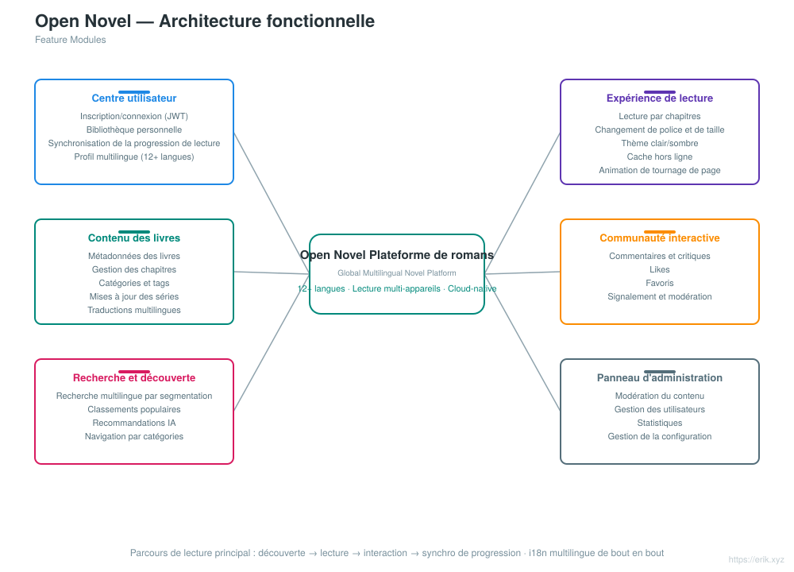
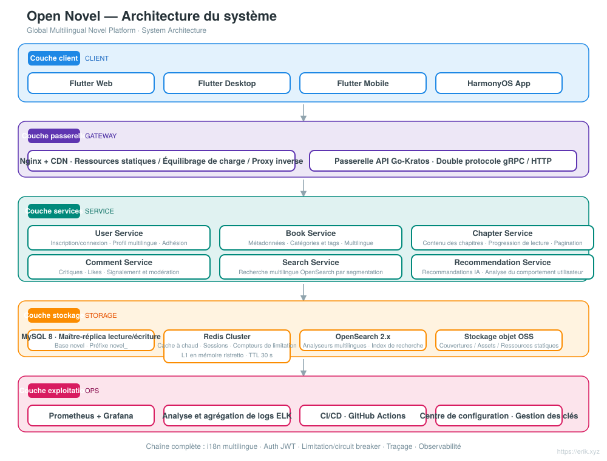
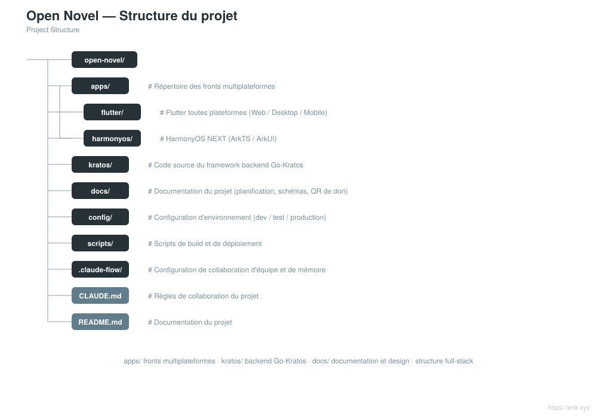

# Open Novel — plateforme mondiale de romans multilingues

<div align="center">

[中文](../../README.md) · [English](README.en.md) · [日本語](README.ja.md) · [한국어](README.ko.md) · [Русский](README.ru.md) · [Deutsch](README.de.md) · **Français** · [Español](README.es.md) · [Português](README.pt.md) · [हिन्दी](README.hi.md) · [العربية](README.ar.md) · [বাংলা](README.bn.md) · [Bahasa Indonesia](README.id.md)

</div>

> Plateforme mondiale de lecture de romans multilingues, basée sur une architecture microservices **Go-Kratos** et des fronts multiplateformes **Flutter / HarmonyOS**, prenant en charge **12+ langues principales** et offrant aux utilisateurs du monde entier lecture, interaction, recherche et recommandations personnalisées.

---

## Présentation du projet

Open Novel est une plateforme mondiale de romans multilingues en architecture cloud-native microservices :

- **Backend** : Go-Kratos v2 (double protocole gRPC / HTTP), microservices découpés par domaine (utilisateurs, livres, chapitres, commentaires, recherche, recommandations)
- **Frontend** : Flutter toutes plateformes (Web / Desktop / Mobile) + application native HarmonyOS NEXT, partageant la même API backend
- **Multilingue** : chargement dynamique des ressources i18n, prise en charge de 12+ langues (chinois, anglais, japonais, coréen, français, allemand, espagnol, russe, arabe, etc.)
- **Stockage** : MySQL 8 (maître-réplica avec séparation lecture/écriture) + Redis (cache à chaud / sessions) + OpenSearch (recherche multilingue)
- **Exploitation** : déploiement en une commande via Docker Compose, supervision Prometheus + Grafana, intégration continue GitHub Actions

## Fonctionnalités

<p align="center"></p>

- **Centre utilisateur** : inscription/connexion (JWT), bibliothèque personnelle, synchronisation de la progression de lecture entre appareils, profil multilingue
- **Expérience de lecture** : lecture par chapitres, changement de police et de taille, thème clair/sombre, cache hors ligne, animation de tournage de page
- **Contenu des livres** : métadonnées des livres, gestion des chapitres, catégories et tags, mises à jour des séries, traductions multilingues
- **Communauté interactive** : commentaires et critiques, likes, favoris, signalement et modération
- **Recherche et découverte** : recherche multilingue par segmentation, classements populaires, recommandations IA, navigation par catégories
- **Panneau d'administration** : modération du contenu, gestion des utilisateurs, statistiques, gestion de la configuration

## Architecture système

<p align="center"></p>

## Vue d'ensemble du projet

<p align="center"></p>

## Cycle de requête

<p align="center"></p>

## Architecture de sécurité

<p align="center"></p>

## Structure du projet

<p align="center"></p>

---

## Pile technologique

| Niveau | Technologies |
| :--- | :--- |
| Client | Flutter (Web / Desktop / Mobile), HarmonyOS NEXT (ArkTS / ArkUI) |
| Passerelle | Nginx + CDN, passerelle API Go-Kratos (double protocole gRPC / HTTP) |
| Serveur | Go 1.22+, Kratos v2, protobuf / gRPC |
| Stockage | MySQL 8.0 (maître-réplica), Redis 7.x (Cluster), OpenSearch 2.x |
| Observabilité | Prometheus, Grafana, ELK, traçage OpenTelemetry |
| Exploitation | Docker Compose, CI/CD GitHub Actions |

## Base de données

- Nom de la base de données : `novel`
- Préfixe des tables : `novel_` (par exemple `novel_user`, `novel_book`, `novel_chapter`, `novel_comment`, etc.)

```sql
CREATE DATABASE novel DEFAULT CHARACTER SET utf8mb4 COLLATE utf8mb4_unicode_ci;
```

La conception détaillée des tables et la stratégie de séparation lecture/écriture sont décrites dans [docs/novel-project-planning.md](../novel-project-planning.md).

## Répertoires des applications clientes

```
apps/
├─ flutter/     # Flutter 全平台（Web / Desktop / Mobile），i18n 多语言
└─ harmonyos/   # HarmonyOS NEXT 原生应用（ArkTS / ArkUI）
```

Voir [apps/README.md](../../apps/README.md).

## Feuille de route

| Phase | Période | Objectifs principaux |
| :--- | :--- | :--- |
| Phase 1 | 2-3 semaines | Services de base du backend Kratos + intégration MySQL / Redis / OpenSearch |
| Phase 2 | 3-4 semaines | Fronts Flutter / HarmonyOS multiplateformes + rédaction des fichiers ARB multilingues |
| Phase 3 | 2 semaines | Durcissement de la sécurité (JWT / RBAC / limitation de débit) + tests de charge |
| Phase 4 | 1-2 semaines | Intégration de bout en bout + configuration de l'accélération CDN |
| Phase 5 | en continu | Intégration des algorithmes de recommandation IA, instrumentation d'analyse du comportement utilisateur |

## Développement local

```bash
# 启动依赖（MySQL / Redis / OpenSearch）
docker compose up -d

# 后端服务（Kratos 工作区）
cd backend && go mod tidy && go run ./cmd/server

# Flutter 端
cd apps/flutter && flutter pub get && flutter run

# HarmonyOS 端
cd apps/harmonyos && hvigorw assembleHap
```

---

## Soutien et dons

Si ce projet vous est utile, n'hésitez pas à le soutenir avec un **Star** et un **Fork** ; les dons par QR code sont également les bienvenus. Chaque soutien est ma motivation pour continuer à maintenir et à faire évoluer le projet. Merci pour vos encouragements !

<div align="center">

**Don WeChat** ｜ **Don Alipay**

　

</div>

### Dons internationaux par virement (virement transfrontalier)

【Informations sur le bénéficiaire】

- Nom du bénéficiaire : WANG KEXUN
- Numéro de compte du bénéficiaire : 881015918251

【Banque du bénéficiaire】

- SWIFT Code de ZA Bank : AABLHKHHXXX
- Nom de la banque : ZA Bank Limited
- Code bancaire : 387
- Adresse de la banque : Core F, Cyberport 3, 100 Cyberport Road, Hong Kong

【Banque correspondante pour virements internationaux (si nécessaire)】

> Veuillez noter qu'il s'agit des informations de la banque correspondante (banque intermédiaire) pour les virements internationaux, et non de celles de la banque du bénéficiaire. Renseignez-vous auprès de votre banque émettrice pour savoir si la fourniture des informations de la banque correspondante est requise.

**La banque correspondante pour les virements en dollars de Hong Kong, en yuans et en dollars américains est Citibank**

- Nom de la banque : Citibank N.A. Hong Kong
- SWIFT Code : CITIHKHXXXX
- Code bancaire : 006
- Nom de l'agence : Hong Kong Branch
- Numéro d'agence : 391
- Adresse de la banque : Citibank Tower, Citibank Plaza, 3 Garden Road, Central, Hong Kong

**La banque correspondante pour les virements dans les autres devises est BNY Mellon**

- Nom de la banque : THE BANK OF NEW YORK MELLON
- SWIFT Code : IRVTUS3NXXX
- Adresse de la banque : THE BANK OF NEW YORK MELLON, 240 GREENWICH STREET, NEW YORK, United States
