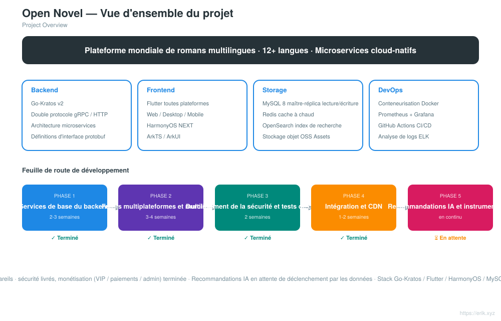
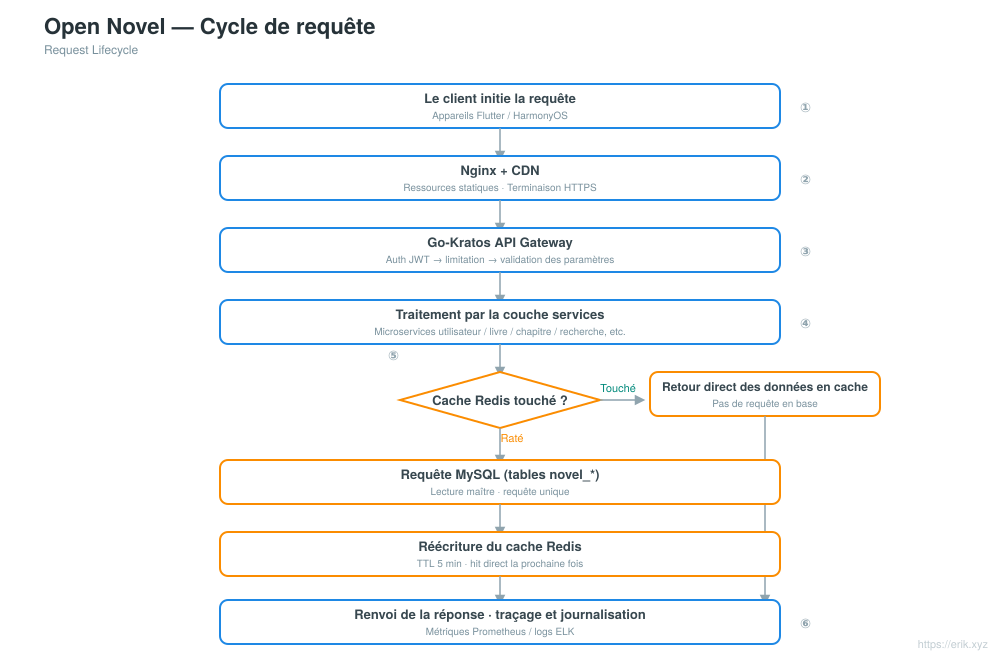
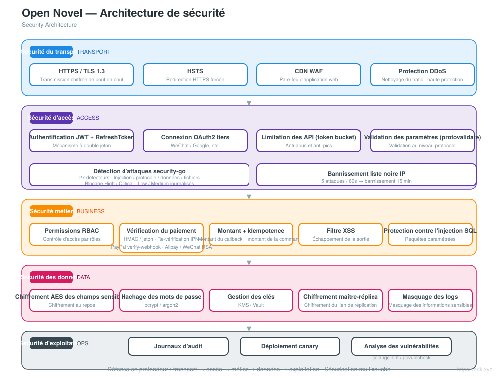

# Open Novel — plateforme mondiale de romans multilingues

<div align="center">

[中文](../../README.md) · [English](README.en.md) · [日本語](README.ja.md) · [한국어](README.ko.md) · [Русский](README.ru.md) · [Deutsch](README.de.md) · **Français** · [Español](README.es.md) · [Português](README.pt.md) · [हिन्दी](README.hi.md) · [العربية](README.ar.md) · [বাংলা](README.bn.md) · [Bahasa Indonesia](README.id.md)

</div>

> Plateforme mondiale de lecture de romans multilingues, basée sur une architecture microservices **Go-Kratos** et des fronts multiplateformes **Flutter / HarmonyOS**, prenant en charge **12+ langues principales** et offrant aux utilisateurs du monde entier lecture, interaction, recherche et recommandations personnalisées.

---

## Présentation du projet

Open Novel est une plateforme mondiale de romans multilingues en architecture cloud-native microservices :

- **Backend** : Go-Kratos v2 (double protocole gRPC / HTTP), microservices découpés par domaine (utilisateurs, livres, chapitres, commentaires, recherche, recommandations)
- **Frontend** : Flutter toutes plateformes (Web / Desktop / Mobile) + application native HarmonyOS NEXT, partageant la même API backend
- **Multilingue** : chargement dynamique des ressources i18n, prise en charge de 12+ langues (chinois, anglais, japonais, coréen, français, allemand, espagnol, russe, arabe, etc.)
- **Stockage** : MySQL 8 (maître-réplica avec séparation lecture/écriture) + Redis (cache à chaud / sessions) + OpenSearch (recherche multilingue)
- **Exploitation** : déploiement en une commande via Docker Compose, supervision Prometheus + Grafana, intégration continue GitHub Actions

## Fonctionnalités

<p align="center"></p>

- **Centre utilisateur** : inscription/connexion (JWT), bibliothèque personnelle, synchronisation de la progression de lecture entre appareils, profil multilingue
- **Expérience de lecture** : lecture par chapitres, changement de police et de taille, thème clair/sombre, cache hors ligne, animation de tournage de page
- **Contenu des livres** : métadonnées des livres, gestion des chapitres, catégories et tags, mises à jour des séries, traductions multilingues
- **Communauté interactive** : commentaires et critiques, likes, favoris, signalement et modération
- **Recherche et découverte** : recherche multilingue par segmentation, classement des mots-clés populaires, suggestions de recherche (historique local côté client de 20 entrées + suggestions avec debounce de 200 ms), recommandations IA, navigation par catégories
- **Panneau d'administration** : modération du contenu, gestion des utilisateurs, statistiques, gestion de la configuration, page de consultation des journaux d'audit (pagination + filtres multi-critères)
- **Paiements & VIP** : paiements multicanal via 9 prestataires (Stripe, NOWPayments (USDT), Razorpay, KOMOJU, PortOne, Mercado Pago, Xendit, PayPal, Alipay), abonnement et renouvellement des plans VIP, routage des moyens de paiement par langue (WeChat Pay non intégré, nécessite un statut de commerçant)

## Architecture système

<p align="center"></p>

L'architecture globale est une architecture microservices Go-Kratos : les clients Flutter / HarmonyOS interagissent avec la passerelle API via Nginx + CDN ; la passerelle route par domaine vers les services backend — utilisateurs, livres, chapitres, commentaires, recherche, recommandations, etc. La couche de données comprend MySQL maître-réplica (séparation lecture/écriture) + cache Redis + index de recherche OpenSearch. Les services communiquent en gRPC ; les interfaces HTTP externes utilisent uniformément le préfixe `/api`.

Autres schémas : vue d'ensemble du projet [../project.svg](../project.svg) · cycle de requête [../request-cycle.svg](../request-cycle.svg) · architecture de sécurité [../security.svg](../security.svg) · structure du projet [../structure.svg](../structure.svg).

## Vue d'ensemble du projet

<p align="center"></p>

## Cycle de requête

<p align="center"></p>

## Architecture de sécurité

<p align="center"></p>

## Structure des répertoires

```
open-novel/
├─ apps/                     # Frontends multiplateformes
│  ├─ flutter/               #   Flutter toutes plateformes (Web / Desktop / Mobile), i18n multilingue
│  └─ harmonyos/             #   Application native HarmonyOS NEXT (ArkTS / ArkUI)
├─ kratos/                   # Code source du framework Go-Kratos (framework amont, conservé tel quel, ne pas modifier)
│  └─ backend/               #   Backend métier du projet : entrée cmd/server + api/ + internal/ + sql/ + opensearch/
├─ docs/                     # Documentation du projet (planification, schémas d'architecture, README i18n, codes de don)
├─ scripts/                  # Scripts de build et de déploiement (post-push.sh pour les releases automatiques, smoke.sh)
├─ docker-compose.yml        # Pile de dépendances locale : MySQL 8 + Redis 7 + OpenSearch 2
├─ CLAUDE.md                 # Règles de collaboration du projet
└─ README.md                 # Documentation du projet
```

<p align="center"></p>

> Remarque : `kratos/` est le code source du framework Kratos (avec son propre README / LICENSE) ; tout le code métier se trouve dans `kratos/backend/`.

## Pile technologique

| Niveau | Technologies |
| :--- | :--- |
| Client | Flutter (Web / Desktop / Mobile), HarmonyOS NEXT (ArkTS / ArkUI) |
| Passerelle | Nginx + CDN, passerelle API Go-Kratos (double protocole gRPC / HTTP) |
| Serveur | Go 1.22+, Kratos v2, protobuf / gRPC |
| Stockage | MySQL 8.0 (maître-réplica), Redis 7.x (Cluster), OpenSearch 2.x, cache L1 en mémoire ristretto au-dessus de Redis (TTL 30 s) |
| Observabilité | Prometheus, Grafana, ELK, traçage OpenTelemetry |
| Exploitation | Docker Compose, CI/CD GitHub Actions |

## Base de données

- Nom de la base de données : `novel`
- Préfixe des tables : `novel_` (par exemple `novel_user`, `novel_book`, `novel_chapter`, `novel_comment`, etc.)

```sql
CREATE DATABASE novel DEFAULT CHARACTER SET utf8mb4 COLLATE utf8mb4_unicode_ci;
```

Script de création des tables : `kratos/backend/sql/init.sql` (exécuté automatiquement au premier démarrage de Docker Compose). La conception détaillée des tables et la stratégie de séparation lecture/écriture sont décrites dans [docs/novel-project-planning.md](../novel-project-planning.md).

## Préfixe d'API

Les interfaces HTTP du backend commencent toutes par `/api` ; la version est négociée via l'en-tête `X-Api-Version: v1` (pas dans l'URL). Elles sont regroupées par domaine :

| Domaine | Exemples de routes | Définition proto |
| :--- | :--- | :--- |
| Utilisateurs | `/api/users` etc. | `kratos/backend/api/user/v1` |
| Livres | `/api/books`、`/api/books/{id}`、`/api/categories`、`/api/tags` | `kratos/backend/api/book/v1` |
| Chapitres | `/api/...` | `kratos/backend/api/chapter/v1` |
| Commentaires | `/api/...` | `kratos/backend/api/comment/v1` |
| Recherche | `/api/...` | `kratos/backend/api/search/v1` |
| Recommandations | `/api/...` | `kratos/backend/api/recommendation/v1` |

Les routes détaillées figurent dans les déclarations `option (google.api.http)` des fichiers proto respectifs.

## Démarrage rapide

```bash
# 1. Démarrer la pile de dépendances (MySQL / Redis / OpenSearch ; exécute automatiquement kratos/backend/sql/init.sql au premier démarrage)
docker compose up -d

# 2. Démarrer le backend (répertoire métier Kratos, HTTP :8000 / gRPC :9000)
cd kratos/backend && go mod tidy && go run ./cmd/server

# 3. Démarrer le front Flutter (se connecte par défaut à localhost:8000, aucune configuration supplémentaire requise)
cd apps/client/flutter && flutter pub get && flutter run -d chrome
```

- Mappage des ports de la pile de dépendances : MySQL `3307`、Redis `6380`、OpenSearch `9200` (les ports hôte 3306/6379 sont occupés par des services locaux, voir le commentaire dans docker-compose.yml).
- L'adresse du backend et les clés se configurent dans `kratos/backend/config/`, avec prise en charge de la surcharge par variables d'environnement (ex. `PORT`, `OPENSEARCH_ADDR`).
- Connecter Flutter à un autre backend : `flutter run -d chrome --dart-define=API_BASE_URL=http://<host>:8000`.

Voir [apps/README.md](../../apps/README.md) et [apps/client/flutter/README.md](../../apps/client/flutter/README.md).

## Processus de publication

- **Automatique** : après un push sur `main`, GitHub Actions ([.github/workflows/release.yml](../../.github/workflows/release.yml)) incrémente automatiquement la version patch à partir du dernier tag `v*`, crée et pousse un tag, puis crée une Release GitHub avec un changelog incrémental ; ignoré si HEAD porte déjà un tag de version. La première release démarre à `v1.0.0`.
- **Solution de secours manuelle** : exécutez [scripts/post-push.sh](../../scripts/post-push.sh) (`gh` doit être authentifié) : `echo "x y refs/heads/main z" | scripts/post-push.sh`.
- **Manuel** :

  ```bash
  git tag -a v1.0.1 -m "release v1.0.1"
  git push origin v1.0.1
  gh release create v1.0.1 --generate-notes
  ```

## Feuille de route

| Phase | Période | Objectifs principaux |
| :--- | :--- | :--- |
| Phase 1 | 2-3 semaines | Services de base du backend Kratos + intégration MySQL / Redis / OpenSearch |
| Phase 2 | 3-4 semaines | Fronts Flutter / HarmonyOS multiplateformes + rédaction des fichiers ARB multilingues |
| Phase 3 | 2 semaines | Durcissement de la sécurité (JWT / RBAC / limitation de débit) + tests de charge |
| Phase 4 | 1-2 semaines | Intégration de bout en bout + configuration de l'accélération CDN |
| Phase 5 | en continu | Intégration des algorithmes de recommandation IA, instrumentation d'analyse du comportement utilisateur |

Toutes les chaînes de tâches sont terminées.

## Soutien et dons

Si ce projet vous est utile, n'hésitez pas à le soutenir avec un **Star** et un **Fork** ; les dons par QR code sont également les bienvenus. Chaque soutien est ma motivation pour continuer à maintenir et à faire évoluer le projet. Merci pour vos encouragements !

<div align="center">

**Don WeChat** ｜ **Don Alipay**

　

</div>

### Dons internationaux par virement (virement transfrontalier)

【Informations sur le bénéficiaire】

- Nom du bénéficiaire : WANG KEXUN
- Numéro de compte du bénéficiaire : 881015918251

【Banque du bénéficiaire】

- SWIFT Code de ZA Bank : AABLHKHHXXX
- Nom de la banque : ZA Bank Limited
- Code bancaire : 387
- Adresse de la banque : Core F, Cyberport 3, 100 Cyberport Road, Hong Kong

【Banque correspondante pour virements internationaux (si nécessaire)】

> Veuillez noter qu'il s'agit des informations de la banque correspondante (banque intermédiaire) pour les virements internationaux, et non de celles de la banque du bénéficiaire. Renseignez-vous auprès de votre banque émettrice pour savoir si la fourniture des informations de la banque correspondante est requise.

**La banque correspondante pour les virements en dollars de Hong Kong, en yuans et en dollars américains est Citibank**

- Nom de la banque : Citibank N.A. Hong Kong
- SWIFT Code : CITIHKHXXXX
- Code bancaire : 006
- Nom de l'agence : Hong Kong Branch
- Numéro d'agence : 391
- Adresse de la banque : Citibank Tower, Citibank Plaza, 3 Garden Road, Central, Hong Kong

**La banque correspondante pour les virements dans les autres devises est BNY Mellon**

- Nom de la banque : THE BANK OF NEW YORK MELLON
- SWIFT Code : IRVTUS3NXXX
- Adresse de la banque : THE BANK OF NEW YORK MELLON, 240 GREENWICH STREET, NEW YORK, United States

### Don en cryptomonnaie (Crypto Donation)

Si ce projet vous est utile, scannez le code QR pour faire un don, merci !

| Réseau (Network) | Code QR (QR Code) | Adresse du portefeuille (Wallet Address) |
|---|---|---|
| BNB Smart Chain (BEP20) | [](../coin/1.jpg) | `0x355d429f97511897ccb4e271ec888205f9ab6629` |
| Tron (TRC20) | [](../coin/2.jpg) | `TEdDHWLajt1XvqtPDWmQctdrJaC3pzZZzz` |
| Ethereum (ERC20) | [](../coin/3.jpg) | `0x355d429f97511897ccb4e271ec888205f9ab6629` |
| Aptos | [](../coin/4.jpg) | `0x836e3780edfc3f7b2372b39e2a1a3a5d7adfaccd96c726f21cfde1b50dd68030` |
| Plasma | [](../coin/5.jpg) | `0x355d429f97511897ccb4e271ec888205f9ab6629` |
| Polygon POS | [](../coin/6.jpg) | `0x355d429f97511897ccb4e271ec888205f9ab6629` |
| Solana | [](../coin/7.jpg) | `2hfhboHdmdrYsY25XfQSsEWxq5ip4EQsR7f4AzSRMUyr` |
| The Open Network (TON) | [](../coin/8.jpg) | `UQB9kFQohzmXUir9QSSZq01iwl9aQZIDdBpNmDklljRtCoGK` |
| Arbitrum One | [](../coin/9.jpg) | `0x355d429f97511897ccb4e271ec888205f9ab6629` |
| AVAX C-Chain | [](../coin/10.jpg) | `0x355d429f97511897ccb4e271ec888205f9ab6629` |

---

## Licence et contact

- **Licence** : aucune licence indépendante à la racine du dépôt ; `kratos/` est le code source amont du framework Kratos, régi par sa [licence MIT](../../kratos/LICENSE). Les conditions de licence du code métier seront précisées par de futures annonces du projet.
- **Contact** : échanges via GitHub Issues / PR ; dons voir la section « Soutien et dons » ci-dessus.
