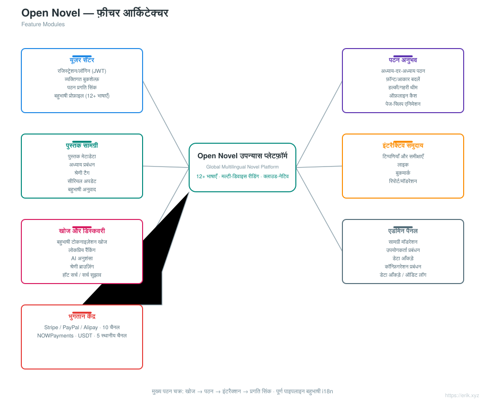
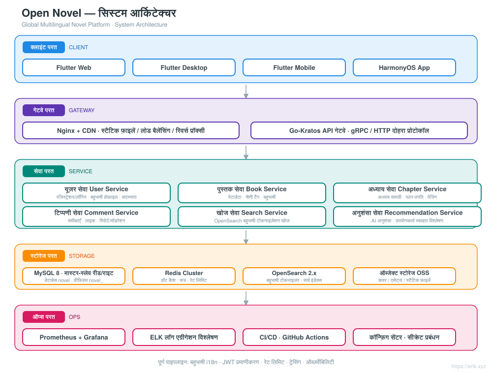
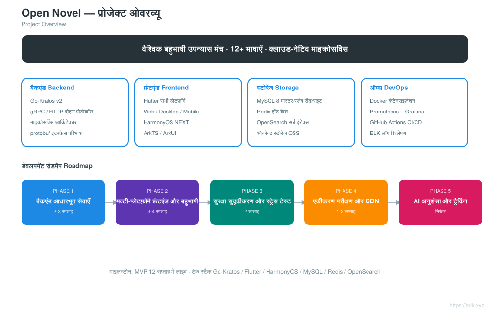
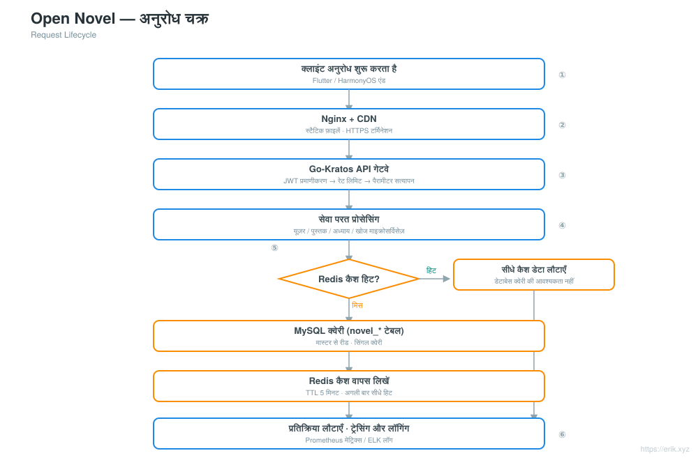
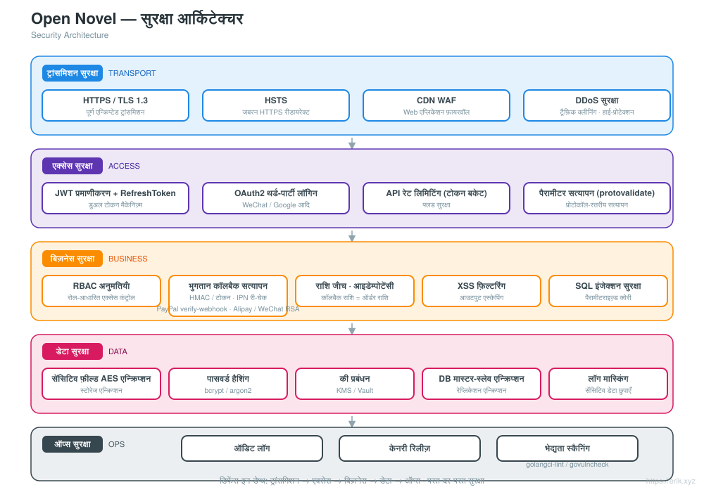
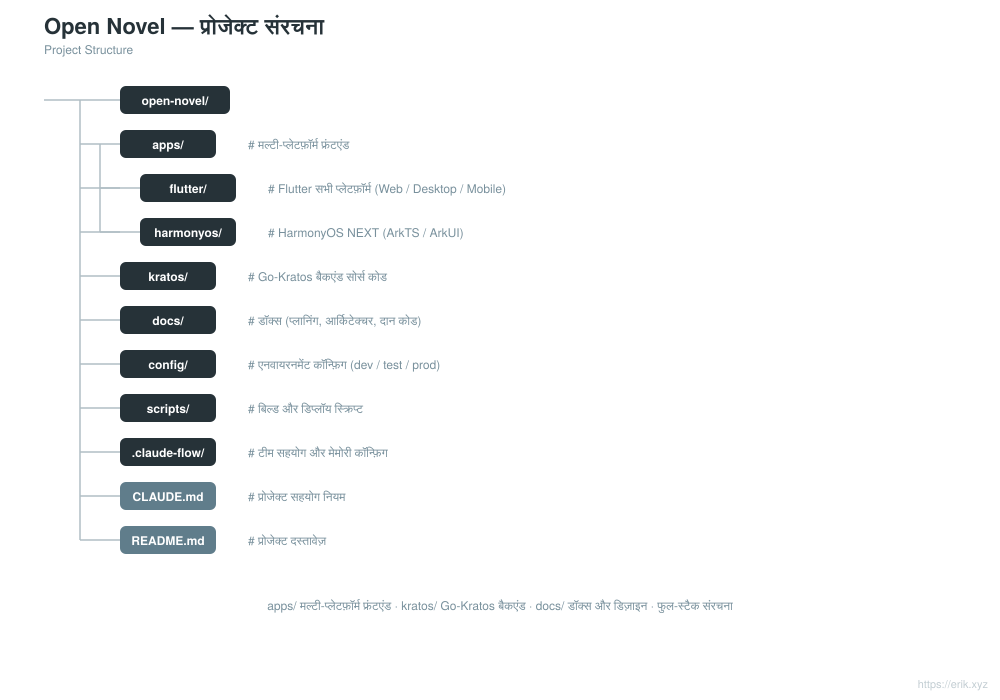

# Open Novel — वैश्विक बहुभाषी उपन्यास मंच

<div align="center">

[中文](../../README.md) · [English](README.en.md) · [日本語](README.ja.md) · [한국어](README.ko.md) · [Русский](README.ru.md) · [Deutsch](README.de.md) · [Français](README.fr.md) · [Español](README.es.md) · [Português](README.pt.md) · **हिन्दी** · [العربية](README.ar.md) · [বাংলা](README.bn.md) · [Bahasa Indonesia](README.id.md)

</div>

> **Go-Kratos** माइक्रोसर्विस आर्किटेक्चर + **Flutter / HarmonyOS** मल्टी-प्लेटफ़ॉर्म फ्रंटएंड पर आधारित वैश्विक बहुभाषी उपन्यास पठन मंच, जो **12+ प्रमुख भाषाओं** का समर्थन करता है और दुनिया भर के उपयोगकर्ताओं को पठन, इंटरैक्शन, खोज और व्यक्तिगत अनुशंसा क्षमताएँ प्रदान करता है।

---

## परियोजना परिचय

Open Novel एक क्लाउड-नेटिव माइक्रोसर्विस आर्किटेक्चर वाला वैश्विक बहुभाषी उपन्यास मंच है:

- **बैकएंड**: Go-Kratos v2 (gRPC / HTTP दोहरा प्रोटोकॉल), माइक्रोसर्विसेज़ डोमेन के अनुसार विभाजित (उपयोगकर्ता, पुस्तकें, अध्याय, टिप्पणियाँ, खोज, अनुशंसा)
- **फ्रंटएंड**: Flutter सभी प्लेटफ़ॉर्म (Web / Desktop / Mobile) + HarmonyOS NEXT नेटिव एप्लिकेशन, सभी एक ही बैकएंड API साझा करते हैं
- **बहुभाषी**: i18n संसाधन डायनामिक रूप से लोड होते हैं, 12+ भाषाओं का समर्थन (चीनी, अंग्रेज़ी, जापानी, कोरियाई, फ्रेंच, जर्मन, स्पेनिश, रूसी, अरबी आदि)
- **स्टोरेज**: MySQL 8 (मास्टर-स्लेव रीड-राइट सेपरेशन) + Redis (हॉट कैश / सत्र) + OpenSearch (बहुभाषी खोज)
- **ऑप्स**: Docker Compose एक-क्लिक डिप्लॉयमेंट, Prometheus + Grafana मॉनिटरिंग, GitHub Actions निरंतर एकीकरण


## विशेषताएँ

<p align="center"></p>

- **उपयोगकर्ता केंद्र**: पंजीकरण/लॉगिन (JWT), व्यक्तिगत बुकशेल्फ़, क्रॉस-डिवाइस पठन प्रगति सिंक, बहुभाषी प्रोफ़ाइल
- **पठन अनुभव**: अध्याय-दर-अध्याय पठन, फ़ॉन्ट और आकार स्विचिंग, हल्की/गहरी थीम, ऑफ़लाइन कैश, पेज-फ्लिप एनिमेशन
- **पुस्तक सामग्री**: पुस्तक मेटाडेटा, अध्याय प्रबंधन, श्रेणी टैग, सीरियल अपडेट, बहुभाषी अनुवाद
- **इंटरैक्टिव समुदाय**: टिप्पणियाँ और समीक्षाएँ, लाइक, बुकमार्क, रिपोर्ट और मॉडरेशन
- **खोज और खोजें**: बहुभाषी टोकनाइज़ेशन खोज, लोकप्रिय रैंकिंग, AI अनुशंसाएँ, श्रेणी ब्राउज़िंग
- **एडमिन पैनल**: सामग्री मॉडरेशन, उपयोगकर्ता प्रबंधन, डेटा आँकड़े, कॉन्फ़िगरेशन प्रबंधन

## सिस्टम आर्किटेक्चर

<p align="center"></p>

## परियोजना अवलोकन

<p align="center"></p>

## अनुरोध चक्र

<p align="center"></p>

## सुरक्षा आर्किटेक्चर

<p align="center"></p>

## परियोजना संरचना

<p align="center"></p>

---

## तकनीकी स्टैक

| परत | तकनीक चयन |
| :--- | :--- |
| क्लाइंट | Flutter (Web / Desktop / Mobile), HarmonyOS NEXT (ArkTS / ArkUI) |
| गेटवे | Nginx + CDN, Go-Kratos API गेटवे (gRPC / HTTP दोहरा प्रोटोकॉल) |
| सर्वर | Go 1.22+, Kratos v2, protobuf / gRPC |
| स्टोरेज | MySQL 8.0 (मास्टर-स्लेव), Redis 7.x (Cluster), OpenSearch 2.x |
| ऑब्ज़र्वेबिलिटी | Prometheus, Grafana, ELK, OpenTelemetry ट्रेसिंग |
| ऑप्स | Docker Compose, GitHub Actions CI/CD |

## डेटाबेस

- डेटाबेस का नाम: `novel`
- टेबल प्रीफ़िक्स: `novel_` (जैसे `novel_user`, `novel_book`, `novel_chapter`, `novel_comment` आदि)

```sql
CREATE DATABASE novel DEFAULT CHARACTER SET utf8mb4 COLLATE utf8mb4_unicode_ci;
```

विस्तृत टेबल डिज़ाइन और रीड-राइट सेपरेशन रणनीति के लिए [docs/novel-project-planning.md](../novel-project-planning.md) देखें।

## मल्टी-प्लेटफ़ॉर्म निर्देशिकाएँ

```
apps/
├─ flutter/     # Flutter सभी प्लेटफ़ॉर्म (Web / Desktop / Mobile), i18n बहुभाषी
└─ harmonyos/   # HarmonyOS NEXT नेटिव एप्लिकेशन (ArkTS / ArkUI)
```

विस्तृत जानकारी के लिए [apps/README.md](../../apps/README.md) देखें।

## रोडमैप

| चरण | अवधि | कार्य का मुख्य फोकस |
| :--- | :--- | :--- |
| Phase 1 | 2-3 सप्ताह | Kratos बैकएंड आधारभूत सेवाएँ + MySQL / Redis / OpenSearch एकीकरण |
| Phase 2 | 3-4 सप्ताह | Flutter / HarmonyOS मल्टी-प्लेटफ़ॉर्म फ्रंटएंड + बहुभाषी ARB लेखन |
| Phase 3 | 2 सप्ताह | सुरक्षा सुदृढ़ीकरण (JWT / RBAC / रेट लिमिटिंग) + स्ट्रेस टेस्ट |
| Phase 4 | 1-2 सप्ताह | फुल-पाइपलाइन एकीकरण परीक्षण + CDN एक्सेलेरेशन कॉन्फ़िगरेशन |
| Phase 5 | निरंतर | AI अनुशंसा एल्गोरिदम एकीकरण, उपयोगकर्ता व्यवहार विश्लेषण ट्रैकिंग |

## स्थानीय विकास

```bash
# डिपेंडेंसी शुरू करें (MySQL / Redis / OpenSearch)
docker compose up -d

# बैकएंड सेवाएँ (Kratos वर्कस्पेस)
cd backend && go mod tidy && go run ./cmd/server

# Flutter एंड
cd apps/flutter && flutter pub get && flutter run

# HarmonyOS एंड
cd apps/harmonyos && hvigorw assembleHap
```

---

## समर्थन और दान

यदि यह परियोजना आपके लिए उपयोगी है, तो कृपया **Star** और **Fork** करके समर्थन करें; स्कैन करके दान देने का भी स्वागत है। आपका हर समर्थन मेरे निरंतर रखरखाव और अपडेट की प्रेरणा है, आपके प्रोत्साहन के लिए धन्यवाद!

<div align="center">

**WeChat दान** ｜ **Alipay दान**

　

</div>

### वैश्विक बैंक ट्रांसफर दान (क्रॉस-बॉर्डर रेमिटेंस)

【प्राप्तकर्ता जानकारी】

- प्राप्तकर्ता का नाम: WANG KEXUN
- प्राप्तकर्ता खाता संख्या: 881015918251

【प्राप्तकर्ता बैंक】

- ZA Bank SWIFT कोड: AABLHKHHXXX
- बैंक का नाम: ZA Bank Limited
- बैंक कोड: 387
- बैंक का पता: Core F, Cyberport 3, 100 Cyberport Road, Hong Kong

【क्रॉस-बॉर्डर रेमिटेंस एजेंट बैंक (यदि आवश्यक हो)】

> कृपया ध्यान दें: यह क्रॉस-बॉर्डर रेमिटेंस एजेंट बैंक (मध्यस्थ बैंक) की जानकारी है, प्राप्तकर्ता बैंक की नहीं। कृपया अपने रेमिटिंग बैंक से पूछें कि क्या क्रॉस-बॉर्डर एजेंट बैंक की जानकारी प्रदान करना आवश्यक है।

**HKD, रेनमिनबी और USD के लिए एजेंट बैंक Citibank है**

- बैंक का नाम: Citibank N.A. Hong Kong
- SWIFT कोड: CITIHKHXXXX
- बैंक कोड: 006
- शाखा का नाम: Hong Kong Branch
- शाखा कोड: 391
- बैंक का पता: Citibank Tower, Citibank Plaza, 3 Garden Road, Central, Hong Kong

**अन्य मुद्राओं के लिए एजेंट बैंक BNY Mellon है**

- बैंक का नाम: THE BANK OF NEW YORK MELLON
- SWIFT कोड: IRVTUS3NXXX
- बैंक का पता: THE BANK OF NEW YORK MELLON, 240 GREENWICH STREET, NEW YORK, United States
