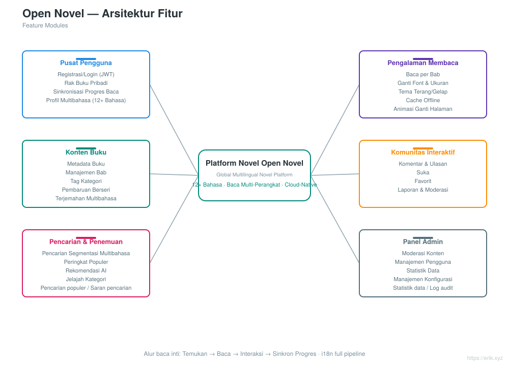
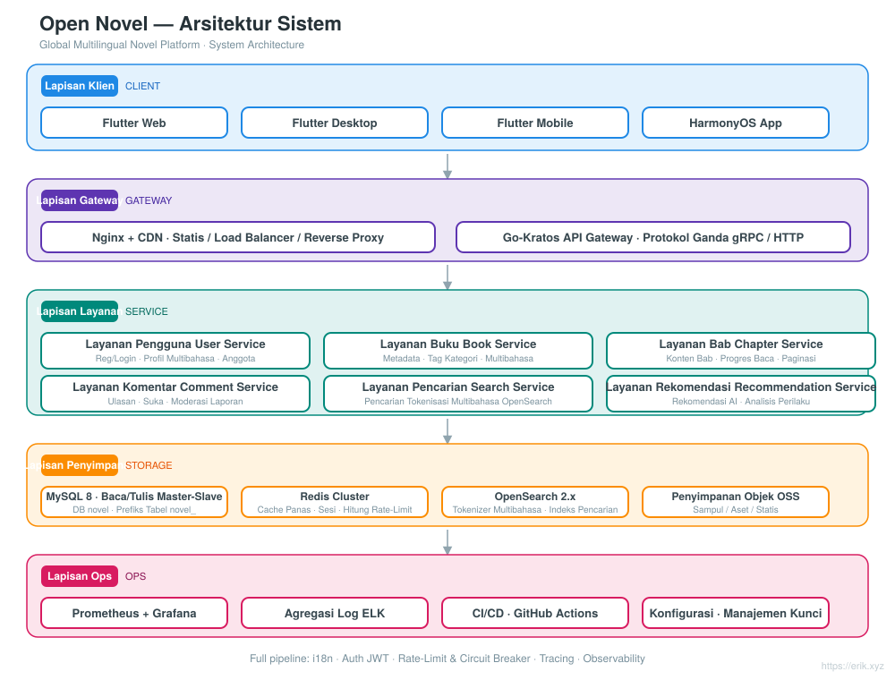
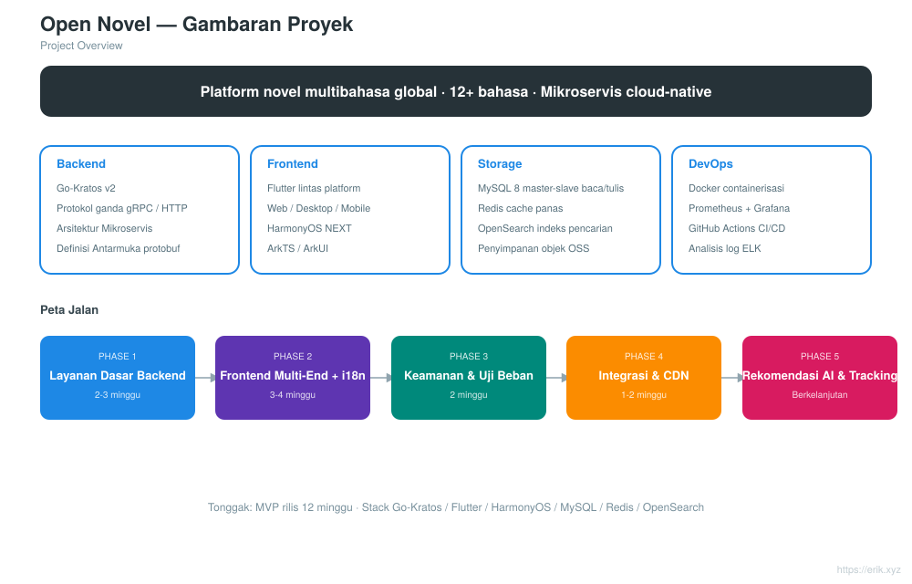
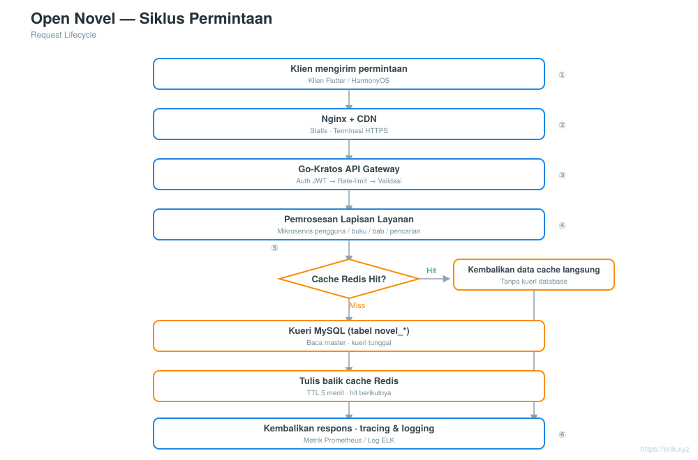
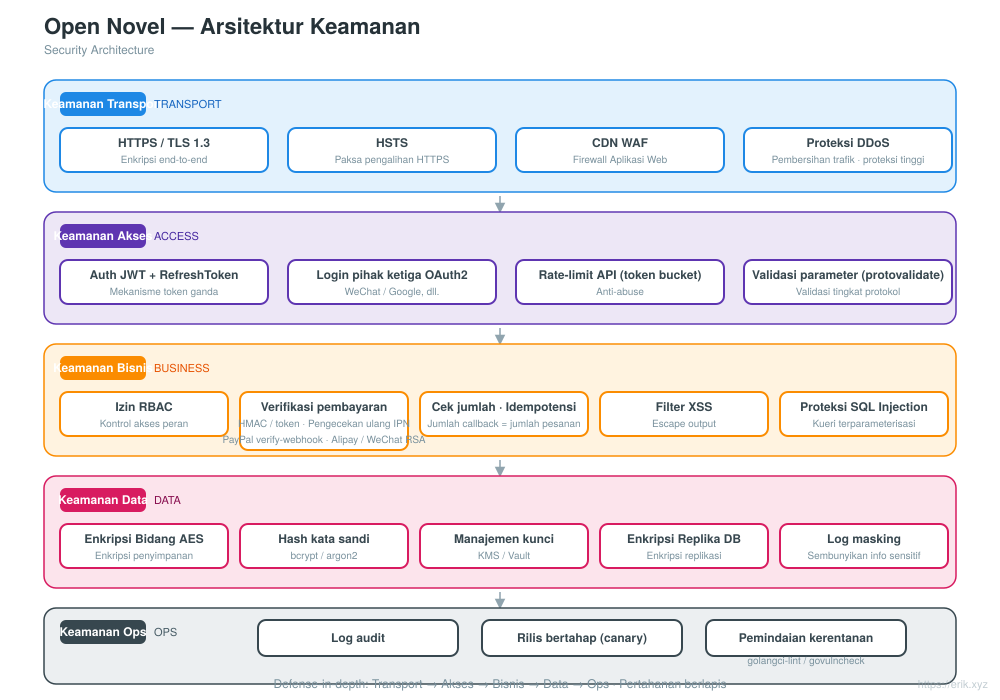
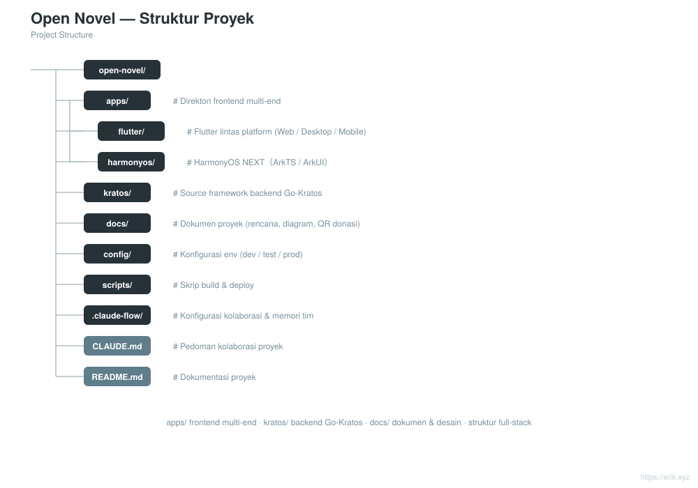

# Open Novel — Platform novel multibahasa global

<div align="center">

[中文](../../README.md) · [English](README.en.md) · [日本語](README.ja.md) · [한국어](README.ko.md) · [Русский](README.ru.md) · [Deutsch](README.de.md) · [Français](README.fr.md) · [Español](README.es.md) · [Português](README.pt.md) · [हिन्दी](README.hi.md) · [العربية](README.ar.md) · [বাংলা](README.bn.md) · **Bahasa Indonesia**

</div>

> Platform membaca novel multibahasa global berbasis arsitektur mikroservis **Go-Kratos** dengan frontend multi-platform **Flutter / HarmonyOS**, mendukung **lebih dari 12 bahasa utama**, dan dirancang untuk memberikan kemampuan membaca, interaksi, pencarian, dan rekomendasi personal kepada pengguna di seluruh dunia.

---

## Pengenalan proyek

Open Novel adalah platform novel multibahasa global dengan arsitektur mikroservis cloud-native:

- **Backend**: Go-Kratos v2 (protokol ganda gRPC / HTTP), mikroservis yang dibagi per domain (pengguna, buku, bab, komentar, pencarian, rekomendasi)
- **Frontend**: Flutter lintas platform (Web / Desktop / Mobile) + aplikasi native HarmonyOS NEXT, berbagi satu set API backend yang sama
- **Multibahasa**: pemuatan dinamis sumber daya i18n, mendukung lebih dari 12 bahasa (Mandarin, Inggris, Jepang, Korea, Prancis, Jerman, Spanyol, Rusia, Arab, dll.)
- **Penyimpanan**: MySQL 8 (master-slave dengan pemisahan baca/tulis) + Redis (cache data panas / sesi) + OpenSearch (pencarian multibahasa)
- **Operasional**: deployment satu klik dengan Docker Compose, pemantauan Prometheus + Grafana, integrasi berkelanjutan GitHub Actions

## Fitur

<p align="center"></p>

- **Pusat pengguna**: registrasi dan login (JWT), rak buku pribadi, sinkronisasi progres baca lintas perangkat, profil multibahasa
- **Pengalaman membaca**: membaca per bab, pergantian font dan ukuran, tema terang/gelap, cache offline, animasi ganti halaman
- **Konten buku**: metadata buku, manajemen bab, tag kategori, pembaruan berseri, terjemahan multibahasa
- **Komunitas interaktif**: komentar dan ulasan, suka, favorit, pelaporan dan moderasi
- **Pencarian dan penemuan**: pencarian dengan segmentasi multibahasa, peringkat populer, rekomendasi AI, penjelajahan kategori
- **Panel admin**: moderasi konten, manajemen pengguna, statistik data, manajemen konfigurasi

## Arsitektur sistem

<p align="center"></p>

Seluruh sistem dibangun di atas arsitektur mikroservis Go-Kratos: klien Flutter / HarmonyOS berinteraksi dengan API gateway melalui Nginx + CDN; gateway merutekan per domain ke layanan backend seperti pengguna, buku, bab, komentar, pencarian, dan rekomendasi; lapisan data adalah MySQL master-slave (pemisahan baca/tulis) + cache Redis + indeks pencarian OpenSearch. Komunikasi antar layanan menggunakan gRPC, dan seluruh antarmuka HTTP eksternal memiliki prefiks terpadu `/api`.

Diagram desain lainnya: gambaran umum proyek [../project.svg](../project.svg) · siklus permintaan [../request-cycle.svg](../request-cycle.svg) · arsitektur keamanan [../security.svg](../security.svg) · struktur proyek [../structure.svg](../structure.svg).

## Gambaran umum proyek

<p align="center"></p>

## Siklus permintaan

<p align="center"></p>

## Arsitektur keamanan

<p align="center"></p>

## Struktur direktori

```
open-novel/
├─ apps/                     # Frontend multi-platform
│  ├─ flutter/               #   Flutter lintas platform (Web / Desktop / Mobile), i18n multibahasa
│  └─ harmonyos/             #   Aplikasi native HarmonyOS NEXT (ArkTS / ArkUI)
├─ kratos/                   # Kode sumber framework Go-Kratos (framework hulu, dipertahankan apa adanya, jangan diubah)
│  └─ backend/               #   Backend bisnis proyek ini: entri cmd/server + api/ + internal/ + sql/ + opensearch/
├─ docs/                     # Dokumentasi proyek (perencanaan, diagram arsitektur, README i18n, kode donasi)
├─ scripts/                  # Skrip build dan deployment (rilis otomatis post-push.sh, smoke.sh)
├─ docker-compose.yml        # Stack dependensi lokal: MySQL 8 + Redis 7 + OpenSearch 2
├─ CLAUDE.md                 # Pedoman kolaborasi proyek
└─ README.md                 # Dokumen penjelasan proyek
```

<p align="center"></p>

> Catatan: `kratos/` adalah kode sumber framework Kratos (memiliki README / LICENSE sendiri), seluruh kode bisnis ada di `kratos/backend/`.

## Tumpukan teknologi

| Lapisan | Teknologi |
| :--- | :--- |
| Klien | Flutter（Web / Desktop / Mobile）、HarmonyOS NEXT（ArkTS / ArkUI） |
| Gateway | Nginx + CDN、Go-Kratos API Gateway（protokol ganda gRPC / HTTP） |
| Server | Go 1.22+、Kratos v2、protobuf / gRPC |
| Penyimpanan | MySQL 8.0（master-slave）、Redis 7.x（Cluster）、OpenSearch 2.x |
| Observabilitas | Prometheus、Grafana、ELK、penelusuran rantai OpenTelemetry |
| Operasional | Docker Compose、GitHub Actions CI/CD |

## Basis data

- Nama basis data: `novel`
- Prefiks tabel: `novel_` (misalnya `novel_user`, `novel_book`, `novel_chapter`, `novel_comment`, dll.)

```sql
CREATE DATABASE novel DEFAULT CHARACTER SET utf8mb4 COLLATE utf8mb4_unicode_ci;
```

Skrip pembuatan tabel: `kratos/backend/sql/init.sql` (dijalankan otomatis saat Docker Compose pertama kali dimulai). Lihat desain tabel terperinci dan strategi pemisahan baca/tulis di [docs/novel-project-planning.md](../novel-project-planning.md).

## Prefiks API

Seluruh antarmuka HTTP backend dimulai dengan `/api`; versi dinegosiasikan melalui header `X-Api-Version: v1` (tidak di URL). Dikelompokkan per domain:

| Domain | Contoh rute | Definisi proto |
| :--- | :--- | :--- |
| Pengguna | `/api/users`, dll. | `kratos/backend/api/user/v1` |
| Buku | `/api/books`、`/api/books/{id}`、`/api/categories`、`/api/tags` | `kratos/backend/api/book/v1` |
| Bab | `/api/...` | `kratos/backend/api/chapter/v1` |
| Komentar | `/api/...` | `kratos/backend/api/comment/v1` |
| Pencarian | `/api/...` | `kratos/backend/api/search/v1` |
| Rekomendasi | `/api/...` | `kratos/backend/api/recommendation/v1` |

Lihat deklarasi `option (google.api.http)` di setiap file proto untuk rute terperinci.

## Memulai dengan cepat

```bash
# 1. Mulai stack dependensi (MySQL / Redis / OpenSearch; kratos/backend/sql/init.sql otomatis membuat tabel saat pertama kali dimulai)
docker compose up -d

# 2. Mulai layanan backend (direktori bisnis Kratos, HTTP :8000 / gRPC :9000)
cd kratos/backend && go mod tidy && go run ./cmd/server

# 3. Mulai aplikasi Flutter (terhubung ke localhost:8000 secara default, tanpa konfigurasi tambahan)
cd apps/flutter && flutter pub get && flutter run -d chrome
```

- Pemetaan port stack dependensi: MySQL `3307`, Redis `6380`, OpenSearch `9200` (port 3306/6379 di host digunakan oleh layanan lokal, lihat komentar di docker-compose.yml).
- Alamat dan kunci backend dikonfigurasi di `kratos/backend/config/`, dapat ditimpa dengan variabel lingkungan (misalnya `PORT`, `OPENSEARCH_ADDR`).
- Untuk menghubungkan Flutter ke backend lain: `flutter run -d chrome --dart-define=API_BASE_URL=http://<host>:8000`.

Lihat [apps/README.md](../../apps/README.md) dan [apps/flutter/README.md](../../apps/flutter/README.md) untuk detailnya.

## Proses rilis

- **Otomatis**: setelah push ke `main`, GitHub Actions ([.github/workflows/release.yml](../../.github/workflows/release.yml)) otomatis menaikkan versi patch berdasarkan tag `v*` terbaru, membuat dan mendorong tag, lalu membuat GitHub Release dengan changelog inkremental; dilewati jika HEAD sudah memiliki tag versi. Rilis pertama dimulai dari `v1.0.0`.
- **Fallback manual**: jalankan [scripts/post-push.sh](../../scripts/post-push.sh) (memerlukan `gh` terautentikasi): `echo "x y refs/heads/main z" | scripts/post-push.sh`.
- **Manual**:

  ```bash
  git tag -a v1.0.1 -m "release v1.0.1"
  git push origin v1.0.1
  gh release create v1.0.1 --generate-notes
  ```

## Peta jalan

| Fase | Periode | Fokus tugas |
| :--- | :--- | :--- |
| Phase 1 | 2-3 minggu | Layanan dasar backend Kratos + integrasi MySQL / Redis / OpenSearch |
| Phase 2 | 3-4 minggu | Frontend multi-platform Flutter / HarmonyOS + penulisan ARB multibahasa |
| Phase 3 | 2 minggu | Penguatan keamanan (JWT / RBAC / pembatasan laju) + uji beban |
| Phase 4 | 1-2 minggu | Integrasi seluruh alur + konfigurasi akselerasi CDN |
| Phase 5 | Berkelanjutan | Integrasi algoritme rekomendasi AI, pelacakan analisis perilaku pengguna |

---

## Dukungan dan donasi

Jika proyek ini bermanfaat bagi Anda, silakan dukung dengan **Star** atau **Fork**; donasi dengan memindai kode QR juga sangat kami hargai. Setiap dukungan Anda adalah motivasi saya untuk terus memelihara dan memperbarui proyek ini. Terima kasih atas dukungannya!

<div align="center">

**Donasi WeChat** ｜ **Donasi Alipay**

　

</div>

### Donasi transfer global (remitansi lintas negara)

【Informasi penerima】

- Nama penerima: WANG KEXUN
- Nomor akun penerima: 881015918251

【Bank penerima】

- ZA Bank SWIFT Code: AABLHKHHXXX
- Nama bank: ZA Bank Limited
- Kode bank: 387
- Alamat bank: Core F, Cyberport 3, 100 Cyberport Road, Hong Kong

【Bank koresponden remitansi lintas negara (jika diperlukan)】

> Perlu diperhatikan bahwa ini adalah informasi bank koresponden (bank perantara) untuk remitansi lintas negara, bukan informasi bank penerima. Tanyakan kepada bank pengirim apakah diperlukan informasi bank koresponden untuk remitansi lintas negara.

**Bank koresponden untuk setoran HKD, CNY, dan USD adalah Citibank**

- Nama bank: Citibank N.A. Hong Kong
- SWIFT Code: CITIHKHXXXX
- Kode bank: 006
- Nama cabang: Hong Kong Branch
- Kode cabang: 391
- Alamat bank: Citibank Tower, Citibank Plaza, 3 Garden Road, Central, Hong Kong

**Bank koresponden untuk setoran mata uang lainnya adalah BNY Mellon**

- Nama bank: THE BANK OF NEW YORK MELLON
- SWIFT Code: IRVTUS3NXXX
- Alamat bank: THE BANK OF NEW YORK MELLON, 240 GREENWICH STREET, NEW YORK, United States

---

## Lisensi dan kontak

- **Lisensi**: tidak ada LICENSE terpisah di akar repositori; `kratos/` adalah kode sumber hulu framework Kratos yang mengikuti [MIT License](../../kratos/LICENSE). Lisensi kode bisnis akan mengikuti pengumuman proyek selanjutnya.
- **Kontak**: melalui GitHub Issues / PR; untuk donasi lihat «Dukungan dan donasi» di atas.
