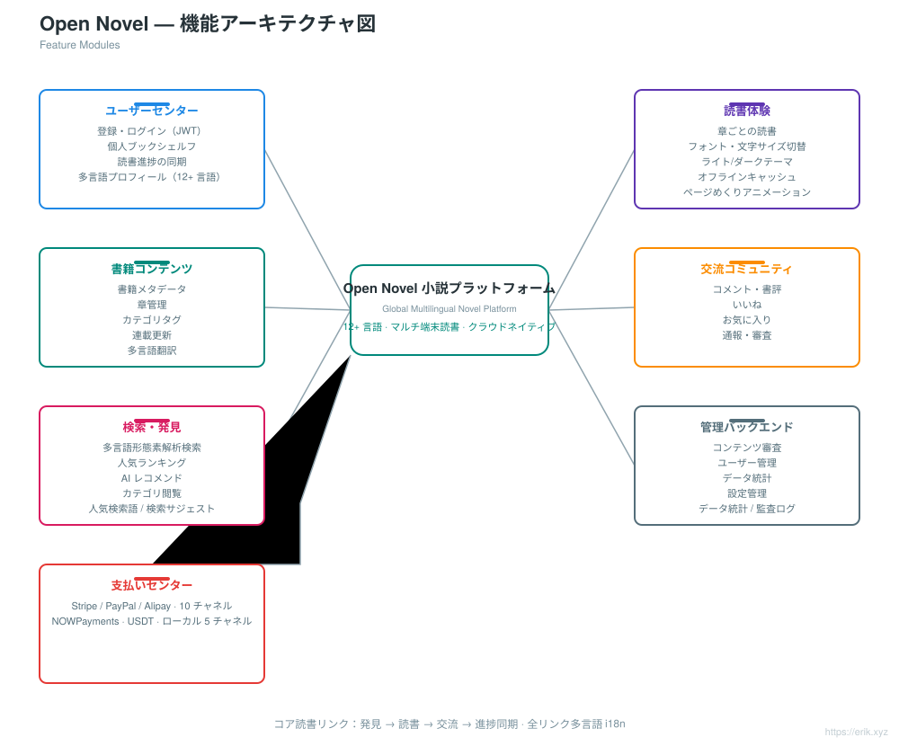
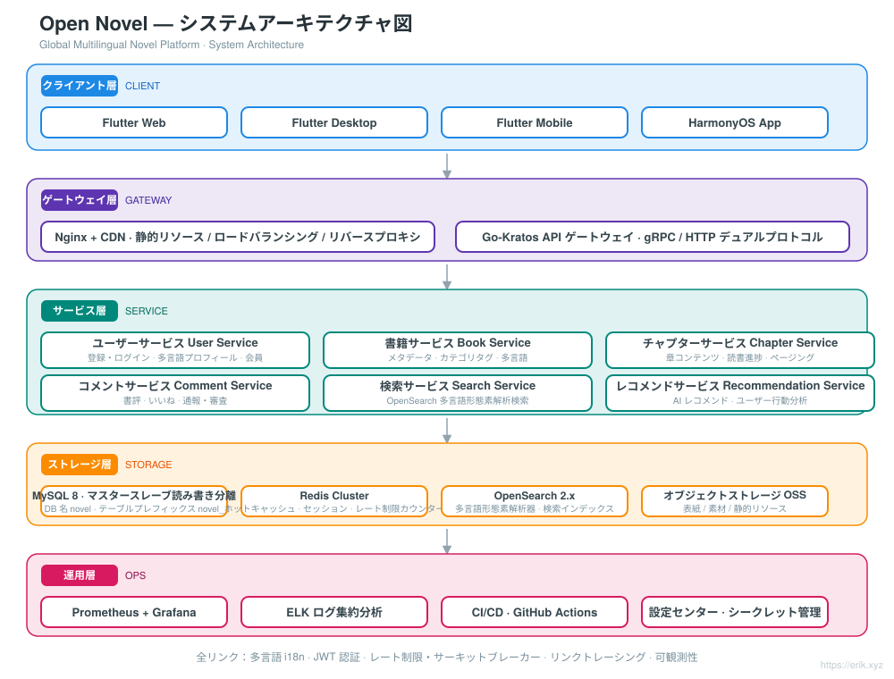
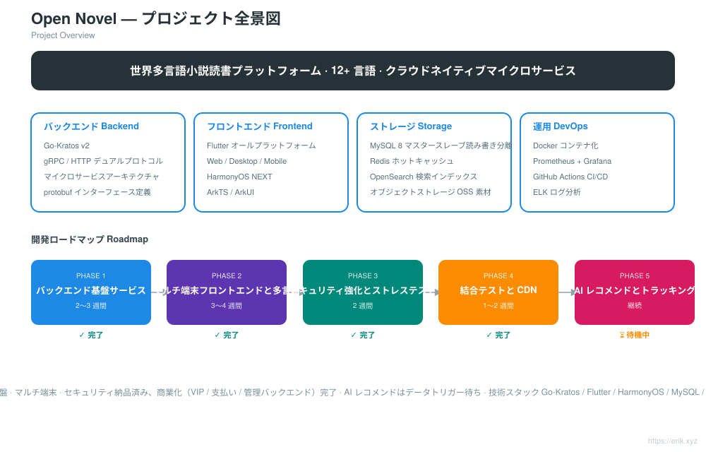
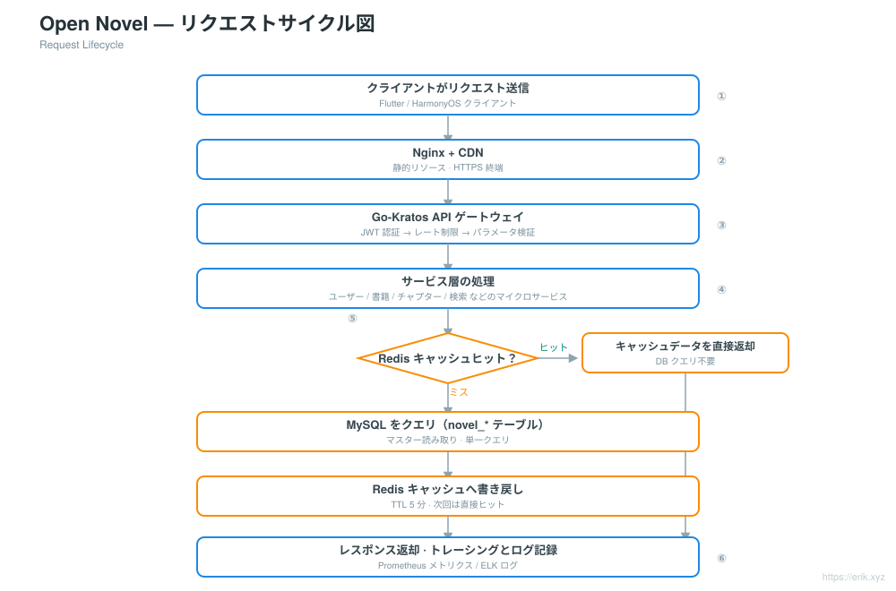
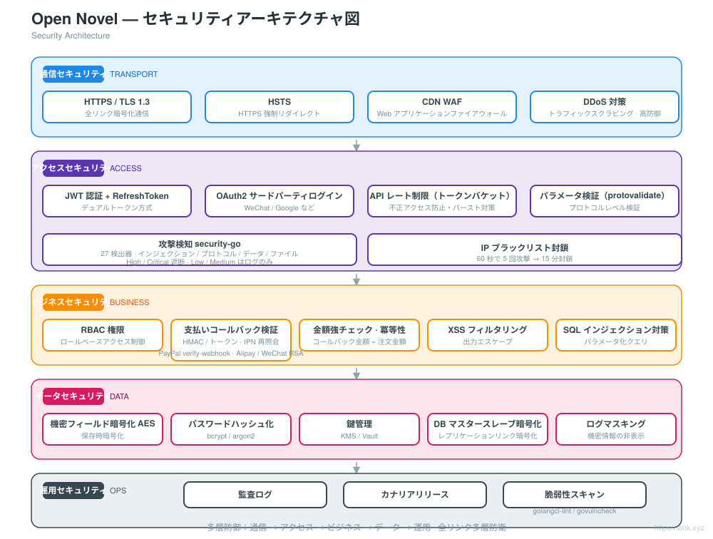
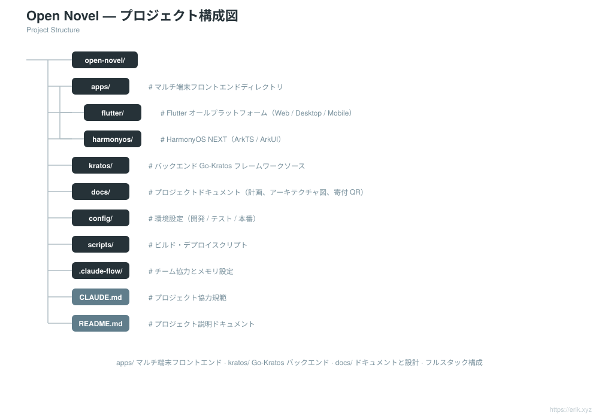

# Open Novel — 世界多言語小説プラットフォーム

<div align="center">

[中文](../../README.md) · [English](README.en.md) · **日本語** · [한국어](README.ko.md) · [Русский](README.ru.md) · [Deutsch](README.de.md) · [Français](README.fr.md) · [Español](README.es.md) · [Português](README.pt.md) · [हिन्दी](README.hi.md) · [العربية](README.ar.md) · [বাংলা](README.bn.md) · [Bahasa Indonesia](README.id.md)

</div>

> **Go-Kratos** マイクロサービスアーキテクチャ + **Flutter / HarmonyOS** マルチクライアントフロントエンドに基づく、世界多言語対応の小説読書プラットフォームです。**12 以上の主要言語**に対応し、世界中のユーザーに読書・交流・検索・パーソナライズレコメンド機能を提供します。

---

## プロジェクト概要

Open Novel は、クラウドネイティブなマイクロサービスアーキテクチャの世界多言語小説プラットフォームです：

- **バックエンド**：Go-Kratos v2（gRPC / HTTP デュアルプロトコル）。マイクロサービスはドメインごとに分割（ユーザー、書籍、チャプター、コメント、検索、レコメンド）
- **フロントエンド**：Flutter オールプラットフォーム（Web / Desktop / Mobile）+ HarmonyOS NEXT ネイティブアプリ。同一のバックエンド API を共用
- **多言語対応**：i18n リソースを動的にロードし、12 以上の言語に対応（中国語、英語、日本語、韓国語、フランス語、ドイツ語、スペイン語、ロシア語、アラビア語など）
- **ストレージ**：MySQL 8（マスタースレーブ読み書き分離）+ Redis（ホットキャッシュ / セッション）+ OpenSearch（多言語検索）
- **運用**：Docker Compose によるワンクリックデプロイ、Prometheus + Grafana モニタリング、GitHub Actions 継続的インテグレーション


## 機能一覧

<p align="center"></p>

- **ユーザーセンター**：登録・ログイン（JWT）、個人ブックシェルフ、端末をまたいだ読書進捗の同期、多言語プロフィール
- **読書体験**：章ごとの読書、フォント・文字サイズの切替、ライト/ダークテーマ、オフラインキャッシュ、ページめくりアニメーション
- **書籍コンテンツ**：書籍メタデータ、章管理、カテゴリタグ、連載更新、多言語翻訳
- **交流コミュニティ**：コメント・書評、いいね、お気に入り、通報・審査
- **検索・発見**：多言語形態素解析検索、人気ランキング、AI レコメンド、カテゴリ閲覧
- **管理バックエンド**：コンテンツ審査、ユーザー管理、データ統計、設定管理

## システムアーキテクチャ

<p align="center"></p>

## プロジェクト全景

<p align="center"></p>

## リクエストサイクル

<p align="center"></p>

## セキュリティアーキテクチャ

<p align="center"></p>

## プロジェクト構成

<p align="center"></p>

---

## 技術スタック

| レイヤー | 技術選定 |
| :--- | :--- |
| クライアント | Flutter（Web / Desktop / Mobile）、HarmonyOS NEXT（ArkTS / ArkUI） |
| ゲートウェイ | Nginx + CDN、Go-Kratos API ゲートウェイ（gRPC / HTTP デュアルプロトコル） |
| サーバーサイド | Go 1.22+、Kratos v2、protobuf / gRPC |
| ストレージ | MySQL 8.0（マスタースレーブ）、Redis 7.x（Cluster）、OpenSearch 2.x |
| 可観測性 | Prometheus、Grafana、ELK、OpenTelemetry リンクトレーシング |
| 運用 | Docker Compose、GitHub Actions CI/CD |

## データベース

- データベース名：`novel`
- テーブルプレフィックス：`novel_`（例：`novel_user`、`novel_book`、`novel_chapter`、`novel_comment` など）

```sql
CREATE DATABASE novel DEFAULT CHARACTER SET utf8mb4 COLLATE utf8mb4_unicode_ci;
```

詳細なテーブル設計と読み書き分離戦略については [docs/novel-project-planning.md](../novel-project-planning.md) を参照してください。

## マルチクライアントディレクトリ

```
apps/
├─ flutter/     # Flutter オールプラットフォーム（Web / Desktop / Mobile）、i18n 多言語対応
└─ harmonyos/   # HarmonyOS NEXT ネイティブアプリ（ArkTS / ArkUI）
```

詳細は [apps/README.md](../../apps/README.md) を参照してください。

## ロードマップ

| フェーズ | 期間 | タスクの重点 |
| :--- | :--- | :--- |
| Phase 1 | 2〜3 週間 | Kratos バックエンド基盤サービス + MySQL / Redis / OpenSearch 統合 |
| Phase 2 | 3〜4 週間 | Flutter / HarmonyOS マルチクライアントフロントエンド + 多言語 ARB 作成 |
| Phase 3 | 2 週間 | セキュリティ強化（JWT / RBAC / レート制限）+ ストレステスト |
| Phase 4 | 1〜2 週間 | 全リンク結合テスト + CDN 高速化設定 |
| Phase 5 | 継続 | AI レコメンドアルゴリズム導入、ユーザー行動分析トラッキング |

## ローカル開発

```bash
# 依存サービスを起動（MySQL / Redis / OpenSearch）
docker compose up -d

# バックエンドサービス（Kratos ワークスペース）
cd backend && go mod tidy && go run ./cmd/server

# Flutter クライアント
cd apps/flutter && flutter pub get && flutter run

# HarmonyOS クライアント
cd apps/harmonyos && hvigorw assembleHap
```

---

## サポートと寄付

このプロジェクトがお役に立ったなら、ぜひ **Star** や **Fork** でサポートしてください。また、QR コードからスキャンして寄付していただくことも歓迎します。皆様のサポートが継続的なメンテナンスとアップデートの原動力です。ご支援ありがとうございます！

<div align="center">

**WeChat 寄付** ｜ **Alipay 寄付**

　

</div>

### グローバル送金による寄付（クロスボーダー送金）

【受取人情報】

- 受取人氏名：WANG KEXUN
- 受取口座番号：881015918251

【受取銀行】

- ZA Bank SWIFT Code：AABLHKHHXXX
- 銀行名：ZA Bank Limited
- 銀行番号：387
- 銀行所在地：Core F, Cyberport 3, 100 Cyberport Road, Hong Kong

【クロスボーダー送金代理銀行（必要な場合）】

> ご注意ください。これはクロスボーダー送金代理銀行（中継銀行）の情報であり、受取銀行の情報ではありません。送金銀行にクロスボーダー送金代理銀行の情報が必要かどうかお問い合わせください。

**香港ドル、人民元、米ドルの入金時の代理銀行は Citibank です**

- 銀行名：Citibank N.A. Hong Kong
- SWIFT Code：CITIHKHXXXX
- 銀行番号：006
- 支店名：Hong Kong Branch
- 支店番号：391
- 銀行所在地：Citibank Tower, Citibank Plaza, 3 Garden Road, Central, Hong Kong

**その他の通貨の入金時の代理銀行は BNY Mellon です**

- 銀行名：THE BANK OF NEW YORK MELLON
- SWIFT Code：IRVTUS3NXXX
- 銀行所在地：THE BANK OF NEW YORK MELLON, 240 GREENWICH STREET, NEW YORK, United States
