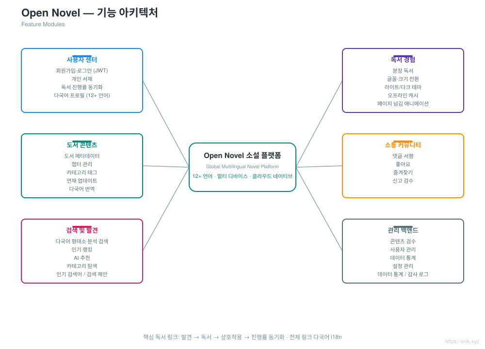
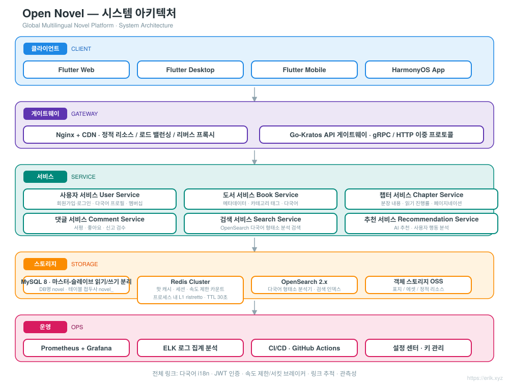
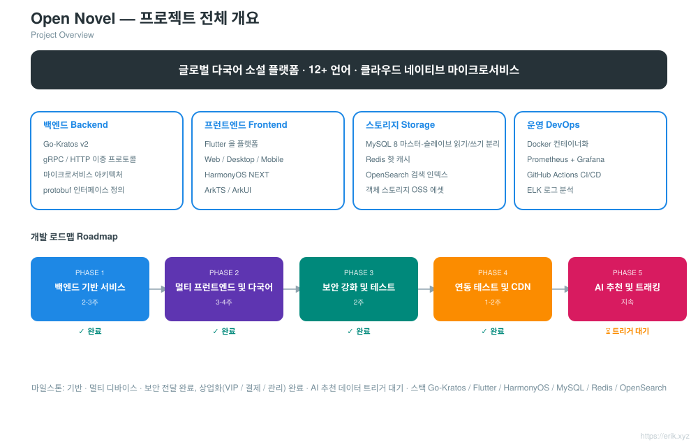
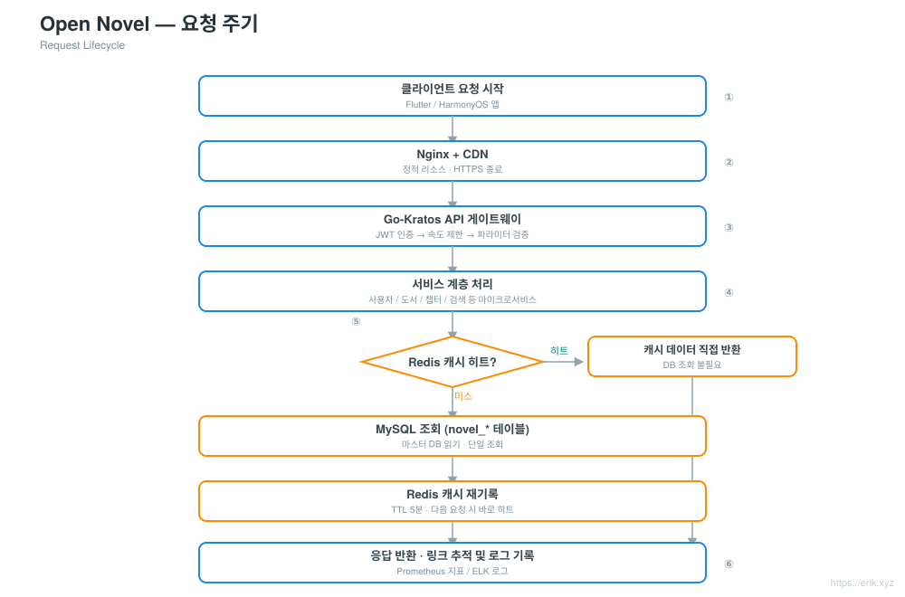
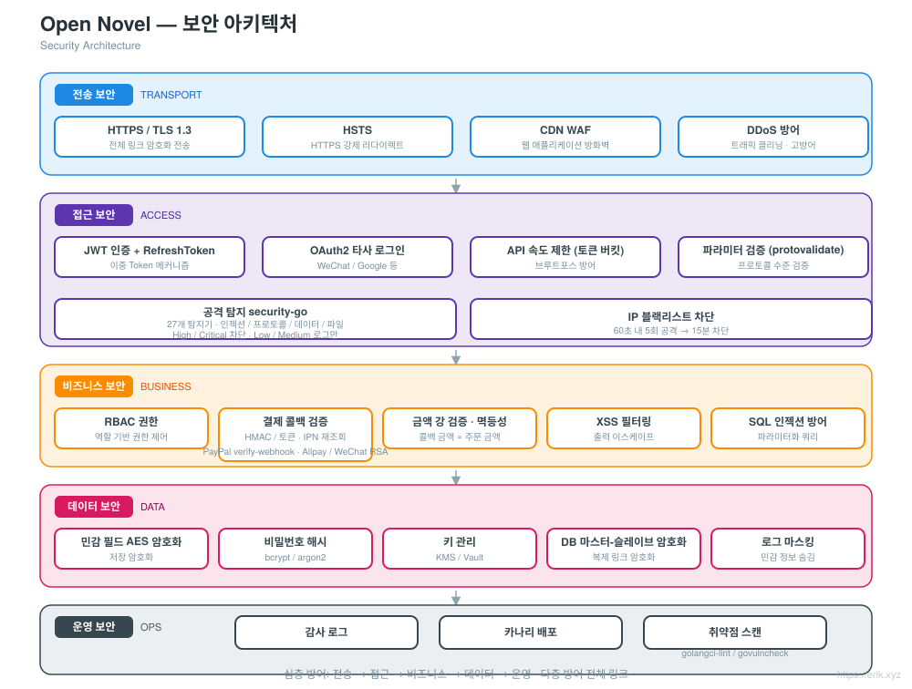
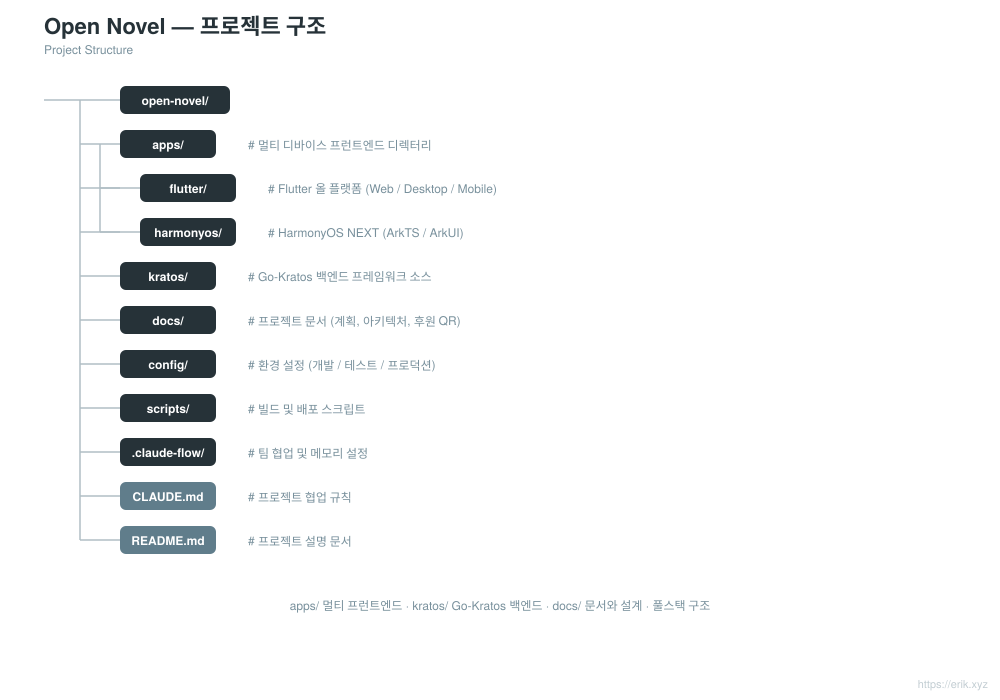

# Open Novel — 글로벌 다국어 소설 플랫폼

<div align="center">

[中文](../../README.md) · [English](README.en.md) · [日本語](README.ja.md) · **한국어** · [Русский](README.ru.md) · [Deutsch](README.de.md) · [Français](README.fr.md) · [Español](README.es.md) · [Português](README.pt.md) · [हिन्दी](README.hi.md) · [العربية](README.ar.md) · [বাংলা](README.bn.md) · [Bahasa Indonesia](README.id.md)

</div>

> **Go-Kratos** 마이크로서비스 아키텍처 + **Flutter / HarmonyOS** 멀티 클라이언트 프런트엔드 기반의 글로벌 다국어 소설 읽기 플랫폼으로, **12개 이상의 주요 언어**를 지원하며 전 세계 사용자에게 읽기, 상호작용, 검색 및 개인화 추천 기능을 제공합니다.

---

## 프로젝트 소개

Open Novel은 클라우드 네이티브 마이크로서비스 아키텍처의 글로벌 다국어 소설 플랫폼입니다:

- **백엔드**: Go-Kratos v2(gRPC / HTTP 듀얼 프로토콜). 마이크로서비스는 도메인별로 분리(사용자, 도서, 챕터, 댓글, 검색, 추천)
- **프런트엔드**: Flutter 올 플랫폼(Web / Desktop / Mobile) + HarmonyOS NEXT 네이티브 앱. 동일한 백엔드 API 공유
- **다국어 지원**: i18n 리소스 동적 로드, 12개 이상의 언어 지원(중국어, 영어, 일본어, 한국어, 프랑스어, 독일어, 스페인어, 러시아어, 아랍어 등)
- **스토리지**: MySQL 8(마스터-슬레이브 읽기/쓰기 분리) + Redis(핫 캐시 / 세션) + OpenSearch(다국어 검색)
- **운영**: Docker Compose 원클릭 배포, Prometheus + Grafana 모니터링, GitHub Actions 지속적 통합

## 기능 및 특징

<p align="center"></p>

- **사용자 센터**: 회원가입·로그인(JWT), 개인 서재, 기기 간 독서 진행률 동기화, 다국어 프로필
- **독서 경험**: 챕터별 독서, 글꼴·크기 전환, 라이트/다크 테마, 오프라인 캐시, 페이지 넘김 애니메이션
- **도서 콘텐츠**: 도서 메타데이터, 챕터 관리, 카테고리 태그, 연재 업데이트, 다국어 번역
- **소통 커뮤니티**: 댓글·서평, 좋아요, 즐겨찾기, 신고·검수
- **검색 및 발견**: 다국어 형태소 분석 검색, 인기 키워드 랭킹, 검색 제안(클라이언트 로컬 히스토리 20개 + 200ms 디바운스 제안), AI 추천, 카테고리 탐색
- **관리 백엔드**: 콘텐츠 검수, 사용자 관리, 데이터 통계, 설정 관리, 감사 로그 조회 페이지(페이징 + 다중 조건 필터)
- **결제 및 VIP**: 11개 결제 프로바이더(Stripe, NOWPayments(USDT), Razorpay, KOMOJU, PortOne, Mercado Pago, Xendit, PayPal, Alipay, WeChat Pay Global, UnionPay) 다중 채널 결제, VIP 플랜 구독 및 갱신, 언어별 결제 수단 라우팅(WeChat Pay Global 연동, 국내 WeChat Pay 미연동, 중국 가맹점 자격 필요)

## 시스템 아키텍처

<p align="center"></p>

전체는 Go-Kratos 마이크로서비스 아키텍처입니다. Flutter / HarmonyOS 클라이언트는 Nginx + CDN을 거쳐 API 게이트웨이와 상호작용하며, 게이트웨이는 도메인별로 사용자, 도서, 챕터, 댓글, 검색, 추천 등의 백엔드 서비스로 라우팅합니다. 데이터 계층은 MySQL 마스터-슬레이브(읽기/쓰기 분리) + Redis 캐시 + OpenSearch 검색 인덱스입니다. 서비스 간 gRPC 통신, 외부 HTTP 인터페이스는 통일 접두사 `/api`을 사용합니다.

기타 설계도: 프로젝트 전체 구조 [docs/project.svg](../../docs/project.svg) · 요청 주기 [docs/request-cycle.svg](../../docs/request-cycle.svg) · 보안 아키텍처 [docs/security.svg](../../docs/security.svg) · 프로젝트 구조 [docs/structure.svg](../../docs/structure.svg).

## 프로젝트 전체 구조

<p align="center"></p>

## 요청 주기

<p align="center"></p>

## 보안 아키텍처

<p align="center"></p>

---

## 디렉터리 구조

```
open-novel/
├─ apps/                     # 멀티 클라이언트 프런트엔드
│  ├─ flutter/               #   Flutter 올 플랫폼(Web / Desktop / Mobile), i18n 다국어 지원
│  └─ harmonyos/             #   HarmonyOS NEXT 네이티브 앱(ArkTS / ArkUI)
├─ kratos/                   # Go-Kratos 프레임워크 소스(업스트림 프레임워크, 원본 유지, 수정 금지)
│  └─ backend/               #   본 프로젝트의 비즈니스 백엔드: cmd/server 엔트리 + api/ + internal/ + sql/ + opensearch/
├─ docs/                     # 프로젝트 문서(기획, 아키텍처 다이어그램, i18n README, 후원 QR 코드)
├─ scripts/                  # 빌드·배포 스크립트(post-push.sh 자동 릴리스, smoke.sh)
├─ docker-compose.yml        # 로컬 의존 스택: MySQL 8 + Redis 7 + OpenSearch 2
├─ CLAUDE.md                 # 프로젝트 협업 규칙
└─ README.md                 # 프로젝트 설명 문서
```

<p align="center"></p>

> 참고: `kratos/`는 Kratos 프레임워크 소스 코드(README / LICENSE 포함)이며, 비즈니스 코드는 전부 `kratos/backend/`에 있습니다.

## 기술 스택

| 계층 | 기술 선정 |
| :--- | :--- |
| 클라이언트 | Flutter(Web / Desktop / Mobile), HarmonyOS NEXT(ArkTS / ArkUI) |
| 게이트웨이 | Nginx + CDN, Go-Kratos API 게이트웨이(gRPC / HTTP 듀얼 프로토콜) |
| 서버 | Go 1.22+, Kratos v2, protobuf / gRPC |
| 스토리지 | MySQL 8.0(마스터-슬레이브), Redis 7.x(Cluster), OpenSearch 2.x, Redis 위의 ristretto 프로세스 내 L1 캐시(30초 TTL) |
| 관측성 | Prometheus, Grafana, ELK, OpenTelemetry 링크 추적 |
| 운영 | Docker Compose, GitHub Actions CI/CD |

## 데이터베이스

- 데이터베이스 이름: `novel`
- 테이블 접두사: `novel_`(예: `novel_user`, `novel_book`, `novel_chapter`, `novel_comment` 등)

```sql
CREATE DATABASE novel DEFAULT CHARACTER SET utf8mb4 COLLATE utf8mb4_unicode_ci;
```

테이블 생성 스크립트: `kratos/backend/sql/init.sql`(Docker Compose 최초 시작 시 자동 실행). 자세한 테이블 설계 및 읽기/쓰기 분리 전략은 [docs/novel-project-planning.md](../novel-project-planning.md)를 참조하세요.

## API 접두사

백엔드 HTTP 인터페이스는 모두 `/api`로 시작하며, 버전은 요청 헤더 `X-Api-Version: v1`로 협상됩니다(URL에 적지 않음). 엔드포인트는 도메인별로 그룹화됩니다:

| 도메인 | 예시 라우트 | proto 정의 |
| :--- | :--- | :--- |
| 사용자 | `/api/users` 등 | `kratos/backend/api/user/v1` |
| 도서 | `/api/books`, `/api/books/{id}`, `/api/categories`, `/api/tags` | `kratos/backend/api/book/v1` |
| 챕터 | `/api/...` | `kratos/backend/api/chapter/v1` |
| 댓글 | `/api/...` | `kratos/backend/api/comment/v1` |
| 검색 | `/api/...` | `kratos/backend/api/search/v1` |
| 추천 | `/api/...` | `kratos/backend/api/recommendation/v1` |

자세한 라우트는 각 proto 파일의 `option (google.api.http)` 선언을 참조하세요.

## 빠른 시작

```bash
# 1. 의존 스택 시작(MySQL / Redis / OpenSearch, 최초 시작 시 kratos/backend/sql/init.sql 자동 실행으로 테이블 생성)
docker compose up -d

# 2. 백엔드 서비스 시작(Kratos 비즈니스 디렉터리, HTTP :8000 / gRPC :9000)
cd kratos/backend && go mod tidy && go run ./cmd/server

# 3. Flutter 클라이언트 시작(기본적으로 localhost:8000에 연결, 추가 설정 불필요)
cd apps/client/flutter && flutter pub get && flutter run -d chrome
```

- 의존 스택 포트 매핑: MySQL `3307`, Redis `6380`, OpenSearch `9200`(호스트 3306/6379는 로컬 서비스가 사용 중, docker-compose.yml 주석 참조).
- 백엔드 주소와 시크릿은 `kratos/backend/config/`에서 설정하며 환경 변수로 덮어쓰기 가능(예: `PORT`, `OPENSEARCH_ADDR`).
- Flutter를 다른 백엔드에 연결하려면: `flutter run -d chrome --dart-define=API_BASE_URL=http://<host>:8000`.

자세한 내용은 [apps/README.md](../../apps/README.md)와 [apps/client/flutter/README.md](../../apps/client/flutter/README.md)를 참조하세요.

## 릴리스 프로세스

- **자동**: `main` 푸시 후 GitHub Actions([.github/workflows/release.yml](../../.github/workflows/release.yml))가 최신 `v*` 태그 기준으로 patch 버전을 자동 증가시키고 태그를 생성·푸시한 뒤 증분 체인지로그로 GitHub Release를 생성합니다. HEAD에 이미 버전 태그가 있으면 건너뜁니다. 첫 릴리스는 `v1.0.0`부터 시작합니다.
- **수동 폴백**: [scripts/post-push.sh](../../scripts/post-push.sh) 실행(`gh` 인증 필요): `echo "x y refs/heads/main z" | scripts/post-push.sh`.
- **수동**:

  ```bash
  git tag -a v1.0.1 -m "release v1.0.1"
  git push origin v1.0.1
  gh release create v1.0.1 --generate-notes
  ```

## 로드맵

| 단계 | 기간 | 주요 작업 |
| :--- | :--- | :--- |
| Phase 1 | 2~3주 | Kratos 백엔드 기반 서비스 + MySQL / Redis / OpenSearch 통합 |
| Phase 2 | 3~4주 | Flutter / HarmonyOS 멀티 클라이언트 프런트엔드 + 다국어 ARB 작성 |
| Phase 3 | 2주 | 보안 강화(JWT / RBAC / 속도 제한) + 스트레스 테스트 |
| Phase 4 | 1~2주 | 전체 연동 테스트 + CDN 가속 설정 |
| Phase 5 | 지속 | AI 추천 알고리즘 도입, 사용자 행동 분석 트래킹 |

모든 작업 체인이 완료되었습니다.

## 후원 및 기부

이 프로젝트가 도움이 되셨다면 **Star**와 **Fork**로 지원해 주세요. 또한 QR 코드를 스캔하여 기부해 주셔도 환영합니다. 여러분의 지원 하나하나가 제가 계속 유지보수하고 업데이트하는 원동력입니다. 감사합니다!

<div align="center">

**위챗 후원** ｜ **알리페이 후원**

　

</div>

### 글로벌 송금 후원(국제 송금)

【수취인 정보】

- 수취인 이름: WANG KEXUN
- 수취 계좌번호: 881015918251

【수취 은행】

- ZA Bank SWIFT Code: AABLHKHHXXX
- 은행명: ZA Bank Limited
- 은행 번호: 387
- 은행 주소: Core F, Cyberport 3, 100 Cyberport Road, Hong Kong

【국제 송금 중개 은행(필요한 경우)】

> 유의하시기 바랍니다. 이는 국제 송금 중개 은행(중개 은행) 정보이며 수취 은행 정보가 아닙니다. 송금 은행에 국제 송금 중개 은행 정보 제공이 필요한지 문의하시기 바랍니다.

**홍콩 달러, 위안화, 미국 달러 입금 시 중개 은행은 Citibank입니다**

- 은행명: Citibank N.A. Hong Kong
- SWIFT Code: CITIHKHXXXX
- 은행 번호: 006
- 지점명: Hong Kong Branch
- 지점 번호: 391
- 은행 주소: Citibank Tower, Citibank Plaza, 3 Garden Road, Central, Hong Kong

**기타 통화 입금 시 중개 은행은 BNY Mellon입니다**

- 은행명: THE BANK OF NEW YORK MELLON
- SWIFT Code: IRVTUS3NXXX
- 은행 주소: THE BANK OF NEW YORK MELLON, 240 GREENWICH STREET, NEW YORK, United States

### 암호화폐 후원 (Crypto Donation)

이 프로젝트가 도움이 되셨다면, QR 코드를 스캔하여 후원해 주세요. 감사합니다!

| 네트워크 (Network) | QR 코드 (QR Code) | 지갑 주소 (Wallet Address) |
|---|---|---|
| BNB Smart Chain (BEP20) | [](../coin/1.jpg) | `0x355d429f97511897ccb4e271ec888205f9ab6629` |
| Tron (TRC20) | [](../coin/2.jpg) | `TEdDHWLajt1XvqtPDWmQctdrJaC3pzZZzz` |
| Ethereum (ERC20) | [](../coin/3.jpg) | `0x355d429f97511897ccb4e271ec888205f9ab6629` |
| Aptos | [](../coin/4.jpg) | `0x836e3780edfc3f7b2372b39e2a1a3a5d7adfaccd96c726f21cfde1b50dd68030` |
| Plasma | [](../coin/5.jpg) | `0x355d429f97511897ccb4e271ec888205f9ab6629` |
| Polygon POS | [](../coin/6.jpg) | `0x355d429f97511897ccb4e271ec888205f9ab6629` |
| Solana | [](../coin/7.jpg) | `2hfhboHdmdrYsY25XfQSsEWxq5ip4EQsR7f4AzSRMUyr` |
| The Open Network (TON) | [](../coin/8.jpg) | `UQB9kFQohzmXUir9QSSZq01iwl9aQZIDdBpNmDklljRtCoGK` |
| Arbitrum One | [](../coin/9.jpg) | `0x355d429f97511897ccb4e271ec888205f9ab6629` |
| AVAX C-Chain | [](../coin/10.jpg) | `0x355d429f97511897ccb4e271ec888205f9ab6629` |

---

## License 및 연락처

- **License**: 저장소 루트에 독립된 LICENSE가 없습니다. `kratos/`는 Kratos 프레임워크의 업스트림 소스이며 해당 [MIT License](../../kratos/LICENSE)를 따릅니다. 비즈니스 코드의 라이선스 방식은 추후 프로젝트 발표에 따릅니다.
- **연락처**: GitHub Issues / PR로 소통할 수 있습니다. 기부는 위의 '후원 및 기부'를 참조하세요.
