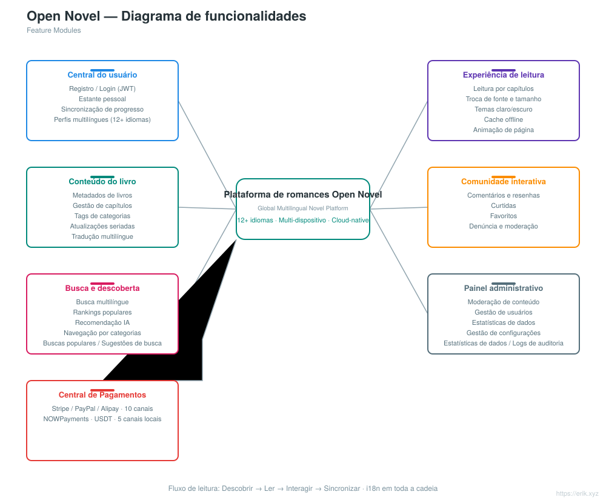
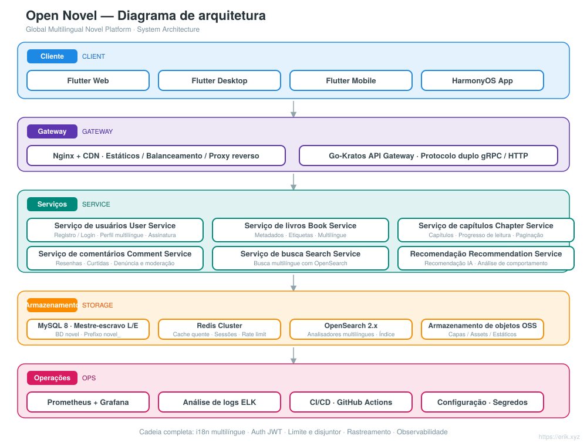
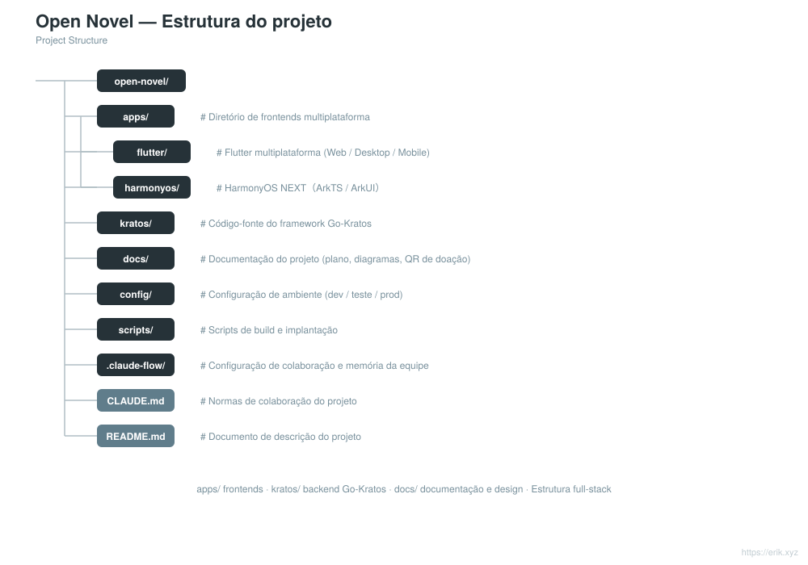

# Open Novel — Plataforma global de romances multilíngue

<div align="center">

[中文](../../README.md) · [English](README.en.md) · [日本語](README.ja.md) · [한국어](README.ko.md) · [Русский](README.ru.md) · [Deutsch](README.de.md) · [Français](README.fr.md) · [Español](README.es.md) · **Português** · [हिन्दी](README.hi.md) · [العربية](README.ar.md) · [বাংলা](README.bn.md) · [Bahasa Indonesia](README.id.md)

</div>

> Plataforma global de leitura de romances multilíngue baseada na arquitetura de microsserviços **Go-Kratos** com frontends multiplataforma **Flutter / HarmonyOS**, compatível com **mais de 12 idiomas principais**, oferecendo a usuários do mundo todo leitura, interação, busca e recomendações personalizadas.

---

## Introdução do projeto

Open Novel é uma plataforma global de romances multilíngue com arquitetura de microsserviços nativa da nuvem:

- **Backend**: Go-Kratos v2 (protocolo duplo gRPC / HTTP), microsserviços divididos por domínio (usuários, livros, capítulos, comentários, busca, recomendações)
- **Frontend**: Flutter multiplataforma (Web / Desktop / Mobile) + aplicativo nativo HarmonyOS NEXT, compartilhando o mesmo conjunto de APIs do backend
- **Multilíngue**: carregamento dinâmico de recursos i18n, compatível com mais de 12 idiomas (chinês, inglês, japonês, coreano, francês, alemão, espanhol, russo, árabe etc.)
- **Armazenamento**: MySQL 8 (mestre-escravo com separação de leitura/escrita) + Redis (cache de dados quentes / sessões) + OpenSearch (busca multilíngue)
- **Operações**: implantação com um clique via Docker Compose, monitoramento com Prometheus + Grafana, integração contínua com GitHub Actions


## Funcionalidades

<p align="center"></p>

- **Central do usuário**: registro e login (JWT), estante pessoal, sincronização do progresso de leitura entre dispositivos, perfis multilíngues
- **Experiência de leitura**: leitura por capítulos, troca de fonte e tamanho, temas claro/escuro, cache offline, animações de virada de página
- **Conteúdo do livro**: metadados de livros, gestão de capítulos, tags de categorias, atualizações seriadas, tradução multilíngue
- **Comunidade interativa**: comentários e resenhas, curtidas, favoritos, denúncia e moderação
- **Busca e descoberta**: busca com segmentação multilíngue, rankings populares, recomendações com IA, navegação por categorias
- **Painel administrativo**: moderação de conteúdo, gestão de usuários, estatísticas de dados, gestão de configurações

## Arquitetura do sistema

<p align="center"></p>

## Visão geral do projeto

<p align="center"></p>

## Ciclo de solicitações

<p align="center"></p>

## Arquitetura de segurança

<p align="center"></p>

## Estrutura do projeto

<p align="center"></p>

---

## Pilha de tecnologia

| Camada | Tecnologia |
| :--- | :--- |
| Cliente | Flutter（Web / Desktop / Mobile）、HarmonyOS NEXT（ArkTS / ArkUI） |
| Porta de entrada | Nginx + CDN、Go-Kratos API Gateway（protocolo duplo gRPC / HTTP） |
| Servidor | Go 1.22+、Kratos v2、protobuf / gRPC |
| Armazenamento | MySQL 8.0（mestre-escravo）、Redis 7.x（Cluster）、OpenSearch 2.x |
| Observabilidade | Prometheus、Grafana、ELK、rastreamento de cadeia OpenTelemetry |
| Operações | Docker Compose、GitHub Actions CI/CD |

## Banco de dados

- Nome do banco de dados: `novel`
- Prefixo das tabelas: `novel_` (por exemplo, `novel_user`, `novel_book`, `novel_chapter`, `novel_comment` etc.)

```sql
CREATE DATABASE novel DEFAULT CHARACTER SET utf8mb4 COLLATE utf8mb4_unicode_ci;
```

Consulte o design detalhado das tabelas e a estratégia de separação de leitura/escrita em [docs/novel-project-planning.md](../novel-project-planning.md).

## Diretórios multiplataforma

```
apps/
├─ flutter/     # Flutter 全平台（Web / Desktop / Mobile），i18n 多语言
└─ harmonyos/   # HarmonyOS NEXT 原生应用（ArkTS / ArkUI）
```

Consulte [apps/README.md](../../apps/README.md) para mais detalhes.

## Roteiro

| Fase | Período | Foco das tarefas |
| :--- | :--- | :--- |
| Phase 1 | 2-3 semanas | Serviços base do backend Kratos + integração MySQL / Redis / OpenSearch |
| Phase 2 | 3-4 semanas | Frontends multiplataforma Flutter / HarmonyOS + escrita de ARB multilíngue |
| Phase 3 | 2 semanas | Reforço de segurança (JWT / RBAC / limitação de taxa) + testes de carga |
| Phase 4 | 1-2 semanas | Integração de todo o fluxo + configuração de aceleração CDN |
| Phase 5 | Contínuo | Integração de algoritmos de recomendação com IA, rastreamento de análise de comportamento do usuário |

## Desenvolvimento local

```bash
# 启动依赖（MySQL / Redis / OpenSearch）
docker compose up -d

# 后端服务（Kratos 工作区）
cd kratos/backend && go mod tidy && go run ./cmd/server

# Flutter 端
cd apps/flutter && flutter pub get && flutter run

# HarmonyOS 端
cd apps/harmonyos && hvigorw assembleHap
```

---

## Apoio e doações

Se este projeto for útil para você, fique à vontade para apoiá-lo com um **Star** ou **Fork**; doações por QR code também são bem-vindas. Cada apoio seu é o que me motiva a continuar mantendo e atualizando o projeto. Obrigado pelo incentivo!

<div align="center">

**Doação por WeChat** ｜ **Doação por Alipay**

　

</div>

### Doação por transferência global (remessa transfronteiriça)

【Informações do beneficiário】

- Nome do beneficiário: WANG KEXUN
- Número da conta do beneficiário: 881015918251

【Banco receptor】

- ZA Bank SWIFT Code: AABLHKHHXXX
- Nome do banco: ZA Bank Limited
- Código do banco: 387
- Endereço do banco: Core F, Cyberport 3, 100 Cyberport Road, Hong Kong

【Banco corresponsal para remessas transfronteiriças (se necessário)】

> Observe que estas são as informações do banco corresponsal (banco intermediário) para remessas transfronteiriças, e não do banco receptor. Consulte seu banco de envio se for necessário fornecer as informações do banco corresponsal.

**O banco corresponsal para depósitos em HKD, CNY e USD é o Citibank**

- Nome do banco: Citibank N.A. Hong Kong
- SWIFT Code: CITIHKHXXXX
- Código do banco: 006
- Nome da agência: Hong Kong Branch
- Código da agência: 391
- Endereço do banco: Citibank Tower, Citibank Plaza, 3 Garden Road, Central, Hong Kong

**O banco corresponsal para depósitos em outras moedas é o BNY Mellon**

- Nome do banco: THE BANK OF NEW YORK MELLON
- SWIFT Code: IRVTUS3NXXX
- Endereço do banco: THE BANK OF NEW YORK MELLON, 240 GREENWICH STREET, NEW YORK, United States
