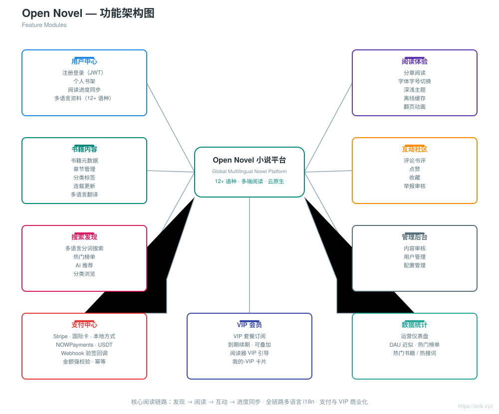
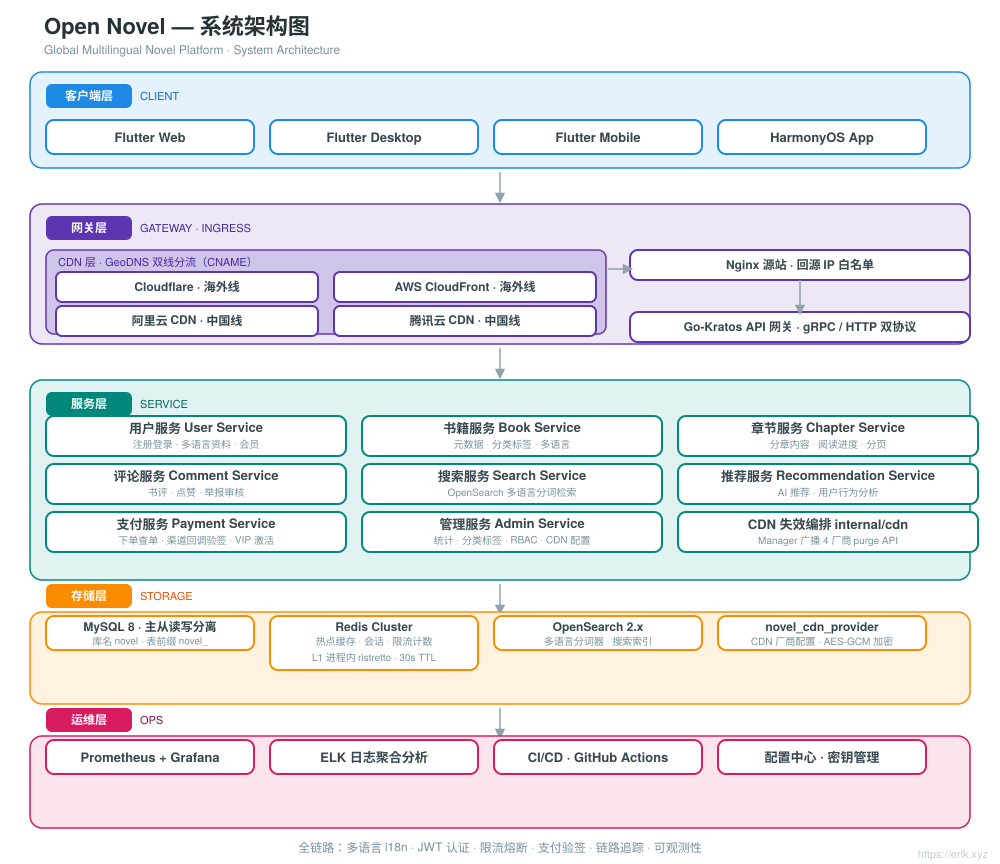
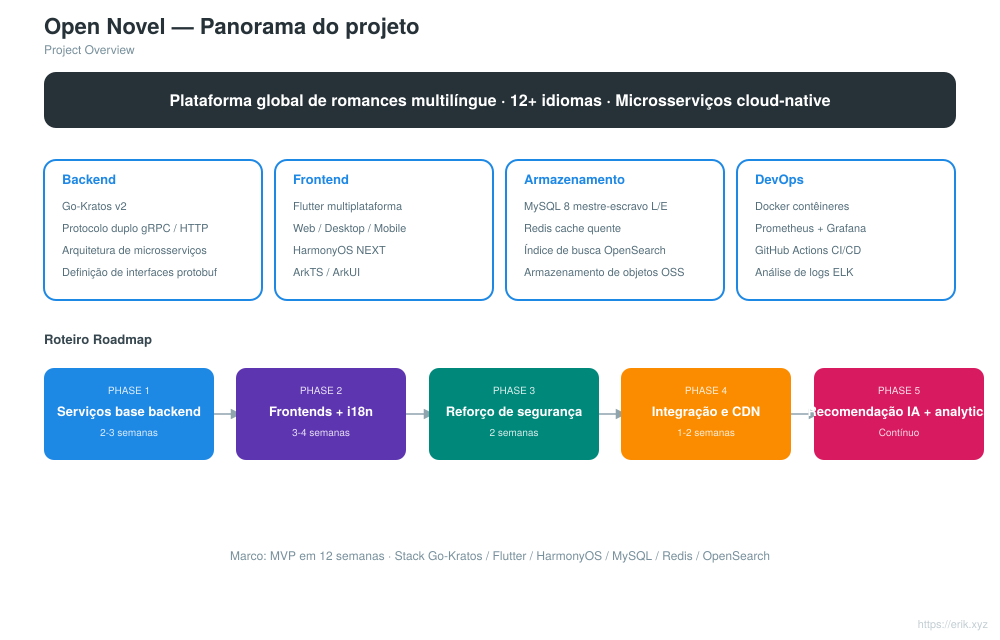
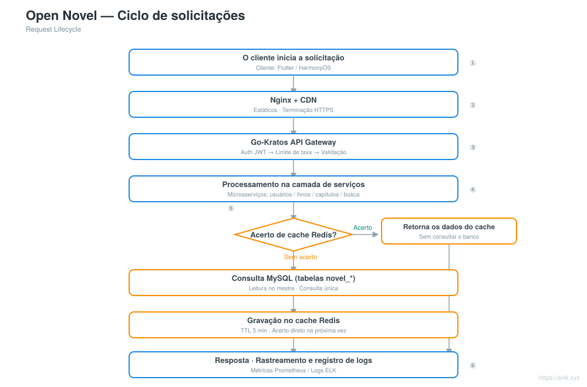
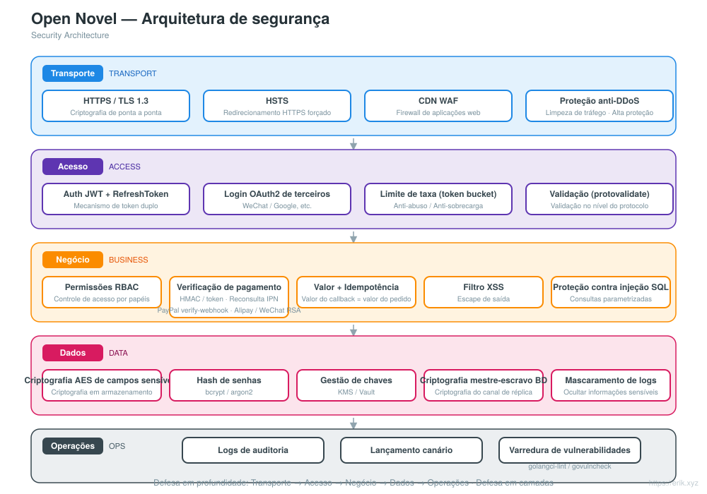
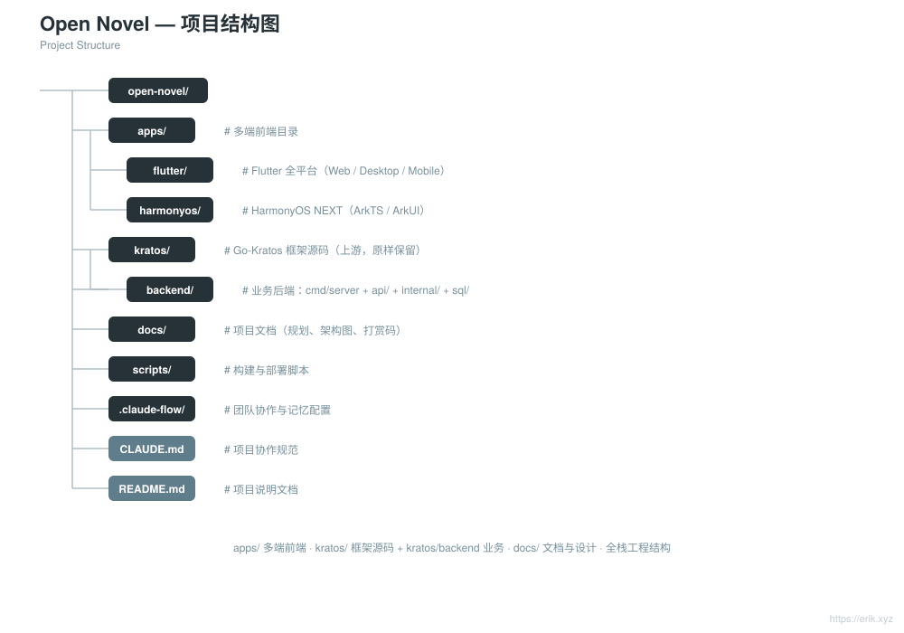

# Open Novel — Plataforma global de romances multilíngue

<div align="center">

[中文](../../README.md) · [English](README.en.md) · [日本語](README.ja.md) · [한국어](README.ko.md) · [Русский](README.ru.md) · [Deutsch](README.de.md) · [Français](README.fr.md) · [Español](README.es.md) · **Português** · [हिन्दी](README.hi.md) · [العربية](README.ar.md) · [বাংলা](README.bn.md) · [Bahasa Indonesia](README.id.md)

</div>

> Plataforma global de leitura de romances multilíngue baseada na arquitetura de microsserviços **Go-Kratos** com frontends multiplataforma **Flutter / HarmonyOS**, compatível com **mais de 12 idiomas principais**, oferecendo a usuários do mundo todo leitura, interação, busca e recomendações personalizadas.

---

## Introdução do projeto

Open Novel é uma plataforma global de romances multilíngue com arquitetura de microsserviços nativa da nuvem:

- **Backend**: Go-Kratos v2 (protocolo duplo gRPC / HTTP), microsserviços divididos por domínio (usuários, livros, capítulos, comentários, busca, recomendações)
- **Frontend**: Flutter multiplataforma (Web / Desktop / Mobile) + aplicativo nativo HarmonyOS NEXT, compartilhando o mesmo conjunto de APIs do backend
- **Multilíngue**: carregamento dinâmico de recursos i18n, compatível com mais de 12 idiomas (chinês, inglês, japonês, coreano, francês, alemão, espanhol, russo, árabe etc.)
- **Armazenamento**: MySQL 8 (mestre-escravo com separação de leitura/escrita) + Redis (cache de dados quentes / sessões) + OpenSearch (busca multilíngue)
- **Operações**: implantação com um clique via Docker Compose, monitoramento com Prometheus + Grafana, integração contínua com GitHub Actions

## Funcionalidades

<p align="center"></p>

- **Central do usuário**: registro e login (JWT), estante pessoal, sincronização do progresso de leitura entre dispositivos, perfis multilíngues
- **Experiência de leitura**: leitura por capítulos, troca de fonte e tamanho, temas claro/escuro, cache offline, animações de virada de página
- **Conteúdo do livro**: metadados de livros, gestão de capítulos, tags de categorias, atualizações seriadas, tradução multilíngue
- **Comunidade interativa**: comentários e resenhas, curtidas, favoritos, denúncia e moderação
- **Busca e descoberta**: busca com segmentação multilíngue, ranking de palavras-chave populares, sugestões de busca (histórico local do cliente de 20 entradas + sugestões com debounce de 200 ms), recomendações com IA, navegação por categorias
- **Painel administrativo**: moderação de conteúdo, gestão de usuários, estatísticas de dados, gestão de configurações, página de consulta de logs de auditoria (paginação + filtros multicondicionais)
- **Pagamentos e VIP**: pagamentos multicanal via 10 provedores (Stripe, NOWPayments (USDT), Razorpay, KOMOJU, PortOne, Mercado Pago, Xendit, PayPal, Alipay, WeChat Pay Global), assinatura e renovação de planos VIP, roteamento de métodos de pagamento por idioma (WeChat Pay Global integrado; WeChat Pay nacional não integrado, exige qualificação de comerciante na China)

## Arquitetura do sistema

<p align="center"></p>

A arquitetura geral é uma arquitetura de microsserviços Go-Kratos: os clientes Flutter / HarmonyOS interagem com o gateway de API via Nginx + CDN; o gateway roteia por domínio para os serviços de backend — usuários, livros, capítulos, comentários, busca e recomendações. A camada de dados consiste em MySQL mestre-escravo (separação de leitura/escrita) + cache Redis + índice de busca OpenSearch. Os serviços se comunicam via gRPC; as interfaces HTTP externas usam uniformemente o prefixo `/api`.

Outros diagramas: visão geral do projeto [../project.svg](../project.svg) · ciclo de solicitações [../request-cycle.svg](../request-cycle.svg) · arquitetura de segurança [../security.svg](../security.svg) · estrutura do projeto [../structure.svg](../structure.svg).

## Visão geral do projeto

<p align="center"></p>

## Ciclo de solicitações

<p align="center"></p>

## Arquitetura de segurança

<p align="center"></p>

## Estrutura de diretórios

```
open-novel/
├─ apps/                     # Frontends multiplataforma
│  ├─ flutter/               #   Flutter multiplataforma (Web / Desktop / Mobile), i18n multilíngue
│  └─ harmonyos/             #   Aplicativo nativo HarmonyOS NEXT (ArkTS / ArkUI)
├─ kratos/                   # Código-fonte do framework Go-Kratos (framework upstream, mantido intacto, não modificar)
│  └─ backend/               #   Backend de negócios do projeto: entrada cmd/server + api/ + internal/ + sql/ + opensearch/
├─ docs/                     # Documentação do projeto (planejamento, diagramas de arquitetura, READMEs i18n, códigos de doação)
├─ scripts/                  # Scripts de build e implantação (post-push.sh para releases automáticas, smoke.sh)
├─ docker-compose.yml        # Pilha de dependências local: MySQL 8 + Redis 7 + OpenSearch 2
├─ CLAUDE.md                 # Regras de colaboração do projeto
└─ README.md                 # Documentação do projeto
```

<p align="center"></p>

> Observação: `kratos/` é o código-fonte do framework Kratos (com README / LICENSE próprios); todo o código de negócios está em `kratos/backend/`.

## Pilha de tecnologia

| Camada | Tecnologia |
| :--- | :--- |
| Cliente | Flutter (Web / Desktop / Mobile), HarmonyOS NEXT (ArkTS / ArkUI) |
| Porta de entrada | Nginx + CDN, Go-Kratos API Gateway (protocolo duplo gRPC / HTTP) |
| Servidor | Go 1.22+, Kratos v2, protobuf / gRPC |
| Armazenamento | MySQL 8.0 (mestre-escravo), Redis 7.x (Cluster), OpenSearch 2.x, cache L1 em processo ristretto sobre Redis (TTL de 30 s) |
| Observabilidade | Prometheus, Grafana, ELK, rastreamento de cadeia OpenTelemetry |
| Operações | Docker Compose, GitHub Actions CI/CD |

## Banco de dados

- Nome do banco de dados: `novel`
- Prefixo das tabelas: `novel_` (por exemplo, `novel_user`, `novel_book`, `novel_chapter`, `novel_comment` etc.)

```sql
CREATE DATABASE novel DEFAULT CHARACTER SET utf8mb4 COLLATE utf8mb4_unicode_ci;
```

Script de criação das tabelas: `kratos/backend/sql/init.sql` (executado automaticamente no primeiro início do Docker Compose). Consulte o design detalhado das tabelas e a estratégia de separação de leitura/escrita em [docs/novel-project-planning.md](../novel-project-planning.md).

## Prefixo de API

As interfaces HTTP do backend começam uniformemente com `/api`; a versão é negociada pelo cabeçalho `X-Api-Version: v1` (não na URL). São agrupadas por domínio:

| Domínio | Exemplos de rotas | Definição proto |
| :--- | :--- | :--- |
| Usuários | `/api/users` etc. | `kratos/backend/api/user/v1` |
| Livros | `/api/books`、`/api/books/{id}`、`/api/categories`、`/api/tags` | `kratos/backend/api/book/v1` |
| Capítulos | `/api/...` | `kratos/backend/api/chapter/v1` |
| Comentários | `/api/...` | `kratos/backend/api/comment/v1` |
| Busca | `/api/...` | `kratos/backend/api/search/v1` |
| Recomendações | `/api/...` | `kratos/backend/api/recommendation/v1` |

As rotas detalhadas estão nas declarações `option (google.api.http)` de cada arquivo proto.

## Início rápido

```bash
# 1. Iniciar a pilha de dependências (MySQL / Redis / OpenSearch; executa automaticamente kratos/backend/sql/init.sql no primeiro início)
docker compose up -d

# 2. Iniciar o backend (diretório de negócios do Kratos, HTTP :8000 / gRPC :9000)
cd kratos/backend && go mod tidy && go run ./cmd/server

# 3. Iniciar o frontend Flutter (conecta por padrão a localhost:8000, sem configuração adicional)
cd apps/client/flutter && flutter pub get && flutter run -d chrome
```

- Mapeamento de portas da pilha de dependências: MySQL `3307`、Redis `6380`、OpenSearch `9200` (as portas 3306/6379 do host estão ocupadas por serviços locais, veja o comentário no docker-compose.yml).
- O endereço e as chaves do backend são configurados em `kratos/backend/config/`, com suporte a sobrescrita por variáveis de ambiente (ex.: `PORT`, `OPENSEARCH_ADDR`).
- Conectar o Flutter a outro backend: `flutter run -d chrome --dart-define=API_BASE_URL=http://<host>:8000`.

Consulte [apps/README.md](../../apps/README.md) e [apps/client/flutter/README.md](../../apps/client/flutter/README.md).

## Processo de lançamento

- **Automático**: após o push para `main`, o GitHub Actions ([.github/workflows/release.yml](../../.github/workflows/release.yml)) incrementa automaticamente a versão patch a partir do tag `v*` mais recente, cria e envia um tag e, em seguida, cria uma Release do GitHub com changelog incremental; ignorado se HEAD já tiver um tag de versão. O primeiro lançamento começa em `v1.0.0`.
- **Fallback manual**: execute [scripts/post-push.sh](../../scripts/post-push.sh) (requer `gh` autenticado): `echo "x y refs/heads/main z" | scripts/post-push.sh`.
- **Manual**:

  ```bash
  git tag -a v1.0.1 -m "release v1.0.1"
  git push origin v1.0.1
  gh release create v1.0.1 --generate-notes
  ```

## Roteiro

| Fase | Período | Foco das tarefas |
| :--- | :--- | :--- |
| Phase 1 | 2-3 semanas | Serviços base do backend Kratos + integração MySQL / Redis / OpenSearch |
| Phase 2 | 3-4 semanas | Frontends multiplataforma Flutter / HarmonyOS + escrita de ARB multilíngue |
| Phase 3 | 2 semanas | Reforço de segurança (JWT / RBAC / limitação de taxa) + testes de carga |
| Phase 4 | 1-2 semanas | Integração de todo o fluxo + configuração de aceleração CDN |
| Phase 5 | Contínuo | Integração de algoritmos de recomendação com IA, rastreamento de análise de comportamento do usuário |

Todas as cadeias de tarefas foram concluídas.

## Apoio e doações

Se este projeto for útil para você, fique à vontade para apoiá-lo com um **Star** ou **Fork**; doações por QR code também são bem-vindas. Cada apoio seu é o que me motiva a continuar mantendo e atualizando o projeto. Obrigado pelo incentivo!

<div align="center">

**Doação por WeChat** ｜ **Doação por Alipay**

　

</div>

### Doação por transferência global (remessa transfronteiriça)

【Informações do beneficiário】

- Nome do beneficiário: WANG KEXUN
- Número da conta do beneficiário: 881015918251

【Banco receptor】

- ZA Bank SWIFT Code: AABLHKHHXXX
- Nome do banco: ZA Bank Limited
- Código do banco: 387
- Endereço do banco: Core F, Cyberport 3, 100 Cyberport Road, Hong Kong

【Banco corresponsal para remessas transfronteiriças (se necessário)】

> Observe que estas são as informações do banco corresponsal (banco intermediário) para remessas transfronteiriças, e não do banco receptor. Consulte seu banco de envio se for necessário fornecer as informações do banco corresponsal.

**O banco corresponsal para depósitos em HKD, CNY e USD é o Citibank**

- Nome do banco: Citibank N.A. Hong Kong
- SWIFT Code: CITIHKHXXXX
- Código do banco: 006
- Nome da agência: Hong Kong Branch
- Código da agência: 391
- Endereço do banco: Citibank Tower, Citibank Plaza, 3 Garden Road, Central, Hong Kong

**O banco corresponsal para depósitos em outras moedas é o BNY Mellon**

- Nome do banco: THE BANK OF NEW YORK MELLON
- SWIFT Code: IRVTUS3NXXX
- Endereço do banco: THE BANK OF NEW YORK MELLON, 240 GREENWICH STREET, NEW YORK, United States

### Doação em criptomoedas (Crypto Donation)

Se este projeto ajudar você, escaneie o código QR para doar, obrigado!

| Rede (Network) | Código QR (QR Code) | Endereço da carteira (Wallet Address) |
|---|---|---|
| BNB Smart Chain (BEP20) | [](../coin/1.jpg) | `0x355d429f97511897ccb4e271ec888205f9ab6629` |
| Tron (TRC20) | [](../coin/2.jpg) | `TEdDHWLajt1XvqtPDWmQctdrJaC3pzZZzz` |
| Ethereum (ERC20) | [](../coin/3.jpg) | `0x355d429f97511897ccb4e271ec888205f9ab6629` |
| Aptos | [](../coin/4.jpg) | `0x836e3780edfc3f7b2372b39e2a1a3a5d7adfaccd96c726f21cfde1b50dd68030` |
| Plasma | [](../coin/5.jpg) | `0x355d429f97511897ccb4e271ec888205f9ab6629` |
| Polygon POS | [](../coin/6.jpg) | `0x355d429f97511897ccb4e271ec888205f9ab6629` |
| Solana | [](../coin/7.jpg) | `2hfhboHdmdrYsY25XfQSsEWxq5ip4EQsR7f4AzSRMUyr` |
| The Open Network (TON) | [](../coin/8.jpg) | `UQB9kFQohzmXUir9QSSZq01iwl9aQZIDdBpNmDklljRtCoGK` |
| Arbitrum One | [](../coin/9.jpg) | `0x355d429f97511897ccb4e271ec888205f9ab6629` |
| AVAX C-Chain | [](../coin/10.jpg) | `0x355d429f97511897ccb4e271ec888205f9ab6629` |

---

## Licença e contato

- **Licença**: não há licença independente na raiz do repositório; `kratos/` é o código-fonte upstream do framework Kratos, regido por sua [licença MIT](../../kratos/LICENSE). A licença do código de negócios será definida por anúncios futuros do projeto.
- **Contato**: comunicação via Issues / PR do GitHub; doações, veja a seção «Apoio e doações» acima.
