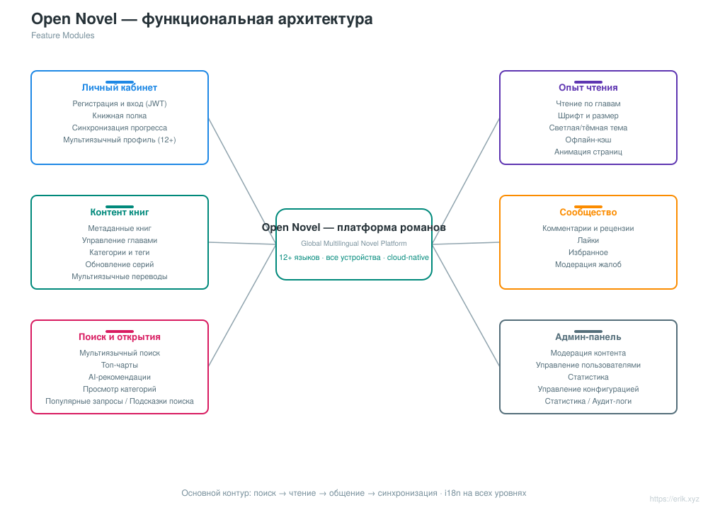
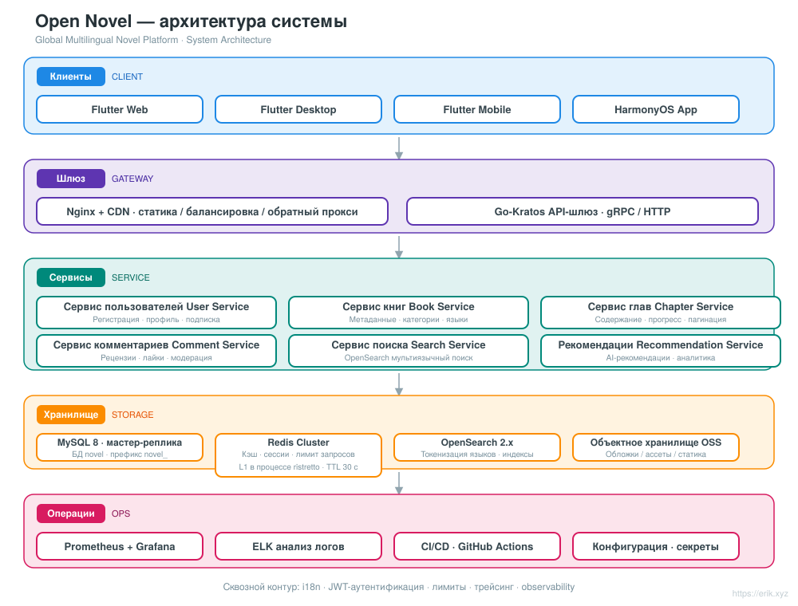
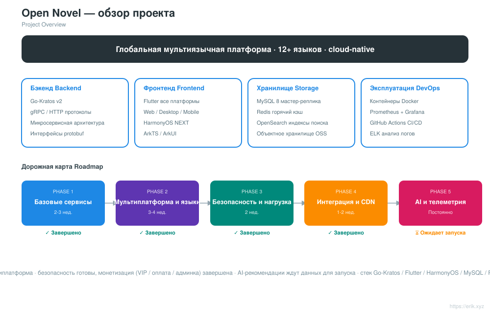
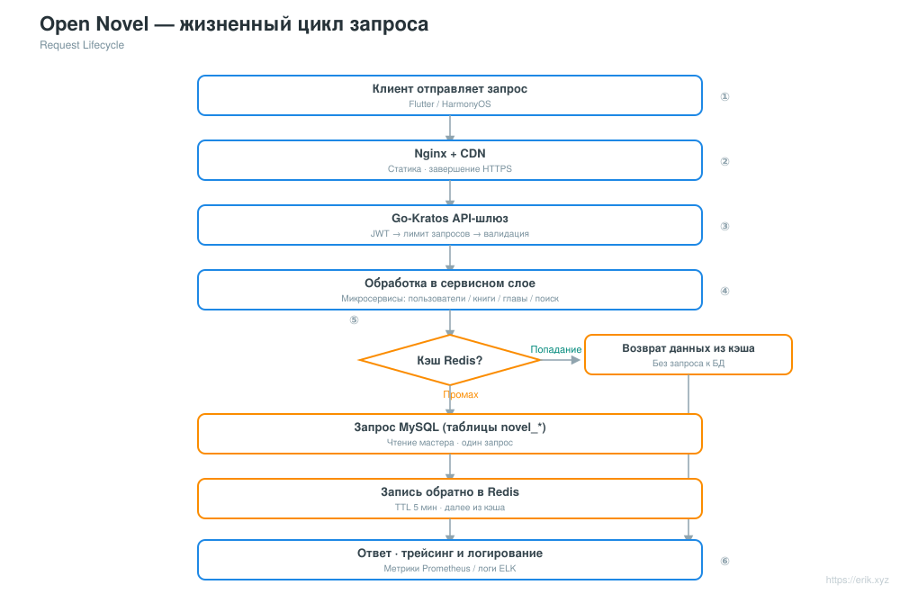
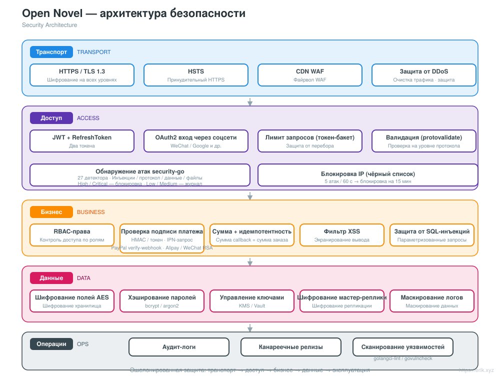
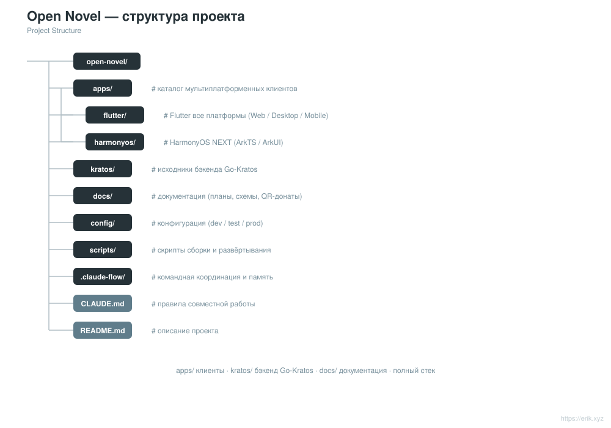

# Open Novel — глобальная мультиязычная платформа для чтения романов

<div align="center">

[中文](../../README.md) · [English](README.en.md) · [日本語](README.ja.md) · [한국어](README.ko.md) · **Русский** · [Deutsch](README.de.md) · [Français](README.fr.md) · [Español](README.es.md) · [Português](README.pt.md) · [हिन्दी](README.hi.md) · [العربية](README.ar.md) · [বাংলা](README.bn.md) · [Bahasa Indonesia](README.id.md)

</div>

> Мультиязычная платформа для чтения романов на микросервисной архитектуре **Go-Kratos** + мультиплатформенных фронтендах **Flutter / HarmonyOS**, поддерживающая **12+ основных языков** и предоставляющая пользователям по всему миру чтение, интерактив, поиск и персонализированные рекомендации.

---

## Обзор проекта

Open Novel — это глобальная мультиязычная платформа для чтения романов в облачной микросервисной архитектуре:

- **Бэкенд**: Go-Kratos v2 (двойные протоколы gRPC / HTTP), микросервисы разделены по доменам (пользователи, книги, главы, комментарии, поиск, рекомендации)
- **Фронтенд**: Flutter на всех платформах (Web / Desktop / Mobile) + нативное приложение HarmonyOS NEXT, использующие единый набор API бэкенда
- **Мультиязычность**: динамическая загрузка i18n-ресурсов, поддержка 12+ языков (китайский, английский, японский, корейский, французский, немецкий, испанский, русский, арабский и др.)
- **Хранилище**: MySQL 8 (мастер-реплика с разделением чтения и записи) + Redis (кэш горячих данных / сессии) + OpenSearch (мультиязычный поиск)
- **Эксплуатация**: развёртывание одной командой через Docker Compose, мониторинг Prometheus + Grafana, непрерывная интеграция GitHub Actions

## Возможности

<p align="center"></p>

- **Личный кабинет**: регистрация и вход (JWT), личная книжная полка, синхронизация прогресса чтения между устройствами, мультиязычный профиль
- **Опыт чтения**: чтение по главам, настройка шрифта и его размера, светлая / тёмная тема, офлайн-кэш, анимация перелистывания страниц
- **Контент книг**: метаданные книг, управление главами, категории и теги, обновление серий, мультиязычные переводы
- **Интерактивное сообщество**: комментарии и рецензии, лайки, избранное, модерация жалоб
- **Поиск и открытия**: мультиязычный поиск по токенам, топ-чарты, AI-рекомендации, просмотр по категориям
- **Админ-панель**: модерация контента, управление пользователями, статистика, управление конфигурацией

## Системная архитектура

<p align="center"></p>

В целом это микросервисная архитектура Go-Kratos: клиенты Flutter / HarmonyOS взаимодействуют с API-шлюзом через Nginx + CDN; шлюз маршрутизирует по доменам к бэкенд-сервисам — пользователи, книги, главы, комментарии, поиск, рекомендации и т. д.; уровень данных — MySQL мастер-реплика (разделение чтения и записи) + кэш Redis + поисковый индекс OpenSearch. Сервисы общаются по gRPC, внешние HTTP-интерфейсы используют единый префикс `/api`.

Остальные схемы: общая схема проекта [docs/project.svg](../../docs/project.svg) · цикл запросов [docs/request-cycle.svg](../../docs/request-cycle.svg) · архитектура безопасности [docs/security.svg](../../docs/security.svg) · структура проекта [docs/structure.svg](../../docs/structure.svg).

## Общая схема проекта

<p align="center"></p>

## Цикл запросов

<p align="center"></p>

## Архитектура безопасности

<p align="center"></p>

---

## Структура каталогов

```
open-novel/
├─ apps/                     # Мультиплатформенные фронтенды
│  ├─ flutter/               #   Flutter на всех платформах (Web / Desktop / Mobile), i18n мультиязычность
│  └─ harmonyos/             #   Нативное приложение HarmonyOS NEXT (ArkTS / ArkUI)
├─ kratos/                   # Исходный код фреймворка Go-Kratos (вышестоящий фреймворк, сохранять как есть, не изменять)
│  └─ backend/               #   Бизнес-бэкенд проекта: точка входа cmd/server + api/ + internal/ + sql/ + opensearch/
├─ docs/                     # Документация проекта (планирование, схемы архитектуры, i18n README, QR-коды для донатов)
├─ scripts/                  # Скрипты сборки и развёртывания (авторелиз post-push.sh, smoke.sh)
├─ docker-compose.yml        # Локальный стек зависимостей: MySQL 8 + Redis 7 + OpenSearch 2
├─ CLAUDE.md                 # Правила совместной работы над проектом
└─ README.md                 # Документация проекта
```

<p align="center"></p>

> Примечание: `kratos/` — это исходный код фреймворка Kratos (со своим README / LICENSE); весь бизнес-код находится в `kratos/backend/`.

## Технологический стек

| Уровень | Технологии |
| :--- | :--- |
| Клиент | Flutter (Web / Desktop / Mobile), HarmonyOS NEXT (ArkTS / ArkUI) |
| Шлюз | Nginx + CDN, API-шлюз Go-Kratos (двойные протоколы gRPC / HTTP) |
| Серверная часть | Go 1.22+, Kratos v2, protobuf / gRPC |
| Хранилище | MySQL 8.0 (мастер-реплика), Redis 7.x (Cluster), OpenSearch 2.x |
| Наблюдаемость | Prometheus, Grafana, ELK, трассировка OpenTelemetry |
| Эксплуатация | Docker Compose, CI/CD GitHub Actions |

## База данных

- Имя базы данных: `novel`
- Префикс таблиц: `novel_` (например, `novel_user`, `novel_book`, `novel_chapter`, `novel_comment` и т. д.)

```sql
CREATE DATABASE novel DEFAULT CHARACTER SET utf8mb4 COLLATE utf8mb4_unicode_ci;
```

Скрипт создания таблиц: `kratos/backend/sql/init.sql` (автоматически выполняется при первом запуске Docker Compose). Подробное описание структуры таблиц и стратегии разделения чтения и записи см. в [docs/novel-project-planning.md](../novel-project-planning.md).

## Префикс API

Все HTTP-интерфейсы бэкенда начинаются с `/api` и сгруппированы по доменам:

| Домен | Примеры маршрутов | Определение proto |
| :--- | :--- | :--- |
| Пользователи | `/api/users` и т. д. | `kratos/backend/api/user/v1` |
| Книги | `/api/books`, `/api/books/{id}`, `/api/categories`, `/api/tags` | `kratos/backend/api/book/v1` |
| Главы | `/api/...` | `kratos/backend/api/chapter/v1` |
| Комментарии | `/api/...` | `kratos/backend/api/comment/v1` |
| Поиск | `/api/...` | `kratos/backend/api/search/v1` |
| Рекомендации | `/api/...` | `kratos/backend/api/recommendation/v1` |

Подробные маршруты — в объявлениях `option (google.api.http)` в каждом proto-файле.

## Быстрый старт

```bash
# 1. Запустите стек зависимостей (MySQL / Redis / OpenSearch; при первом запуске автоматически выполняется kratos/backend/sql/init.sql для создания таблиц)
docker compose up -d

# 2. Запустите бэкенд-сервис (бизнес-каталог Kratos, HTTP :8000 / gRPC :9000)
cd kratos/backend && go mod tidy && go run ./cmd/server

# 3. Запустите клиент Flutter (по умолчанию подключается к localhost:8000, дополнительная настройка не требуется)
cd apps/flutter && flutter pub get && flutter run -d chrome
```

- Проброс портов стека зависимостей: MySQL `3307`, Redis `6380`, OpenSearch `9200` (порты хоста 3306/6379 заняты локальными сервисами, см. комментарии в docker-compose.yml).
- Адрес бэкенда и секреты настраиваются в `kratos/backend/config/`, поддерживается переопределение через переменные окружения (например, `PORT`, `OPENSEARCH_ADDR`).
- Для подключения Flutter к другому бэкенду: `flutter run -d chrome --dart-define=API_BASE_URL=http://<host>:8000`.

Подробности — в [apps/README.md](../../apps/README.md) и [apps/flutter/README.md](../../apps/flutter/README.md).

## Процесс релиза

- **Автоматически**: после пуша в `main` запускается [scripts/post-push.sh](../../scripts/post-push.sh) (либо как git push-хук, либо вручную). Скрипт увеличивает patch-версию на основе последнего тега `v*`, создаёт и пушит тег, затем создаёт GitHub Release с инкрементальным changelog; требуется авторизованный `gh`. Первый релиз начинается с `v1.0.0`.
- **Вручную**:

  ```bash
  git tag -a v1.0.1 -m "release v1.0.1"
  git push origin v1.0.1
  gh release create v1.0.1 --generate-notes
  ```

## Дорожная карта

| Этап | Период | Основные задачи |
| :--- | :--- | :--- |
| Phase 1 | 2-3 недели | Базовые сервисы бэкенда на Kratos + интеграция MySQL / Redis / OpenSearch |
| Phase 2 | 3-4 недели | Мультиплатформенные фронтенды Flutter / HarmonyOS + написание мультиязычных ARB-файлов |
| Phase 3 | 2 недели | Усиление безопасности (JWT / RBAC / ограничение частоты запросов) + нагрузочное тестирование |
| Phase 4 | 1-2 недели | Сквозная интеграция всех звеньев + настройка ускорения CDN |
| Phase 5 | постоянно | Внедрение AI-алгоритмов рекомендаций, сбор данных аналитики поведения пользователей |

## Поддержка и благодарность

Если этот проект оказался для вас полезным, поддержите его **Star** и **Fork**; также можно отблагодарить автора донатом по QR-коду. Каждая ваша поддержка — моя мотивация продолжать развитие и обновление проекта. Спасибо за поддержку!

<div align="center">

**Донат WeChat** ｜ **Донат Alipay**

　

</div>

### Глобальные донаты банковским переводом (международный перевод)

【Информация о получателе】

- Имя получателя: WANG KEXUN
- Номер счёта получателя: 881015918251

【Банк получателя】

- SWIFT Code банка ZA Bank: AABLHKHHXXX
- Название банка: ZA Bank Limited
- Код банка: 387
- Адрес банка: Core F, Cyberport 3, 100 Cyberport Road, Hong Kong

【Банк-посредник для международных переводов (при необходимости)】

> Обратите внимание: это информация о банке-посреднике (промежуточном банке) для международных переводов, а не о банке получателя. Уточните в своём банке, требуется ли предоставление информации о банке-посреднике.

**Для переводов в гонконгских долларах, юанях и долларах США банком-посредником является Citibank**

- Название банка: Citibank N.A. Hong Kong
- SWIFT Code: CITIHKHXXXX
- Код банка: 006
- Название отделения: Hong Kong Branch
- Номер отделения: 391
- Адрес банка: Citibank Tower, Citibank Plaza, 3 Garden Road, Central, Hong Kong

**Для переводов в других валютах банком-посредником является BNY Mellon**

- Название банка: THE BANK OF NEW YORK MELLON
- SWIFT Code: IRVTUS3NXXX
- Адрес банка: THE BANK OF NEW YORK MELLON, 240 GREENWICH STREET, NEW YORK, United States

---

## Лицензия и контакты

- **Лицензия**: в корне репозитория нет отдельного LICENSE; `kratos/` — это вышестоящий исходный код фреймворка Kratos, который распространяется по его [MIT License](../../kratos/LICENSE). Способ лицензирования бизнес-кода будет объявлен в последующих публикациях проекта.
- **Контакты**: общение через GitHub Issues / PR; донаты — см. раздел «Поддержка и благодарность» выше.
